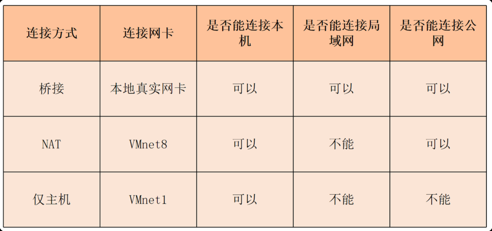
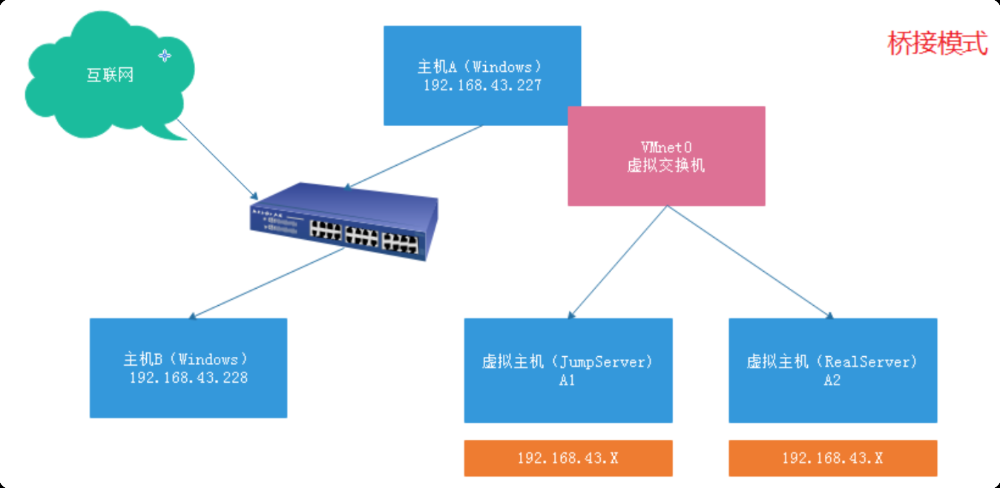
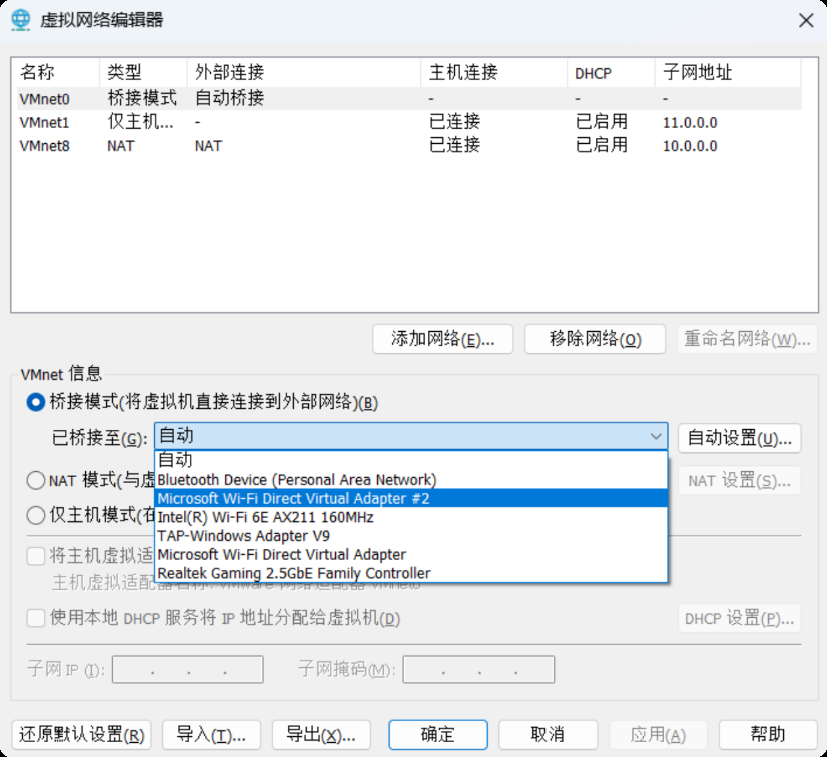
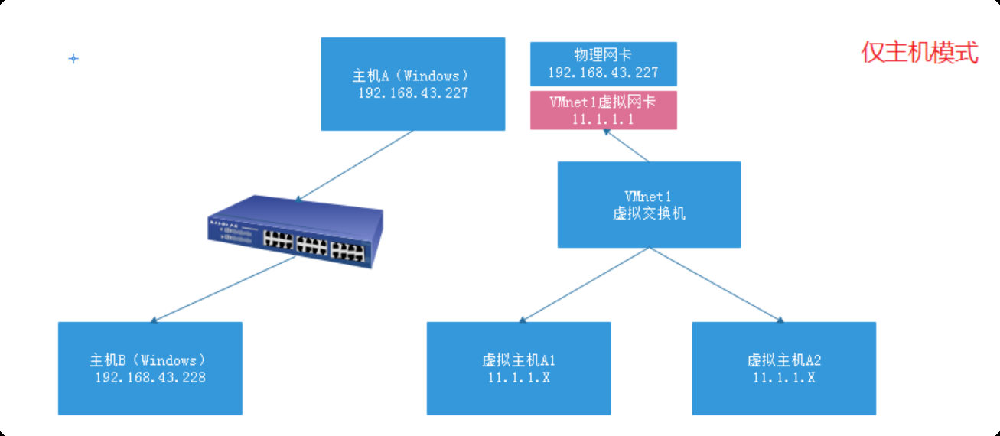
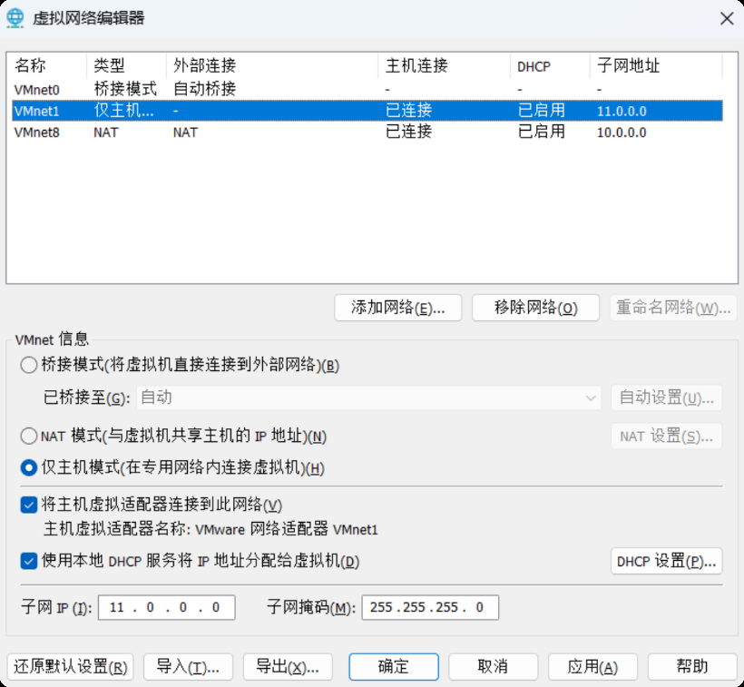
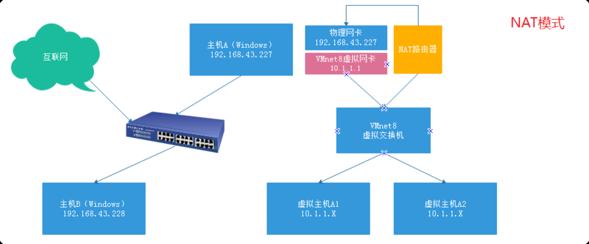
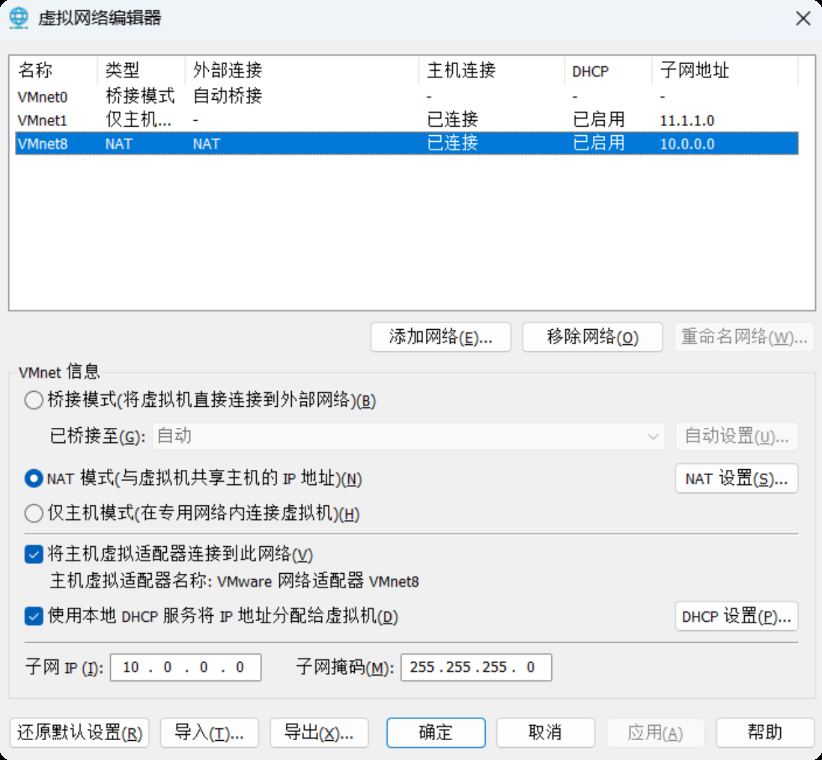

# 1. 网络模式详解

在 VMware 中，一共存在 3 种网络模式



## 1.1. VMnet0 桥接模式

- 虚拟机和物理真机连接在同一交换机，相当于系统与 Windows 处于同一个网段。与物理真机同网段，如 192.168.43.X
- 桥接模式可以连接外网（有网络）
- 桥接模式中，Linux 系统就相当于一台独立的计算机，与 Windows 物理真机处于同一个网络环境中。

如果桥接模式连接不上，需要更改桥接的网卡。



## 1.2. VMnet1 仅主机模式

- 封闭的网络环境，仅能与 Windows 物理真机进行连接。无法连接外网。与物理真机不在同一个网段，拥有独立的 IP 网段。
- 仅主机模式仅能用于内部连通。
- 仅主机模式无法连接外网。



- Host-only 模式



## 1.3. VMnet8 NAT 模式

- 相当于一个独立的网络环境，与物理真机不处于同一个网段。但是其可以通过虚拟网络路由器（NAT 地址转化）连接外网。
- 与物理真机不在同一个网段，拥有独立的 IP 网段
- 不仅可以进行内部连接（VMware=> CentOS7）
- 拥有一个虚拟的路由器（NAT 设备）可以让我们虚拟机连接到外网环境



- NAT 模式配置



# 2. 故障排查

## 2.1. 无法连接虚拟机(使用 NAT 模式)

1. 检查虚拟机 IP 地址是否正确

```shell
ip a

# 10.1.1.3/24
```

1. 检查本地连接网卡中的 VMnet8 的 IP 地址是否为 10.0.0.1
2. 编辑->虚拟网络编辑器->更改设置
    1. 虚拟机的 NAT 设置网关地址是否为 10.0.0.2
    2. VMnet8 配置子网是否为 `10.0.0.0 255.255.255.0`