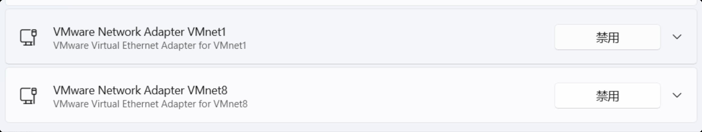

# 1. 虚拟机安装

1. 下载 [VMware Workstation](https://access.broadcom.com/default/ui/v1/signin/)

VMware WorkStation 安装完毕后，其在网络适配器中会产生两张虚拟网卡。VMnet1 与 VMnet8，如果没有这两张网卡需要卸载干净后重装。



2. 下载 [ISO 镜像](https://mirrors.aliyun.com/rockylinux/9.8/isos/x86_64/)

3. 进行操作系统安装，此处省略图

4. 修改网络配置

```shell
vi /etc/NetworkManager/system-connections/ens160.nmconnection

[connection]
id=ens160
uuid=6cac79fd-4f88-37ba-b497-1e48a537085e
type=ethernet
autoconnect-priority=-999
interface-name=ens160
timestamp=1735917354

[ethernet]

[ipv4]
method=manual
address=10.0.0.10/24,10.0.0.2
dns=223.5.5.5,8.8.8.8

[ipv6]
addr-gen-mode=eui64
method=auto

[proxy]
```

5. 加载配置文件

```shell
nmcli c load ens160.nmconnection #重新加载单个网口配置文件
nmcli c reload #重新加载所有网口配置文件
nmcli c up ens160 #启动指定网口
```

6. 关机，快照。

7. 制作模板机器

    - 运行 init-rockylinux9.8.sh 脚本
    - 关机，快照。

8. 克隆虚拟机,克隆虚拟机时选择“链接克隆”，可以节省磁盘空间，克隆完成后需要修改 IP 地址，确保每台虚拟机的 IP 地址唯一。