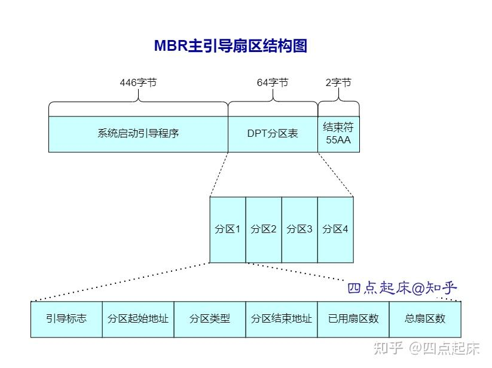

# 1. 磁盘分区命名规则

由于磁盘驱动的不同，磁盘可以分为 IDE 磁盘和 SCSI 硬盘，`IDE硬盘基本已过时（对Linux服务器而言）`，而 SATA、USB、SAS 等硬盘的接口都是 SCSI 硬盘，所以这些都统称为 SCSI 硬盘，是目前 Linux 服务器的主流。

在 Linux 系统中磁盘设备文件的命名规则为： **`主设备号 + 次设备号 + 磁盘分区号`** 而 Linux 万物皆文件的个性，硬盘自然是映射在 /dev 目录下：

- `IDE硬盘 hdx~`：`hd`表明为设备类型，这里指`IDE`硬盘，`x`为盘号，值可以为 a（基本盘），b（基本从属盘），c（辅助主盘），d（辅助从属盘）；`~`代表分区，前四个分区 1-4 表示，他们是主分区或者扩展分区，从 5 开始就是逻辑分区；例如：第一块盘 hda，第二块盘 hdb…第一块盘的第一个分区 hda1，第二个分区 hda2…
- `SCSI硬盘 sdx~`：`sd`表明为设备类型，这里指`SCSI`硬盘，`x`为盘号，值可以为 a（基本盘），b（基本从属盘），c（辅助主盘），d（辅助从属盘）；`~`代表分区，前四个分区 1-4 表示，他们是主分区或者扩展分区，从 5 开始就是逻辑分区；例如：第一块盘 sda，第二块盘 sdb… 第一块盘的第一个分区 sda1，第二个分区 sda2…

在 MBR 分区中：3 个主分区 +1 个扩展分区，第 5 个分区及以上就是逻辑分区，只有主分区和逻辑分区才可以正常写入数据。

考虑到常用性，以下内容就以`SCSI硬盘`为主来讲；

刚刚讲到的`x`，那系统是怎么识别 sda，sdb，sdc 即磁盘 1，磁盘 2，磁盘 3 的呢？

假如在你的 PC 上，有两个 SATA 磁盘个一个 USB 磁盘，而这两个 SATA 磁盘分别放在 SATA1 和 SATA5 插槽上，USB 磁盘则在 USB 接口上，那这三块磁盘的顺序是什么呢？ 其实，磁盘的顺序是靠侦测到的顺序来标识的； 

1. SATA1 插槽上的为：/dev/sda
2. SATA2 插槽上的为：/dev/sdb
3. USB（开机完成才能被系统捕捉到）：/dev/sdc

## 1.1. 扫描磁盘接口

机器增加磁盘后，通过扫描接口识别该磁盘。

```shell
for HOST in `ls /sys/class/scsi_host/ | xargs`;
do
  {
    echo "- - -" >/sys/class/scsi_host/${HOST}/scan;
  } &
done
wait
echo "等待所有进程执行完成"

lsblk
```

# 2. 磁盘分区

## 2.1. 为什么要分区？

不论磁盘的分区还是数据库表的分区以及其它的分区，核心思想基本都一致，可以概括以下两点原因；

- 数据的安全性隔离：因为每个分区是独立分开的，所以当你需要重现格式化或数据重新填充分区 A 时，分区 B 并不会受影响，这就是为啥你 Windows 重装系统的话，一般只是 C 盘重新载入新系统数据，而其他的 D，E，F 盘并不会受影响； 
- 系统的效率考虑：加快数据寻址的效率，当你只有一块分区时，找数据文件 a 你得从头找到尾部，但是当你分区了，操作系统会记录文件的绝对路径，你就可以直接从某个分区下去找，大大提升了速度和效率；

## 2.2. 磁盘分区类型及原理

### 2.2.1. MBR 分区格式

早期磁盘第一个扇区（`521bytes`）里面包含重要的信息`MBR（Master Boot Record）`，其中`446 bytes`，安装开机管理程序的地方；剩下的`64bytes`记录硬盘分区的数据，即分区表，如下图所示：

存在局限性：

- 只能有 3 个主分区和 1 个扩展分区
- MBR 分区的单分区不能超 2T



> 为什么 MBR 分区不能超过 4 个主分区？
>
> MBR（Master Boot Record，主引导记录）是硬盘上第一个扇区的内容，它包含了硬盘的分区信息、启动代码等重要数据。MBR 分区表的大小是固定的，只有 64 字节，用于存储分区信息。每个分区项的关键项信息就占用 16 字节，因此理论上 MBR 分区表最多只能描述 4 个分区（64 字节 / 16 字节/分区 = 4 个分区）。
>
> 非要超过 4 个分区，那就只能使用扩展分区来做了。

因此：以下的四个分区我们并不能区分是主分区还是扩展分区，两种都有可能；

- /dev/sda1
- /dev/sda2
- /dev/sda3
- /dev/sda4

既然第一个扇区的分区表只能记录四个分区的数据，那自然就想到用额外的扇区来记录分区信息，这就是扩展分区的由来。因此下面的内容我们就可以确定其分区情况。

- /dev/sda1 （主分区）
- /dev/sda2（扩展分区）
- /dev/sda5（逻辑分区）
- /dev/sda6（逻辑分区）
- /dev/sda7（逻辑分区）
- /dev/sda8（逻辑分区）
- /dev/sda9（逻辑分区）

#### 2.2.2.1. 各分区概念

#### 2.2.2.2. 主分区

- 系统统中必须要存在的分区，系统盘选择主分区安装
- 数字编号只能是 1-4.sda1、sda2、sda3、sda4
- 主分区最多四个，最少一个。
- 能被单独格式化

#### 2.2.2.3. 扩展分区

- 相当于一个独立的小磁盘。
- 独立的分区表，不能独立存在，即不能直接存放数据
- 必须在扩展分区上建立逻辑分区才能存放数据
- 占用主分区的编号（主分区+扩展分区）之和最多 4 个
- 不能被格式化

#### 2.2.2.4. 逻辑分区

- 数字编号只能是从 5 开始
- 存放于扩展分区之上
- 存放任意普通数据
- 能被单独格式化
- 两个独立的逻辑分区可以支持合并成一个新的逻辑分区

> 假如我有一块硬盘，如果我想要得到 6 个分区，用 MBR 分区格式该怎么分配：
>
> 需要用到扩展分区，可以分配为：
>
> - P+P+P+E(L+L+L)
> - 也可以 P+P+E（L+L+L+L）
> - 也可以 P+E（L+L+L+L+L） 

`MBR`分区的原理清晰后，其不足的地方也暴露的无疑，因为分区表的容量 16bytes 有限，始终存在以下不足；

- 操作系统无法抓取 2.2T 以上的磁盘容量，个人 PC 可能目前来说够，但是服务器已经无法满足了；
- MBR 仅有一块分区表，无法实现高可用，一旦被损坏，很难再救援恢复；
- MBR 内存放的开机管理程序也只有 446bytes，也是无法容纳更多的开机程序代码的；

### 2.2.2. MBR 总结【基本不再使用，了解即可】

- 小于 2T 的磁盘适用
- 2<= 扩展分区+主分区 <=4

### 2.2.3. GPT 分区格式

GPT 将磁盘划分为一块块的逻辑区块地址（Logical Block Address，简称 LBA）进行管理，每个 LBA 预设计为 512 字节，即一个扇区的大小。为了改进 MBR 的不足，GPT 使用前后各 34 个 LBA 标识分区表信息（最后的 34 个 LBA 可以理解为备份，增强了高可用性）。LBA 的标识是从 0 开始的，LBA0 到 34 共 35 块，以下是每个 LBA 的含义：

.png)

- **LBA0**: 包含两部分，一部分类似 MBR 的 446 字节，存储启动管理程序；另一部分存储一个特殊标记，用于标识该磁盘为 GPT 格式。无法识别 GPT 分区的程序将无法操作该磁盘，从而起到保护作用。值得注意的是，目前基本管理程序普遍支持 GPT 格式，因此该 LBA 块实际上与分区信息并无直接关联，这也是为什么它不算入 34 个 LBA 的原因。
- **LBA1**: GPT 的表头，记录分区本身的位置与大小，同时也记录在备份中最后 34 个 LBA 的位置信息，以便于恢复。
- **LBA2-34**: 共 32 块 LBA，每块 LBA 可以记录 4 笔分区表，共支持 4 × 32 = 128 笔分区。每个 LBA 默认为 512 字节，因此每笔记录需要 512/4 = 128 字节，其中 64 字节用于记录起始和结束的扇区号码。这意味着一个单一分区槽的最大容量为：

$$
2^{64}\times512\mathrm{~bytes}=2^{63}\times1\mathrm{~KB}=2^{33}\mathrm{~TB}=8\mathrm{~ZB}
$$

因此基本上 GPT 弥补了 MBR 的不足，但是 GPT 只是分区格式方法不同哈，以 SCSI 硬盘为例，磁盘的命名规则并没有大改；仍然是第一块盘 sda，第二块盘 sdb… 第一块盘的第一个分区 sda1，第二个分区 sda2 等，但是 GPR 去除了扩展分区的概念，直接分区为主分区和逻辑分区，一般创建的时候无脑主分区就可以。

#### 2.2.4. GPT 总结【用这个，掌握操作】

- 128 个主分区
- 大于 2T 的磁盘适用

## 2.3. 磁盘分区实操

### 2.3.1. MRB->fdisk

1. 给虚拟机添加一块磁盘，关机，20G
2. 开机后利用指令`lsblk`，可以看到磁盘`sdb`就是刚刚添加的磁盘，无分区情况；`sda`就是之前安装虚拟机设置的磁盘，有两个分区`sda1`和`sda2`；

```bash
lsblk

NAME            MAJ:MIN RM  SIZE RO TYPE MOUNTPOINT
sda               8:0    0   60G  0 disk
├─sda1            8:1    0    1G  0 part /boot
└─sda2            8:2    0   59G  0 part
  ├─centos-root 253:0    0 38.3G  0 lvm  /
  ├─centos-swap 253:1    0    2G  0 lvm  [SWAP]
  └─centos-home 253:2    0 18.7G  0 lvm  /home
sdb               8:16   0   20G  0 disk
sr0              11:0    1  4.4G  0 rom

# 也可以用fdisk来查看磁盘
fdisk -l

磁盘 /dev/sda：64.4 GB, 64424509440 字节，125829120 个扇区
Units = 扇区 of 1 * 512 = 512 bytes
扇区大小(逻辑/物理)：512 字节 / 512 字节
I/O 大小(最小/最佳)：512 字节 / 512 字节
磁盘标签类型：dos
磁盘标识符：0x0001d6b8

设备 Boot      Start         End      Blocks   Id  System
/dev/sda1   *   2048     2099199     1048576   83  Linux
/dev/sda2       2099200   125829119    61864960   8e  Linux LVM

磁盘 /dev/sdb：21.5 GB, 21474836480 字节，41943040 个扇区
Units = 扇区 of 1 * 512 = 512 bytes
扇区大小(逻辑/物理)：512 字节 / 512 字节
I/O 大小(最小/最佳)：512 字节 / 512 字节


磁盘 /dev/mapper/centos-root：41.1 GB, 41120956416 字节，80314368 个扇区
Units = 扇区 of 1 * 512 = 512 bytes
扇区大小(逻辑/物理)：512 字节 / 512 字节
I/O 大小(最小/最佳)：512 字节 / 512 字节


磁盘 /dev/mapper/centos-swap：2147 MB, 2147483648 字节，4194304 个扇区
Units = 扇区 of 1 * 512 = 512 bytes
扇区大小(逻辑/物理)：512 字节 / 512 字节
I/O 大小(最小/最佳)：512 字节 / 512 字节


磁盘 /dev/mapper/centos-home：20.1 GB, 20073938944 字节，39206912 个扇区
Units = 扇区 of 1 * 512 = 512 bytes
扇区大小(逻辑/物理)：512 字节 / 512 字节
I/O 大小(最小/最佳)：512 字节 / 512 字节
```

接下来开始采用 MBR 的方式进行分区，用到指令`fdisk`，要求给 20G 的新磁盘分区，要求为 P（5G）+P（5G）+L（5G）+L（5G）； 即，两个主分区，每个 5G，两个逻辑分区，每个 5G，之前说过逻辑分区不能单独存在，必须搭载扩展分区，所以实际情况应该是两个主分区，每个 5G，一个扩展分区 10G，扩展分区里面两个逻辑分区，每个 5G。

```shell
# fdisk /dev/sdb指令进入分区操作的交互命令行
fdisk /dev/sdb
欢迎使用 fdisk (util-linux 2.23.2)。

更改将停留在内存中，直到您决定将更改写入磁盘。
使用写入命令前请三思。

Device does not contain a recognized partition table
使用磁盘标识符 0xcc9206a3 创建新的 DOS 磁盘标签。

命令(输入 m 获取帮助)：

# 输入 m 获得操作提示
命令操作
   a   toggle a bootable flag
   b   edit bsd disklabel
   c   toggle the dos compatibility flag
   d   delete a partition
   g   create a new empty GPT partition table
   G   create an IRIX (SGI) partition table
   l   list known partition types
   m   print this menu
   n   add a new partition
   o   create a new empty DOS partition table
   p   print the partition table
   q   quit without saving changes
   s   create a new empty Sun disklabel
   t   change a partition\'s system id
   u   change display/entry units
   v   verify the partition table
   w   write table to disk and exit
   x   extra functionality (experts only)

# 根据提示输入n add a new partition

命令(输入 m 获取帮助)：n
Partition type:
   p   primary (0 primary, 0 extended, 4 free)
   e   extended
# 这里p是主分区，e为拓展分区，先来个主分区，选择p

Select (default p): p
分区号 (1-4，默认 1)：1
# 这里跳转到选择分区号，之前理论讲过MBR只能有四个主或扩展分区，因为是新的分区，这里选择1即可；
起始 扇区 (2048-41943039，默认为 2048)：
将使用默认值 2048
# 这里选择起始的扇区，选择默认的即可

Last 扇区, +扇区 or +size{K,M,G} (2048-41943039，默认为 41943039)：+5G
分区 1 已设置为 Linux 类型，大小设为 5 GiB
# 这里选择结束的扇区，如果你选择默认的，那么就是将整块磁盘给到一个分区，
# 这里磁盘有20G，我们可以来个5G的，选择+5G，就是给第一个分区5G空间

# 这里还没完，还需要写入w，则完成分区1分区；
命令(输入 m 获取帮助)：w
The partition table has been altered!

Calling ioctl() to re-read partition table.
正在同步磁盘。

# 完成同步后会自动退出，再次使用lsblk指令查看，发现已经多了sdb1
lsblk
NAME            MAJ:MIN RM  SIZE RO TYPE MOUNTPOINT
sda               8:0    0   60G  0 disk
├─sda1            8:1    0    1G  0 part /boot
└─sda2            8:2    0   59G  0 part
  ├─centos-root 253:0    0 38.3G  0 lvm  /
  ├─centos-swap 253:1    0    2G  0 lvm  [SWAP]
  └─centos-home 253:2    0 18.7G  0 lvm  /home
sdb               8:16   0   20G  0 disk
└─sdb1            8:17   0    5G  0 part
sr0              11:0    1  4.4G  0 rom

# 再来创建第二个主分区
fdisk /dev/sdb
欢迎使用 fdisk (util-linux 2.23.2)。

更改将停留在内存中，直到您决定将更改写入磁盘。
使用写入命令前请三思。


命令(输入 m 获取帮助)：n
Partition type:
   p   primary (1 primary, 0 extended, 3 free)
   e   extended
   
# 选择p表示创建第二个主分区
Select (default p): p

# 这里自动选择序号2，因为1已经被第一个主分区占用
分区号 (2-4，默认 2)：2

# 其实位置选择默认即可
起始 扇区 (10487808-41943039，默认为 10487808)：
将使用默认值 10487808

# 结束扇区依然选择5G
Last 扇区, +扇区 or +size{K,M,G} (10487808-41943039，默认为 41943039)：+5G
分区 2 已设置为 Linux 类型，大小设为 5 GiB

# w指令保存磁盘修改
命令(输入 m 获取帮助)：w
The partition table has been altered!

Calling ioctl() to re-read partition table.
正在同步磁盘。

# lsblk指令得到第二块主分区sbd2
lsblk
NAME            MAJ:MIN RM  SIZE RO TYPE MOUNTPOINT
sda               8:0    0   60G  0 disk
├─sda1            8:1    0    1G  0 part /boot
└─sda2            8:2    0   59G  0 part
  ├─centos-root 253:0    0 38.3G  0 lvm  /
  ├─centos-swap 253:1    0    2G  0 lvm  [SWAP]
  └─centos-home 253:2    0 18.7G  0 lvm  /home
sdb               8:16   0   20G  0 disk
├─sdb1            8:17   0    5G  0 part
└─sdb2            8:18   0    5G  0 part
sr0              11:0    1  4.4G  0 rom

# 接下来是创建拓展分区和逻辑分区

fdisk /dev/sdb
欢迎使用 fdisk (util-linux 2.23.2)。

更改将停留在内存中，直到您决定将更改写入磁盘。
使用写入命令前请三思。


命令(输入 m 获取帮助)：n
Partition type:
   p   primary (2 primary, 0 extended, 2 free)
   e   extended

# 选择e表示拓展分区，编号可以选择默认的3
Select (default p): e
分区号 (3,4，默认 3)：3

# 起始扇区选择默认的位置
起始 扇区 (20973568-41943039，默认为 20973568)：
将使用默认值 20973568

# 剩下的所有磁盘分给这个拓展分区
Last 扇区, +扇区 or +size{K,M,G} (20973568-41943039，默认为 41943039)：
将使用默认值 41943039
分区 3 已设置为 Extended 类型，大小设为 10 GiB

# 记得写入w保存磁盘更改

命令(输入 m 获取帮助)：w
The partition table has been altered!

Calling ioctl() to re-read partition table.
正在同步磁盘。

# 之前理论说过，扩展分区是不能单独存在的，必须要有逻辑分区在里面，接下来再来两次，创建逻辑分区

fdisk /dev/sdb
欢迎使用 fdisk (util-linux 2.23.2)。

更改将停留在内存中，直到您决定将更改写入磁盘。
使用写入命令前请三思。

命令(输入 m 获取帮助)：n

# 这里你会发现，多了个l（logic） 的选项，即逻辑分区的意思，这里记得选l
Partition type:
   p   primary (2 primary, 1 extended, 1 free)
   l   logical (numbered from 5)
Select (default p): l
添加逻辑分区 5

# 选择默认的起始扇区
起始 扇区 (20975616-41943039，默认为 20975616)：
将使用默认值 20975616

# 第一个逻辑分区为5G
Last 扇区, +扇区 or +size{K,M,G} (20975616-41943039，默认为 41943039)：+5G
# 默认逻辑分区从编号5开始，因为1-4要预留给到主分区和扩展分区
分区 5 已设置为 Linux 类型，大小设为 5 GiB

# 记得保存磁盘更改，写入w；
命令(输入 m 获取帮助)：w
The partition table has been altered!

Calling ioctl() to re-read partition table.
正在同步磁盘。

# 再来一次，创建 第二块逻辑分区
fdisk /dev/sdb
欢迎使用 fdisk (util-linux 2.23.2)。

更改将停留在内存中，直到您决定将更改写入磁盘。
使用写入命令前请三思。

命令(输入 m 获取帮助)：n
Partition type:
   p   primary (2 primary, 1 extended, 1 free)
   l   logical (numbered from 5)
Select (default p): l
添加逻辑分区 6
起始 扇区 (31463424-41943039，默认为 31463424)：
将使用默认值 31463424

# 使用默认的结束扇区，即将剩下的扩展分区的空间全部给到第二个逻辑分区
Last 扇区, +扇区 or +size{K,M,G} (31463424-41943039，默认为 41943039)：
将使用默认值 41943039
分区 6 已设置为 Linux 类型，大小设为 5 GiB

命令(输入 m 获取帮助)：w
The partition table has been altered!

Calling ioctl() to re-read partition table.
正在同步磁盘。

# 到此，主分区，扩展分区，逻辑分区的分区操作就算完了；切忌使用前还需要进行格式化，
# 格式化的操作再下个小结挂载的时候再细讲

# 使用lsblk查看刚刚的主分区，扩展分区，逻辑分区的分区操作的结果，
# 发现完全符合之前MBR分区的理论和我们的预期
lsblk
NAME            MAJ:MIN RM  SIZE RO TYPE MOUNTPOINT
sda               8:0    0   60G  0 disk
├─sda1            8:1    0    1G  0 part /boot
└─sda2            8:2    0   59G  0 part
  ├─centos-root 253:0    0 38.3G  0 lvm  /
  ├─centos-swap 253:1    0    2G  0 lvm  [SWAP]
  └─centos-home 253:2    0 18.7G  0 lvm  /home
sdb               8:16   0   20G  0 disk
├─sdb1            8:17   0    5G  0 part
├─sdb2            8:18   0    5G  0 part
├─sdb3            8:19   0    1K  0 part
├─sdb5            8:21   0    5G  0 part
└─sdb6            8:22   0    5G  0 part
sr0              11:0    1  4.4G  0 rom

# 其他重要指令
# 发现分区操作失误，可以d删除指令
 d   delete a partition
```

### 2.3.2. GPT->parted

之前说过`MBR`分区格式，即对应的`fdisk`操作有局限就是大于 2T 的磁盘无法使用该理论和方法，那个人 PC 可能觉得 2T 完全满足，但是服务器 2T 肯定是不足的，因此学习下 GPT 的分区方法也是很有必要的，使用的指令为`parted`，博主比较穷，私人是没有 2T 的硬盘的，这里就用一个 20G 的来模拟，实现以下要求；

要求：给 20G 的新磁盘分区，要求为 P（5G）+P（5G）+L（5G）+L（5G）； 即，两个主分区，每个 5G，两个逻辑分区，每个 5G。

```shell
# 使用lsblk查看刚刚新增的磁盘sdc
lsblk
NAME            MAJ:MIN RM  SIZE RO TYPE MOUNTPOINT
sda               8:0    0   60G  0 disk
├─sda1            8:1    0    1G  0 part /boot
└─sda2            8:2    0   59G  0 part
  ├─centos-root 253:0    0 38.3G  0 lvm  /
  ├─centos-swap 253:1    0    2G  0 lvm  [SWAP]
  └─centos-home 253:2    0 18.7G  0 lvm  /home
sdb               8:16   0   20G  0 disk
├─sdb1            8:17   0    5G  0 part
├─sdb2            8:18   0    5G  0 part
├─sdb3            8:19   0    1K  0 part
├─sdb5            8:21   0    5G  0 part
└─sdb6            8:22   0    5G  0 part
sdc               8:32   0   20G  0 disk
sr0              11:0    1  4.4G  0 rom

# 进行parted分区
# 使用parted /dev/sdc进入交互的parted命令行
yum -y install parted

parted /dev/sdc
GNU Parted 3.1
使用 /dev/sdc
Welcome to GNU Parted! Type 'help' to view a list of commands.
(parted)

# 输入p查看当前分区，发现为0个分区
(parted) p
Model: VMware, VMware Virtual S (scsi)
Disk /dev/sdc: 21.5GB
Sector size (logical/physical): 512B/512B
Partition Table: gpt
Disk Flags:
Number  Start  End  Size  File system  Name  标志

# 将磁盘格式化为 GPT
(parted) mklabel gpt

# 创建第一个主分区
(parted) mkpart primary 0% 5G # 不要用绝对 0
警告: The resulting partition is not properly aligned for best performance.
忽略/Ignore/放弃/Cancel? Ignore

# 查看当前磁盘分区情况，发现第一个主分区成功
(parted) p
Model: VMware, VMware Virtual S (scsi)
Disk /dev/sdc: 21.5GB
Sector size (logical/physical): 512B/512B
Partition Table: gpt
Disk Flags:

Number  Start   End     Size    File system  Name     标志
 1      17.4kB  5000MB  5000MB               primary

# 创建第二个主分区
(parted) mkpart primary 5G 10G

# 输入p查看第二个主分区
(parted) p
Model: VMware, VMware Virtual S (scsi)
Disk /dev/sdc: 21.5GB
Sector size (logical/physical): 512B/512B
Partition Table: gpt
Disk Flags:

Number  Start   End     Size    File system  Name     标志
 1      17.4kB  5000MB  5000MB               primary
 2      5001MB  10.0GB  5000MB               primary

# 创建第三个逻辑分区，理论篇说过GPT分区，逻辑分区不需要以扩展分区为载体，所以这里没有扩展分区，
# 一般情况下无脑主分区即可，这里使用逻辑
(parted) mkpart logic 10G 15G

# 输入p查看第一个逻辑分区
(parted) p
Model: VMware, VMware Virtual S (scsi)
Disk /dev/sdc: 21.5GB
Sector size (logical/physical): 512B/512B
Partition Table: gpt
Disk Flags:

Number  Start   End     Size    File system  Name     标志
 1      17.4kB  5000MB  5000MB               primary
 2      5001MB  10.0GB  5000MB               primary
 3      10.0GB  15.0GB  5000MB               logic

# 创建第2个逻辑分区
(parted) mkpart logic 15G 20G

# 输入p查看当前分区
(parted) p
Model: VMware, VMware Virtual S (scsi)
Disk /dev/sdc: 21.5GB
Sector size (logical/physical): 512B/512B
Partition Table: gpt
Disk Flags:

Number  Start   End     Size    File system  Name     标志
 1      17.4kB  5000MB  5000MB               primary
 2      5001MB  10.0GB  5000MB               primary
 3      10.0GB  15.0GB  5000MB               logic
 4      15.0GB  20.0GB  5000MB               logic

# 也可以使用print查看当前分区
(parted) print
Model: VMware, VMware Virtual S (scsi)
Disk /dev/sdc: 21.5GB
Sector size (logical/physical): 512B/512B
Partition Table: gpt
Disk Flags:

Number  Start   End     Size    File system  Name     标志
 1      17.4kB  5000MB  5000MB               primary
 2      5001MB  10.0GB  5000MB               primary
 3      10.0GB  15.0GB  5000MB               logic
 4      15.0GB  20.0GB  5000MB               logic

# 退出parted交互命令行
(parted) quit
信息: You may need to update /etc/fstab.

# 利用lsblk查看刚刚的gpt分区
lsblk
NAME            MAJ:MIN RM  SIZE RO TYPE MOUNTPOINT
sda               8:0    0   60G  0 disk
├─sda1            8:1    0    1G  0 part /boot
└─sda2            8:2    0   59G  0 part
  ├─centos-root 253:0    0 38.3G  0 lvm  /
  ├─centos-swap 253:1    0    2G  0 lvm  [SWAP]
  └─centos-home 253:2    0 18.7G  0 lvm  /home
sdb               8:16   0   20G  0 disk
├─sdb1            8:17   0    5G  0 part
├─sdb2            8:18   0    5G  0 part
├─sdb3            8:19   0    1K  0 part
├─sdb5            8:21   0    5G  0 part
└─sdb6            8:22   0    5G  0 part
sdc               8:32   0   20G  0 disk
├─sdc1            8:33   0  4.7G  0 part
├─sdc2            8:34   0  4.7G  0 part
├─sdc3            8:35   0  4.7G  0 part
└─sdc4            8:36   0  4.7G  0 part
sr0              11:0    1  4.4G  0 rom

# parted分区指令的其他命令

# 删除第2个分区
(parted) rm 2
```

# 3.磁盘格式化与挂载

## 3.1. 文件系统类型

Linux存在几十个文件系统类型：ext2，ext3，ext4，xfs，brtfs 等，不同文件系统采用不同的方法来管理磁盘空间，各有优劣；文件系统是具体到分区的，所以格式化针对的是分区，分区格式化是指采用指定的文件系统类型对分区空间进行登记、索引并建立相应的管理表格的过程。

- ext2 具有极快的速度和极小的 CPU 占用率，可用于硬盘和移动存储设备
- ext3 增加日志功能，可回溯追踪
- ext4 日志式文件系统，支持 1EB（1024*1024TB），最大单文件 16TB，支持连续写入可减少文件碎片。rhel6 默认文件系统
- xfs 可以管理 500T 的硬盘。rhel7 默认文件系统
- brtfs 文件系统针对固态盘做优化；

## 3.2. 格式化

这么多怎么记呢，其实很简单， ext 一代比一代强，目前要用当然是 ext4， xfs 又是更强的文件系统，CentOS7 默认的文件系统，如果你的系统支持，优选 xfs，再是 ext4 吧，当然如果是固态硬盘，可以考虑 brtfs； 磁盘的格式化，是精确到每个分区的；磁盘分区在使用前，必须先格式化以下，然后具体怎么用呢；具体步骤如下；

1. 格式化磁盘分区
2. 将磁盘分区挂载到一个文件夹下，其实可以理解为将文件夹映射到该分区下，当有文件存入该文件夹，则实际就存入了该磁盘的分区；
3. 挂载分为手动挂载和自动挂载，手动挂载，则开启重启后会失效，自动挂载则在开机的时候给你挂好，让使用者无感；
4. 有时候不需要该分区，则需要先卸载该分区对应的文件夹，再删除分区，则为卸载操作；

## 3.3. 挂载

```Bash
# 在根目录下新建一个myfile目录作为挂载的目录
cd /
mkdir file

# 格式化sdc2分区，选用文件系统问目前最优的xfs
# 注意，/dev/sdc2一定要带上2，一定要带上2，一定要带上2
# 不带上什么意思，就是格式化整个磁盘，结果就是你之前做的sdc的分区全部白费了
mkfs.xfs /dev/sdc2

# 手动挂载
mount /dev/sdc2 file/

# 查看挂载情况，发现sdc2后面已经挂在了/file
[root@node2 /]# lsblk
NAME            MAJ:MIN RM  SIZE RO TYPE MOUNTPOINT
sda               8:0    0   60G  0 disk
├─sda1            8:1    0    1G  0 part /boot
└─sda2            8:2    0   59G  0 part
  ├─centos-root 253:0    0 38.3G  0 lvm  /
  ├─centos-swap 253:1    0    2G  0 lvm  [SWAP]
  └─centos-home 253:2    0 18.7G  0 lvm  /home
sdb               8:16   0   20G  0 disk
sdc               8:32   0   20G  0 disk
├─sdc1            8:33   0  4.7G  0 part
├─sdc2            8:34   0  4.7G  0 part /file
├─sdc3            8:35   0  4.7G  0 part
└─sdc4            8:36   0  4.7G  0 part
sr0              11:0    1  4.4G  0 rom

# 磁盘卸载
# 使用umount卸载分区时，可以指定挂载点，也可以指定挂载的路径
umount /dev/sdc2
# 或者等价于
umount /file 

# 此时关机重启下，再lsblk指令，返现该手动挂载的目录失效了
lsblk
NAME            MAJ:MIN RM  SIZE RO TYPE MOUNTPOINT
sda               8:0    0   60G  0 disk
├─sda1            8:1    0    1G  0 part /boot
└─sda2            8:2    0   59G  0 part
  ├─centos-root 253:0    0 38.3G  0 lvm  /
  ├─centos-swap 253:1    0    2G  0 lvm  [SWAP]
  └─centos-home 253:2    0 18.7G  0 lvm  /home
sdb               8:16   0   20G  0 disk
sdc               8:32   0   20G  0 disk
├─sdc1            8:33   0  4.7G  0 part
├─sdc2            8:34   0  4.7G  0 part
├─sdc3            8:35   0  4.7G  0 part
└─sdc4            8:36   0  4.7G  0 part
sr0              11:0    1  4.4G  0 rom

# 因此要实现自动挂载

# 获取sdc2的UUID
blkid /dev/sdc2
/dev/sdc2: UUID="2b9fa094-078c-4c38-8b1f-d15986f6eb96" TYPE="xfs" PARTLABEL="primary" PARTUUID="83532884-4d4b-40d0-a9b3-4b85adc2ddd3"

# 编辑/etc/fstab文件，加入新的分区挂载
vim /etc/fstab

# 最后一行追加刚刚的磁盘挂载

#
# /etc/fstab
# Created by anaconda on Sat Apr 11 20:27:09 2020
#
# Accessible filesystems, by reference, are maintained under '/dev/disk'
# See man pages fstab(5), findfs(8), mount(8) and/or blkid(8) for more info
#
/dev/mapper/centos-root /                       xfs     defaults        0 0
UUID=ee1291e7-1efb-4872-b874-c51bf0007866 /boot xfs     defaults        0 0
/dev/mapper/centos-home /home                   xfs     defaults        0 0
/dev/mapper/centos-swap swap                    swap    defaults        0 0


UUID=2b9fa094-078c-4c38-8b1f-d15986f6eb96 /file xfs     defaults        0 0
# 注意，如果不用UUID，用磁盘设备名称也可，以下信息等价[不建议]
#/dev/sdc2               /file                   xfs     defaults       0 0

#以上就完成了磁盘的自动挂载，可以开机重启验证下
```

>注意：一定一定要注意使用 mount -a 检查，否则写错了系统无法启动，还得进入救援模式进行修改。

# 4. 磁盘扩容

先扩容磁盘，再扩容分区，最后扩容文件系统。

> ext4文件系统才可以扩缩容，xfs只能扩容

# 5. LVM 技术

## 5.1. 基本流程

```Bash
yum -y install lvm2
# pv 创建前的准备工作
# 如果是一块裸盘，且无分区-->直接 pvcreate
# 如果磁盘有 GPT 分区 → parted set x lvm on, x 为分区
# 如果磁盘有 MRB 分区 **→** fdisk，输入 t，大写L（列出所有的），8e 变成lvm

# /sdb1 已经修改完了分区id
# 物理卷
pv create /dev/sdb1 /dev/sdc
pvs

# 卷组
vgcreate vgdata /dev/sdb1 /dev/sdc
# vgcreate -s 16M vgdata /dev/sdb1 /dev/sdc # 这里可以选择 PE 大小，PE：扩容缩容的最小单位，默认最小4K
vgdisplay

# 逻辑卷
lvcreate -n lvmysql -L 10G vgdata # n 名字 L 大小
lvdisplay

# 挂载
mount /dev/vg_data/lv_mysql  /data
```

## 5.2. 旧盘加容量扩容

### 案例1：已有盘扩容

假如我在云厂商上面买了一个100g的硬盘，并且通过 pv,vg,lv 的方式挂载到了/data路径下，现在云厂商把100g扩充到了1个t，我该如何扩容。

1. 先确认环境（必看、不危险）

```shell
lsblk
sudo pvdisplay
sudo vgdisplay
sudo lvdisplay
df -h
```

重点看：

- 底层盘：比如 `/dev/vdb` 已经显示 1T
- VG 还有 Free PE / Free Size（现在几乎为 0）
- /dev/mapper/xxx 是你的 /data

2. 让系统识别磁盘扩容（在线、不停业务）

假设云盘设备是 **/dev/vdb**（按 lsblk 实际改）

```Bash
sudo echo 1 > /sys/block/vdb/device/rescan
sudo partprobe
```

再 lsblk 确认 /dev/vdb 容量已是 1T

3. 如果整块盘直接做 PV（你大概率这种）直接扩 PV

你说 “一整块盘 pv”，无分区，直接一条：

```Plain
sudo pvresize /dev/vdb
```

立刻生效，VG 就多出 900G 空闲

验证：

```Bash
sudo vgdisplay
```

Free Size 变约 900G 即可

3. 扩容 LV + 扩容文件系统（最后一步真正用起来）

假设 LV 路径是 /dev/vg0/data

```Bash
sudo lvextend -l +100%FREE /dev/vg0/data
```

4. 在线扩容文件系统（不用 umount、不停业务）

如果是 ext4：

```Bash
sudo resize2fs /dev/mapper/xxx
```

如果是 xfs（CentOS 默认）：

```Bash
sudo xfs_growfs /data
```

检查结果

```Plain
df -h /data
```

### 案例2：加新盘扩容

1. 确认新盘设备名

```Bash
lsblk
```

你会看到一个全新盘，例如 /dev/vdc（最常见）下面没有分区、没有挂载，如果没有泡一下扫描磁盘接口脚本。

2. 把新加整块盘直接做成 LVM PV

假设新盘 = /dev/vdc

```Bash
sudo pvcreate /dev/vdc
```

3. 把新盘加入现有 VG（关键合并）

先查 VG 名字

```Bash
sudo vgdisplay
```

假设 VG 名字叫 vgdata（你按实际改）加入：

```Bash
sudo vgextend vgdata /dev/vdc
```

现在：VG 空闲空间 = 新加硬盘全部容量

4. 直接扩容原来的 /data LV（不格式化、不丢数据）

把所有空闲全部给 /data

先确认 /data 的 LV 路径：

```Bash
df -h
```

一般是 /dev/mapper/vgdata-data

执行全盘扩容：

```Bash
sudo lvextend -l +100%FREE /dev/mapper/vgdata-data
```

5. 在线扩容文件系统（最后一步生效）

如果 ext4：

```Bash
sudo resize2fs /dev/mapper/vgdata-data
```

如果 xfs（CentOS 默认）：

```Bash
sudo xfs_growfs /data
```

6. 验证结果

```Plain
df -h /data
```

# 6.磁盘读写测试

```Bash
# 默认大小字节
dd if=/PATH/FROM/SRC of=/PATH/TO/DEST  bs=N count=N
```

测试硬盘写速度

```Bash
dd if=/dev/zero of=/tmp/1GB.file bs=1024 count=1000000
```

测试硬盘读速度

```Bash
dd if=/tmp/1GB.file bs=64k | dd of=/dev/null
```
