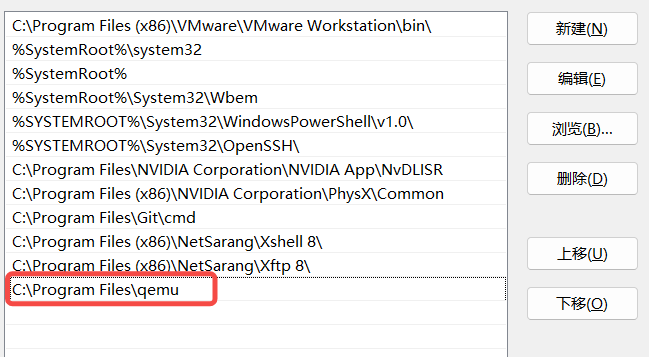

# 1. 准备工具

## 1.1. 下载 QEMU

https://qemu.weilnetz.de/w64/

添加环境变量



## 1.2. 下载固件

https://releases.linaro.org/components/kernel/uefi-linaro/16.02/release/qemu64/

中的 QEMU_EFI.fd

## 1.3. 虚拟网卡工具

https://build.openvpn.net/downloads/releases/tap-windows-9.24.7-I601-Win10.exe

## 1.4. Kylin 操作系统

银河麒麟服务器操作系统 V10 SP3 x86_64 版 2403（兆芯/海光）

https://iso.kylinos.cn/web_pungi/download/cdn/9D2GPNhvxfsF3BpmRbJjlKu0dowkAc4i/Kylin-Server-V10-SP3-2403-Release-20240426-x86_64.iso

```shell
magnet:?xt=urn:btih:GVSUMKN3Y4AWHI6S7HNERCQY27N4FPGY&dn=Kylin-Server-V10-SP3-2403-Release-20240426-x86_64.iso&tr=http%3A%2F%2Fwx.kylinos.cn%3A46969%2Fannounce&tr=udp%3A%2F%2Fwx.kylinos.cn%3A46969%2Fannounce&xl=4696293376
```

银河麒麟服务器操作系统 V10 SP3 aarch64 版 2403（飞腾/鲲鹏）

https://iso.kylinos.cn/web_pungi/download/cdn/ni3tIfZoEKLDglszRXvh9WymuwOT5r6M/Kylin-Server-V10-SP3-2403-Release-20240426-arm64.iso

```shell
magnet:?xt=urn:btih:MFT4Y6HFZU2GIRH44I2CHZWUIOKHQ23M&dn=Kylin-Server-V10-SP3-General-Release-2303-ARM64.iso&tr=http%3A%2F%2Fwx.kylinos.cn%3A46969%2Fannounce&tr=udp%3A%2F%2Fwx.kylinos.cn%3A46969%2Fannounce&xl=4415842304
```

银河麒麟服务器操作系统 V10 SP3_loongarch64 版 2403（龙芯3B5000）

https://iso.kylinos.cn/web_pungi/download/cdn/tLh71VaxXSoTDP8yBz4YnrMZlmk3QvGJ/Kylin-Server-V10-SP3-2403-Release-20240426-loongarch64.iso

```shell
magnet:?xt=urn:btih:6L4AERU7B3JWFO7O5Q5HM5IAVJTQ6PZP&dn=Kylin-Server-V10-SP3-2403-Release-20240426-loongarch64.iso&tr=http%3A%2F%2Fwx.kylinos.cn%3A46969%2Fannounce&tr=udp%3A%2F%2Fwx.kylinos.cn%3A46969%2Fannounce&xl=4386215936
```

