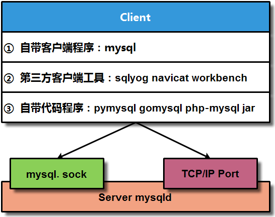
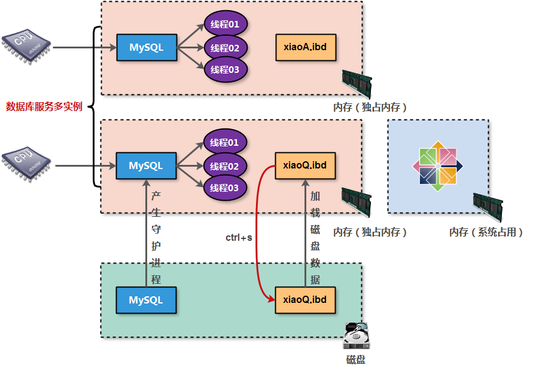
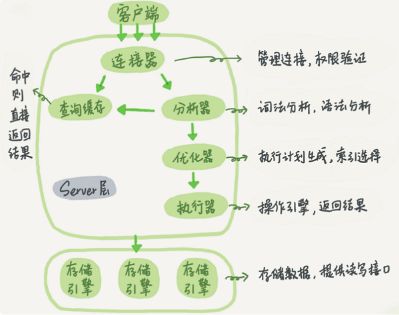
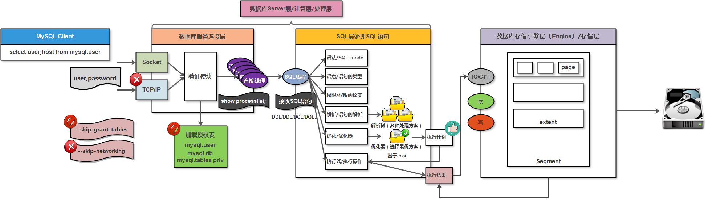

# 1. 数据库服务工作模型

数据库服务采用 C/S（客户端 / 服务端） 架构，通过 Socket（套接字） 与 TCP/IP 协议建立通信连接。

客户端主要分为三类工具，用于不同角色与场景：

| 序号 | 客户端工具类型                 | 相关软件 / 命令示例                                     |
| :--- | :----------------------------- | :------------------------------------------------------ |
| 01   | 数据库自带客户端命令（管理员） | `mysql`、`mysqladmin`、`mysqldump`                      |
| 02   | 第三方图形化客户端（开发人员） | SQLyog、Navicat、MySQL Workbench                        |
| 03   | 应用程序连接器（API 层）       | `pymysql`、`gomysql`、`php-mysql`、`libmysqlclient.jar` |

服务端核心进程负责处理客户端连接请求：

| 序号 | 服务端进程 | 备注说明                                              |
| :--- | :--------- | :---------------------------------------------------- |
| 01   | `mysqld`   | 数据库服务主进程，监听并处理所有客户端连接与 SQL 请求 |

客户端与服务端的连接分为两种方式：

| 序号 | 连接方式 | 备注说明                                                    |
| :--- | :------- | :---------------------------------------------------------- |
| 01   | 本地连接 | 基于 Unix Socket 文件实现，仅适用于客户端与服务端在同一机器 |
| 02   | 远程连接 | 基于 TCP/IP 网络协议实现，支持跨主机 / 网络的远程访问       |

图形化展示：



# 2. 数据库服务实例构成

数据库服务实例就是程序运行工作的一种方式，会占用一定的内存资源和 CPU 资源，并且会派生出多个线程完成不同的任务需求；

MySQL 实例 = mysqld + master thread 监控管理 + 具体干活的 thread + 预分配的内存结构

mysql 实例就是占用内存资源的统称，利用 mysql 实例可以对数据进行处理；



# 3. 数据库服务程序结构

数据库语句的执行过程



⼤体来说，MySQL 可以分为 Server 层和存储引擎层两部分：

**服务层（Server）**该层汇聚了 MySQL 的绝大多数核心服务组件，涵盖连接器、查询缓存、SQL 分析器、优化器与执行器等关键模块。同时，MySQL 所有内置函数（如日期时间运算、数学计算、加密解密函数等）均在此层实现。此外，所有跨存储引擎的通用功能，包括存储过程、触发器、视图等，也统一由服务层提供支持。

**存储引擎层（Engine）**存储引擎层专门负责数据的底层存储与读取操作，整体采用插件式架构设计，灵活支持 InnoDB、MyISAM、Memory 等多款主流存储引擎。其中，InnoDB 是当前应用最广泛的存储引擎，自 MySQL 5.5.5 版本起正式成为默认存储引擎。实际建表时，若执行 `CREATE TABLE` 语句未手动指定引擎类型，系统将默认采用 InnoDB；也可主动自定义引擎，例如通过 `ENGINE=MEMORY` 语法指定内存存储引擎创建数据表。不同存储引擎的数据存取机制、性能特性及功能支持差异显著，后续将详细讲解不同业务场景下的引擎选型技巧。

SQL 执行的全部流程：



## 3.1. 连接器

第⼀步，语句执⾏前会先连接到数据库服务上，这时候处理连接请求的就是连接器；连接器负责和客户端端建⽴连接、 获取权限、 维持和管理连接， 连接请求命令⼀般书写为：

```Bash
mysql -h$ip -P$port -u$user -p
```

输完命令之后， 就需要在交互对话⾥⾯输⼊密码。 虽然密码也可以直接跟在 -p 后⾯写在命令⾏中， 但这样可能会导致你的密码泄露。如果连接的是⽣产服务器， 强烈建议不要这么做。

连接命令中的 mysql 是客户端工具，用来跟服务端建立连接。在完成经典的 TCP 握手后，连接器就要开始认证客户端的身份；这个时候验证的就是输入的用户名和密码。

- 如果用户名密码验证失败：就会收到一个 Access denied for user 的错误，然后客户端程序结束执行。
- 如果用户名密码验证成功：连接器会到权限表里面查出你拥有的权限。之后，这个连接里面的权限判断逻辑，都将依赖于此时读到的权限。

这就意味着，一个用户成功建立连接后，即使用管理员账号对这个用户的权限做了修改，也不会影响已经存在连接的权限。修改完成后，只有再新建的连接才会使用新的权限设置。

连接完成后，如果没有后续的动作，这个连接就处于空闲状态，可以在 `show processlist `命令中看到它。其中的 Command 列显示为 “Sleep” 的这一行，就表示现在系统里面有一个空闲连接。

客户端如果太长时间没动静，连接器就会自动将它断开。这个时间是由参数 wait_timeout 控制的，默认值是 8 小时。如果在连接被断开之后，客户端再次发送请求的话，就会收到一个错误提醒：Lost connection to MySQL ser ver during query

这时候如果你要继续，就需要重连，然后再执行请求了。

数据库里面网络连接方式：

- 长连接：是指连接成功后，如果客户端持续有请求，则一直使用同一个连接。
- 短连接：则是指每次执行完很少的几次查询就断开连接，下次查询再重新建立一个。

在数据库使用过程中，全部使用长连接后，可能会发现，有些时候 MySQL 占用内存涨得特别快；这是因为 MySQL 在执行过程中临时使用的内存是管理在连接对象里面的。这些资源会在连接断开的时候才释放。所以如果长连接累积下来，可能导致内存占用太大，被系统强行杀掉（OOM），从现象看就是 MySQL 异常重启了。

如何解决：

1. 定期断开长连接。使用一段时间，或者程序里面判断执行过一个占用内存的大查询后，断开连接，之后要查询再重连。
2. 如果用的是 MySQL 5.7 或更新版本，可以在每次执行一个比较大的操作后；通过执行 mysql_reset_connection 来重新初始化连接资源；这个过程不需要重连和重新做权限验证，但是会将连接恢复到刚刚创建完时的状态；

查询数据库服务最大并发连接数量：

```Bash
show variables like 'max_connections';
# 默认情况下， 数据库服务的连接线程最⼤数量值 151 ，但实际是 152 个连接数， 会额外预留⼀个让本地管理员进⾏连接； 
```

查看当前正在连接的客户端数量

```Bash
show status like 'Threads_connected';
```

查看所有连接详情（谁在连、在干嘛）

```Bash
show processlist;
```

临时修改

```Bash
set global max_connections = 1000;
```

永久修改

```TOML
[mysqld]
max_connections = 500
```

## 3.2. 连接缓存

连接建立完成后，就可以执行 select 语句了。执行逻辑就会来到第二步：查询缓存。

MySQL 拿到一个查询请求后，会先到查询缓存看看，之前是不是执行过这条语句。之前执行过的语句及其结果可能会以 key-value 对的形式，被直接缓存在内存中。

key 是查询的语句，value 是查询的结果；

- 如果查询能够直接在这个缓存中找到 key，那么这个 value 就会被直接返回给客户端。
- 如果语句不在查询缓存中，就会继续后面的执行阶段。执行完成后，执行结果会被存入查询缓存中。

综上所述，如果查询命中缓存，MySQL 不需要执行后面的复杂操作，就可以直接返回结果，这个效率会很高。

查询缓存的失效非常频繁，只要有对一个表的更新，这个表上所有的查询缓存都会被清空；

因此很可能你费劲地把结果存起来，还没使用呢，就被一个更新全清空了；对于更新压力大的数据库来说，查询缓存的命中率会非常低。

除非你的业务就是有一张静态表，很长时间才会更新一次；比如，一个系统配置表，那这张表上的查询才适合使用查询缓存。

MySQL 提供了一种 “按需使用” 的方式：可以将参数 query_cache_type 设置成 DEMAND，这样对于默认的 SQL 语句都不使用查询缓存。而对于确定要使用查询缓存的语句，可以用 SQL_CACHE 显式指定，像下面这个语句一样：

```TOML
mysql> select SQL_CACHE * from T where ID=10；
```

MySQL 8.0 版本直接将查询缓存的整块功能删掉了，也就是说 8.0 开始彻底没有这个功能了。

## 3.3.  分析器

如果没有命中查询缓存，就要开始真正执行语句了。首先，MySQL 需要知道你要做什么，因此需要对 SQL 语句做解析。

分析器先会做 “词法分析”：你输入的是由多个字符串和空格组成的一条 SQL 语句，MySQL 需要识别出里面的字符串分别是什么，代表什么。

MySQL 从你输入的 select 这个关键字识别出来，这是一个查询语句。它也要把字符串 “T” 识别成 “表名 T”，把字符串 “ID” 识别成 “列 ID”。

做完了这些识别以后，就要做 “语法分析”：根据词法分析的结果，语法分析器会根据语法规则，判断你输入的这个 SQL 语句是否满足 MySQL 语法。

如果你的语句不对，就会收到 “You have an error in your SQL syntax” 的错误提醒。

## 3.4. 优化器

经过了分析器，MySQL 就知道你要做什么了。在开始执行之前，还要先经过优化器的处理。

优化器是在表里面有多个索引的时候，决定使用哪个索引；或者在一个语句有多表关联（join）的时候，决定各个表的连接顺序。

比如你执行下面这样的语句，这个语句是执行两个表的 join：

```sql
select * 
from t1
join t2 on t1.id = t2.id
where t1.c = 10 and t2.d = 20;
```

- 既可以先从表 t1 里面取出 c=10 的记录的 ID 值，再根据 ID 值关联到表 t2，再判断 t2 里面 d 的值是否等于 20。
- 也可以先从表 t2 里面取出 d=20 的记录的 ID 值，再根据 ID 值关联到 t1，再判断 t1 里面 c 的值是否等于 10。

这两种执行方法的逻辑结果是一样的，但是执行的效率会有不同，而优化器的作用就是决定选择使用哪一个方案。

优化器阶段完成后，这个语句的执行方案就确定下来了，然后进入执行器阶段。

如果还有疑问，比如优化器是怎么选择索引的，有没有可能选择错等等，没关系，会在后面的文章中单独展开说明优化器的内容。

## 4.4. 执行器

MySQL 通过分析器知道了你要做什么，通过优化器知道了该怎么做，于是就进入了执行器阶段，开始执行语句。

开始执行的时候，要先判断一下你对这个表 T 有没有执行查询的权限，如果没有，就会返回没有权限的错误；

在工程实现上，如果命中查询缓存，会在查询缓存返回结果的时候，做权限验证。查询也会在优化器之前调用 precheck 验证权限：

```SQL
mysql> select * from T where ID=10; 
ERROR 1142 (42000): SELECT command denied to user 'b'@'localhost' for table 'T'
```

如果有权限，就打开表继续执行。打开表的时候，执行器就会根据表的引擎定义，去使用这个引擎提供的接口。

比如这个例子中的表 T 中，ID 字段没有索引，那么执行器的执行流程是这样的：

1. 调用 InnoDB 引擎接口取这个表的第一行，判断 ID 值是不是 10，如果不是则跳过，如果是则将这行存在结果集中；
2. 调用引擎接口取“下一行”，重复相同的判断逻辑，直到取到这个表的最后一行。
3. 执行器将上述遍历过程中所有满足条件的行组成的记录集作为结果集返回给客户端。

至此，这个语句就执行完成了。

对于有索引的表，执行的逻辑也差不多；

第一次调用的是“取满足条件的第一行”这个接口，之后循环取“满足条件的下一行”这个接口，这些接口都是引擎中已经定义好的；

会在数据库的慢查询日志中看到一个 rows_examined 的字段，表示这个语句执行过程中扫描了多少行。

这个值就是在执行器每次调用引擎获取数据行的时候累加的。

在有些场景下，执行器调用一次，在引擎内部则扫描了多行，因此引擎扫描行数跟 rows_examined 并不是完全相同的。

后面会专门有相关文章来讲存储引擎的内部机制，里面会有详细的说明。

# 4. 数据库逻辑结构

MySQL 逻辑结构概述： 

数据库服务中的逻辑结构是抽象出来的操作对象，因为数据库服务⽆法操作底层物理磁盘，需要通过管理逻辑结构，从⽽控制物理结构； 

在 MySQL 数据库服务中逻辑结构包括：数据库（相当于 Linux 系统的⽬录），数据表（相当于 Linux 系统的⽂件）； 

MySQL 逻辑结构特点： 

数据库构成：数据库名称 + 数据库属性信息； 

数据表构成：数据表名称 + 数据表的列字段 + 数据表的行记录 + 数据表属性信息（元数据信息）；

# 5. 数据库服务物理结构

宏观角度物理结构：就是数据库服务数据目录中的数据信息；

- 逻辑结构的库，从宏观角度对应的就是物理结构中的目录；
- 逻辑结构的表，从宏观角度对应的就是物理结构中的文件；（5.7 对应是myi-索引 frm-表结构 myd-数据行内容 8.0 对应是ibd）

微观角度物理结构：就是数据库服务存储引擎结构信息

数据库存储引擎结构信息说明：

| **结构信息**                  | **解释说明**                                                 |
| ----------------------------- | ------------------------------------------------------------ |
| 数据存储段概念（segment）     | 主要由多个区 / 簇构成，一般一个表对应就是一个段              |
| 数据存储区 / 簇概念（extent） | 主要由多个页组成，默认大小为：64 page（连续的）等价于 1M 大小（默认大小） |
| 数据存储页概念（page）        | 主要用于存储数据库表中的数据行信息，默认大小为 16KB（MySQL 最小 IO 单元） |