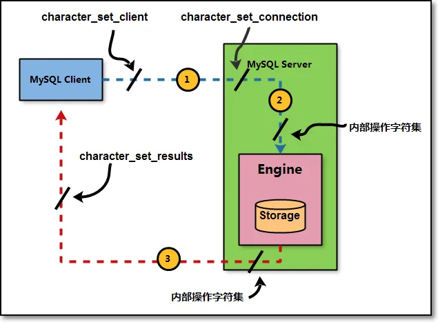

# 1. 数据库 SQL 语言分类

## 1.1. 什么是 SQL 语句？

SQL，全称为结构化查询语言（Structured Query Language），是一种专门用来操作和定义关系数据库的编程语言。它作为一种行业标准，得到了绝大多数关系型数据库管理系统的支持。

在实际应用中，通常遵循几项重要的SQL标准，如 SQL 89、SQL 92、SQL 99和SQL 03等。根据其功能与操作方式的不同，SQL语言通常可以细分为四大类型。

## 1.2. DDL（ Data Definition Language 数据定义语言）

- **核心语句**：`CREATE`（创建）、`ALTER`（修改）、`DROP`（删除）
- **功能**：负责管理数据库的基础数据（不会对表的内容修改），比如增删库、增删表、增删索引、增删用户等；
- **掌握人员**：DBA和运维人员必须精通。

```sql
? Data Definition;  -- 官方DDL语句类型所有相关命令
```

## 1.3. DCL （Data Control Language 数据控制语言）

- **核心语句**：`GRANT`（授权）、`REVOKE`（回收权限）、`COMMIT`（提交）、`ROLLBACK`（回滚）
- **功能**：主要用来定义访问权限和安全级别。
- **掌握人员**：主要由 DBA 负责。

```shell
? Account Management 
```

## 1.4. DML（Data Manipulation Language 数据操作语言）

- **核心语句**：`INSERT`（增）、`DELETE`（删）、`UPDATE`（改）、`SELECT`（查）
- **功能**：用于对数据库表中的**数据记录**进行增加、删除、修改和查询操作。
- **掌握人员**：**开发人员**必须精通，DBA和运维也需掌握。

```shell
? Data Manipulation
```

## 1.5. DQL （Data Query Language 数据查询语言）

- **核心语句**：`SELECT`
- **功能**：用于从数据库中查询、检索数据，是使用最频繁的语句。

# 2. 操作语句知识准备

## 2.1. 数据库字符集

在计算机内部无法直接存储“文字”，它存储和处理的是二进制数字。为了用数字表示字符，人们制定了各种“字符编码”规则，为每个字符分配一个唯一的数字编号。

- **ASCII码**：早期美国制定，用1个字节（8位二进制）表示一个字符，共256个，足以涵盖英文、数字和基本符号。
- **ANSI编码**：各国为表示本国语言，对ASCII进行了扩展。例如，中国的**GB2312**（简体中文，约6763汉字）和后来的**GBK**（扩展字库，约2.1万汉字），用2个字节表示一个汉字。类似地，台湾有Big5，日本有JIS编码。
- **Unicode（统一码）**：旨在统一全球所有字符，为每个字符分配一个唯一的编码。但其直接编码方案（如UCS-4）效率较低，一个英文字母也可能占用4个字节。
- **UTF-8**：这是Unicode的一种高效实现方式，是一种“可变长编码”。它根据字符的不同，智能地使用1到4个字节表示，例如英文字母占1字节，常用汉字占3字节。因其通用性和高效性，已成为互联网和开发中的主流编码标准。

在中文应用场景中，主要涉及两种字符集：

- **UTF-8**：国际通用，涵盖全球几乎所有语言文字。
- **GBK**：国家标准GB2312的扩展，主要涵盖汉字、日文片假名及常用符号。

在使用中文的网站或应用时，用户向数据库存储中文信息是十分常见的操作。然而，由于数据库服务默认的字符编码设置，常常会导致这些中文字符在存储或显示时出现乱码。

这一问题的根本原因在于，数据输入/显示的编码规则与数据库识别存储的编码规则不一致。因此，要确保中文信息被准确无误地处理，必须调整数据库服务的配置文件，将其默认字符编码设置为支持中文的正确格式（如UTF-8）。

### 2.1.1. 命令

查看字符集信息

```sql
show charset;

show variables like '%char%';
+--------------------------+----------------------------------------------------------------+
| Variable_name            | Value                                                          |
+--------------------------+----------------------------------------------------------------+
| character_set_client     | utf8mb4                                                        |
| character_set_connection | utf8mb4                                                        |
| character_set_database   | utf8mb4                                                        |
| character_set_filesystem | binary                                                         |
| character_set_results    | utf8mb4  -- 4字节  32  可以放表情                                      |
| character_set_server     | utf8mb4                                                        |
| character_set_system     | utf8mb3  -- 3字节  24 等于mysql 的 utf-8                                           |
| character_sets_dir       | /usr/local/mysql-8.0.26-linux-glibc2.12-x86_64/share/charsets/ |
+--------------------------+----------------------------------------------------------------+
```

数据库中字符设置参数信息说明

| **参数信息**             | **解释说明**                                                 |
| ------------------------ | ------------------------------------------------------------ |
| character_set_client     | 用来设置客户端使用的字符集                                   |
| character_set_connection | 用来设置连接数据库时的字符集。如果程序中没有指明连接数据库使用的字符集类型，则按照这个字符集设置。 |
| character_set_database   | 用来设置默认创建数据库的编码格式。如果在创建数据库时没有设置编码格式，就按照这个格式设置。 |
| character_set_filesystem | 文件系统的编码格式，把操作系统上的文件名转化成此字符集，即把 character_set_client 转换为 character_set_filesystem。默认为 binary，表示不做任何转换。 |
| character_set_results    | 数据库给客户端返回结果时使用的编码格式。如果没有指明，则使用服务器默认的编码格式。 |
| character_set_server     | 服务器安装时指定的默认编码格式。这个变量建议由系统自己管理，不要人为定义。 |
| character_set_system     | 数据库系统使用的编码格式，这个值一直是 utf8。不需要设置，它是为存储系统元数据的编码格式。 |
| character_sets_dir       | 这个变量是字符集安装的目录。                                 |

MySQL 服务器处理客户端请求时，字符集转换遵循以下清晰流程，这有助于理解各字符集参数的作用：



1. ***请求接收阶段***

服务器首先将接收到的请求数据，从 character_set_client 转换到 character_set_connection的字符集。

2. ***内部操作阶段***

- 在处理具体操作（如比较、计算、存储）前，数据会从 character_set_connection转换为内部操作字符集。其确定优先级依次为：
- 该数据字段定义中指定的 CHARACTER SET值。
- 若未指定，则使用所在数据表的字符集设置值。
- 若表未指定，则使用所在数据库的字符集设置值。
- 若数据库也未指定，则最终使用 character_set_server的设定值。

3. ***结果返回阶段***

操作完成后，服务器会将结果数据从内部操作字符集转换到 character_set_results所指定的字符集，再返回给客户端。

---

查看数据库/数据表字符集信息

```sql
show create database 库名;
use 库名;
show create table 表名;
```

数据库服务最新8.0版本的字符集信息为 utf8mb4。早期数据库服务版本字符集编码为latin1。

企业⽣产环境中，建议客户端与服务端字符集要统⼀；

设置默认字符集：

```shell
cat /etc/my.cnf
[mysql]
default-character-set=utf8mb4
[mysqld]
character-set-server=utf8mb4
```

设置数据库或数据表字符集 

```sql
CREATE DATABASE 库名 CHARACTER SET charset_name(字符集名称);
alter DATABASE 库名 CHARACTER SET charset_name(字符集名称);

CREATE TABLE 表名 (字段01 字段01类型 字段01约束或属性信息,字段02 字段02类型 字段02约束或属性信息) CHARACTER SET charset_name(字符集名称);
alter table 表名 CHARACTER SET charset_name(字符集名称);
```

### 2.1.2. 扩展：表中存在乱码，如何修复

步骤一：需要备份表中数据 （逻辑备份 mysqldump） 

步骤二：清理表中数据信息

步骤三：修改数据库或数据表字符集

步骤四：重新导入表中数据信息 （DML insert）

## 2.2. 数据库排序规则

字符编码校对规则，也常被称为排序规则，它定义了在进行字符串比较、排序和查询时，数据库所使用的具体规则。这决定了字符比较是基于其编码顺序还是直接的二进制值，以及是否区分大小写、重音等。

选择不同的排序规则，会直接影响数据查询的结果、排序的顺序以及字符串匹配的精度。

以 `utf8mb4`字符集为例，其常用的排序规则主要有以下三种：

**`utf8mb4_unicode_ci`**

- **特点**：基于完整的Unicode标准进行排序和比较，能够精确处理各种语言（如德语、法语、俄语等）中的特殊字符和变体字符，排序结果最符合国际化标准。
- **性能**：算法相对复杂，在多语言精确排序方面最准确，但速度略慢于 `general_ci`。

**`utf8mb4_general_ci`**

- **特点**：一种较为简化的通用排序规则，未严格实现Unicode的所有排序规则。在绝大多数仅涉及中文、英文的常见场景下，其排序结果与 `unicode_ci`一致且足够使用。仅在处理某些特殊语言字符时，结果可能不够精确。
- **性能**：算法相对简单，因此比较和排序的速度通常比 `unicode_ci`更快。

**`utf8mb4_bin`**

- **特点**：将每个字符直接按照其二进制编码进行比较。它**严格区分大小写**，并且能准确存储和比较二进制数据。所有比较都基于编码值，不涉及任何语言规则。

通常，utf8mb4_unicode_ci 在多语言支持上更精确，utf8mb4_general_ci 在常见场景下速度更快。

如果您的应用主要面向中文和英文，不涉及复杂的多语言排序需求，选择 utf8mb4_general_ci 即可在性能和准确性上获得良好平衡。

如果您的应用必须严格处理德语、法语、俄语等语言的排序，则应选择 utf8mb4_unicode_ci。

而 utf8mb4_bin则用于需要区分大小写或进行二进制精确比较的特殊场景。

### 2.2.1. 命令

查看所有校对规则信息，字符集对应默认校对规则。

```sql
show collation; 
```

排序规则后缀及其含义

| 排序规则后缀 | 解释说明                                |
| ------------ | --------------------------------------- |
| _ci          | 不区分大小写（Case-insensitive 的缩写） |
| _cs          | 区分大小写（Case-sensitive 的缩写）     |
| _ai          | 不区分重音（Accent-insensitive 的缩写） |
| _as          | 区分重音（Accent-sensitive 的缩写）     |
| _bin         | 采用二进制编码进行比较和存储            |

设置校对规则

```sql
-- 创建库设置
CREATE DATABASE 库名 CHARACTER SET charset_name(字符集名称) COLLATE collation_name(校对规则名称);
alter DATABASE 库名 CHARACTER SET charset_name(字符集名称) COLLATE collation_name(校对规则名称);

-- 创建表设置
CREATE TABLE 表名 (字段01 字段01类型 字段01约束或属性信息,字段02 字段02类型 字段02约束或属性信息) CHARACTER SET charset_name(字符集名称) COLLATE collation_name(校对规则名称);
alter table 表名 CHARACTER SET charset_name(字符集名称) COLLATE collation_name(校对规则名称);
```

# 3. 数据类型

- 保证写入数据信息合理性/有效性
- 保证存储数据占用磁盘空间合理性
- 保证索引结构合理性（更快调取数据）

## 3.1. 整数类型

| 数据类型    | 存储空间 | 有符号范围 (SIGNED)            | 无符号范围 (UNSIGNED) |
| ----------- | -------- | ------------------------------ | --------------------- |
| tinyint     | 1 字节   | -128 ~ 127                     | 0 ~ 255               |
| smallint    | 2 字节   | -32,768 ~ 32,767               | 0 ~ 65,535            |
| mediumint   | 3 字节   | -8,388,608 ~ 8,388,607         | 0 ~ 16,777,215        |
| int/integer | 4 字节   | -2,147,483,648 ~ 2,147,483,647 | 0 ~ 4,294,967,295     |
| bigint      | 8 字节   | -9.22×10¹⁸ ~ 9.22×10¹⁸         | 0 ~ 约 1.84×10¹⁹      |

- **选择原则**：应根据实际数据范围选择最合适的类型，以节省存储空间并提升性能。例如，`年龄`字段通常使用 `TINYINT UNSIGNED`（无符号，0~255）即可。
- **有符号 vs 无符号**：若确定数值不会为负，可添加 `UNSIGNED`关键字将范围上限提升约一倍（例如 `TINYINT UNSIGNED`范围为 0~255）。
- **性能影响**：更小的数据类型通常意味着更快的查询速度和更少的存储占用。

## 3.2. 浮点数类型

| 数据类型 | 存储空间 | 有效数字（近似精度） | 说明 (m, d) 参数                                             |
| -------- | -------- | -------------------- | ------------------------------------------------------------ |
| float    | 4 字节   | 约 7 位十进制数字    | FLOAT(m, d)：m 是总位数，d 是小数位数。（例如 FLOAT(5,2) 可存储 -999.99 ~ 999.99） |
| double   | 8 字节   | 约 15 位十进制数字   | DOUBLE(m, d)：m 是总位数，d 是小数位数。精度和范围比 FLOAT 更高。 |

**近似计算**

- **最重要**：`FLOAT` 和 `DOUBLE` 使用 IEEE 754 标准存储，是**二进制近似值**，并非绝对精确。这会导致某些十进制小数（如 0.1）无法精确表示，在连续计算（特别是财务计算）中可能产生微小的舍入误差。
- **绝对不应用于存储精确的货币金额**。

**精度与范围**

- **FLOAT**：单精度，范围约为 ±3.4E+38，精度约7位有效数字。
- **DOUBLE**：双精度，范围约为 ±1.8E+308，精度约15位有效数字。是许多科学计算和通用场景的默认选择。

**关于 (m, d) 参数**

- `m` 表示总位数（精度），`d` 表示小数位数（标度）。
- 在 MySQL 8.0.17 之后，`FLOAT(m,d)` 和 `DOUBLE(m,d)` 的用法已被弃用，未来版本将移除。官方建议仅使用 `FLOAT` 或 `DOUBLE` 来声明列，而不指定 `(m, d)`。若需控制显示格式，应在应用层处理。

> 科学数据、传感器读数、地理坐标、需要极大/极小范围的数据 float, double 存储效率高，计算速度快，可接受近似值。 
>
> 财务数据、货币金额、任何要求完全精确的数值计算 DECIMAL(M, D) 以字符串形式精确存储十进制数，完全避免舍入误差。
>
> 通用高精度浮点数计算 DOUBLE在精度和性能之间取得良好平衡。

## 3.3. 字符类型

基本字符类型：适合存储长度明确或较短的字符串（如姓名、标签、代码）。

| 类型       | 最大声明长度 (字符数)                  | 存储与特性                                                   | 存储开销                                        | 适用场景                                                     |
| :--------- | :------------------------------------- | :----------------------------------------------------------- | :---------------------------------------------- | :----------------------------------------------------------- |
| CHAR(n)    | 255                                    | 定长。存储时总分配 n 个字符的空间，不足部分用空格填充。检索时会去除尾部空格。 | 固定为 n * 字符集字节数。                       | 长度固定不变的数据，如性别(M/F)、状态码、MD5哈希值(32位)、邮编。 |
| VARCHAR(n) | 65,535 字符 (受行大小上限和字符集影响) | 变长。仅存储实际字符内容（+1~2字节记录长度）。存储和检索均保留尾部空格。 | 实际字符数 * 字符集字节数 + 长度标识(1~2字节)。 | 长度变化较大的数据，如用户名、文章标题、地址等绝大多数字符串字段。 |

**核心区别示例**：

- 定义 `CHAR(5)` 并存入 `'abc'`，实际存储为 `'abc '`（补2空格），始终占用5字符空间。
- 定义 `VARCHAR(5)` 并存入 `'abc'`，仅存储 `'abc'`，占用 3 字符空间 + 1 字节长度开销。

文本类型：用于存储较大的文本或二进制数据，拥有极高的容量上限。

| **类型**   | **最大存储容量 (字符数)**        | **大致等价文本量**       |
| :--------- | :------------------------------- | :----------------------- |
| TINYTEXT   | 255 字节 / 字符                  | 非常短的备注或摘要。     |
| TEXT       | 65,535 字节 / 字符 (64 KB)       | 一篇长文章。             |
| MEDIUMTEXT | 16,777,215 字节 / 字符 (16 MB)   | 一部中篇小说。           |
| LONGTEXT   | 4,294,967,295 字节 / 字符 (4 GB) | 超大型文本，如百科全书。 |

**注意**：上述容量单位为“字符”，但实际占用**字节数**取决于字符集（如 `utf8mb4` 中一个字符最多占4字节）。

字符集影响至关重要

- 上述“最大长度”指字符数，但实际占用磁盘和内存的字节数由字符集决定。
- 使用 `utf8mb4`（推荐，支持所有Unicode，包括表情符号）时，一个字符最多占用4字节。这意味着一个 `VARCHAR(255)` 列最多可能占用 255 * 4 + 长度标识 = ~1020 字节。

1. `CHAR` vs `VARCHAR` 如何选？
   - 用 `CHAR`：数据长度绝对固定（如身份证号、电话号码、定长代码）。定长结构在频繁更新时不易产生碎片，查询略快。
   - 用 `VARCHAR`：其他所有情况。变长存储能显著节省空间，是现代数据库设计的默认选择。
2. `VARCHAR(n)` vs `TEXT` 如何选？
   - 用 `VARCHAR`：当字符串长度相对可预测且通常小于几千字符时。它支持完整的索引，性能更优。
   - 用 `TEXT`：当需要存储段落、文章等可能很长的内容，或长度可能超过 65535 字符时。请注意，`TEXT` 列在排序、临时表创建等方面可能有性能考虑。
3. 关于 `BLOB` 类型
   - 除了 `TEXT` 系列，还有对应的 `BLOB`（`TINYBLOB`, `BLOB`, `MEDIUMBLOB`, `LONGBLOB`）系列用于存储二进制数据（如图片、音频文件等）。其容量与 `TEXT` 系列一一对应，区别在于 `BLOB` 以二进制字节串处理，无字符集概念。

最佳实践建议：对于普通的可变长度字符串，优先使用 `VARCHAR(n)`，并为 `n` 设置一个合理的、足够用的最大值。仅当存储文章、日志等大段文本时，才选择 `TEXT` 类型。

## 3.4. 时间类型

| 类型      | 含义                                                   |
| --------- | ------------------------------------------------------ |
| date      | 记录时间信息的年月日 ，'2008-12-2'                     |
| time      | 记录时间信息的小时分钟秒 ，'12:25:36'                  |
| datetime  | 记录时间信息的年月日 小时分钟秒 ，'2008-12-2 22:06:44' |
| timestamp | 记录时间戳信息，自动存储记录修改时间                   |

## 3.5. 特殊类型

Enum 

- 枚举类型 ，gender(男 女) `create table t1 (sex enum('boy','girl'));`

数据类型参考链接：https://www.php.cn/faq/460317.html

# 4. 约束属性设置

## 4.1. 约束设置

**约束设置**：通过约束确保数据的完整性和一致性，同时设置索引信息便于快速检索数据。

### 4.1.1 主键约束

PK（主键约束）：表示主键约束，具有非空且唯一的特性（一张表只能有一个主键）。常用于学号等唯一标识字段。

示例查询：`SELECT * FROM student WHERE 学号 = 'xxx'`

设置方法：

```sql
CREATE TABLE 表名 (
    字段01 数据类型 字段属性,
    字段02 数据类型 字段属性,
    ...
    约束信息
);

-- 示例：设置id为主键
CREATE TABLE `xiaoA`.`t1` (
    `id` INT NOT NULL,
    PRIMARY KEY (`id`)
);
```

### 4.1.2. 唯一约束

UK（唯一约束）：确保字段值的唯一性，但允许为空（空值可多个）。常用于手机号、身份证号等字段。

设置方法：

```sql
CREATE TABLE `xiaoA`.`t1` (
  `id` INT NOT NULL,
  `phone_num` CHAR(11) NULL,
  PRIMARY KEY (`id`),
  UNIQUE INDEX `phone_num_UNIQUE` (`phone_num`)
);
```

### 4.1.3. 非空约束

NN（非空约束）：确保字段值不能为空。常用于年龄、姓名等必填字段。

设置方法：

```sql
CREATE TABLE `xiaoA`.`t1` (
  `age` INT NOT NULL
);
```

### 4.1.4 外键约束

FK（外键约束）：用于建立多表之间的关联关系，保证数据的参照完整性。

概念说明：

- 外键：子表中的一个字段，指向父表的主键
- 父表（主表）：被引用的表
- 子表（附表）：包含外键的表

基本语法：`FOREIGN KEY (子表字段) REFERENCES 父表(父表主键)`

创建示例：

```sql
-- 创建父表（班级表）
CREATE TABLE class (
    id INT PRIMARY KEY AUTO_INCREMENT,
    name VARCHAR(10) NOT NULL COMMENT '班级名称',
    room VARCHAR(10) COMMENT '教室'
) CHARSET utf8;

-- 创建子表（学生表），添加外键约束
CREATE TABLE student (
    id INT PRIMARY KEY AUTO_INCREMENT,
    number CHAR(10) NOT NULL UNIQUE COMMENT '学号',
    name VARCHAR(10) NOT NULL COMMENT '姓名',
    c_id INT,
    FOREIGN KEY (c_id) REFERENCES class(id)
) CHARSET utf8;
```

数据操作约束：

- 插入数据：必须先向父表插入数据，再向子表插入数据（子表先插入会触发外键约束）
- 删除数据：必须先删除子表中的相关数据，再删除父表数据（父表先删除会触发外键约束）

## 4.2. 属性设置

属性设置：约束的补充功能，用于更精细地控制数据存储

### 4.2.1. AUTO_INCREMENT（自增属性）

自动生成递增的数值，通常配合主键使用。

设置方法：

```sql
CREATE TABLE `xiaoA`.`t1` (
  `id` INT NOT NULL AUTO_INCREMENT,  -- 设置自增
  `name` VARCHAR(10) NOT NULL,
  PRIMARY KEY (`id`)
);
```

扩展思考：如何设置自增起始值？自增的上限是多少？

```sql
ALTER TABLE student AUTO_INCREMENT = 100; 
-- 下次插入为 max(id)+1,
```

int：有符号21亿，无符号42亿

bigint：有符号922京，无符号1844京

### 4.2.2. DEFAULT（默认值属性）

字段设置默认值，当插入数据未指定该字段时自动填充。

设置方法：

```shell
ALTER TABLE `xiaoA`.`t1`
ADD COLUMN `num` VARCHAR(11) NOT NULL DEFAULT '000' AFTER `name`;
```

### 4.2.3. UNSIGNED（无符号属性）

限定数值字段只能为非负数（≥0）。

设置方法：

```sql
ALTER TABLE `xiaoA`.`t1` 
CHANGE COLUMN `age` `age` INT UNSIGNED NULL DEFAULT NULL;
```

### 4.2.4. COMMENT（注释属性）

为字段添加说明信息，便于维护和理解。

设置方法：

```sql
ALTER TABLE `xiaoA`.`t1` 
CHANGE COLUMN `num` `num` VARCHAR(11) NOT NULL COMMENT '用户手机号';
```

# 5. 数据库模式概念

MySQL 中有一个非常重要的配置项：**`sql_mode`**，它定义了 MySQL 应该支持哪些 SQL 语法以及应该执行何种数据验证检查，用于进一步保证数据存储的合理性和严谨性。

查看当前 sql_mode

```sql
mysql> SELECT @@sql_mode;
+-----------------------------------------------------------------------------------------------------------------------+
| @@sql_mode                                                                                                            |
+-----------------------------------------------------------------------------------------------------------------------+
| ONLY_FULL_GROUP_BY,STRICT_TRANS_TABLES,NO_ZERO_IN_DATE,NO_ZERO_DATE,ERROR_FOR_DIVISION_BY_ZERO,NO_ENGINE_SUBSTITUTION |
+-----------------------------------------------------------------------------------------------------------------------+
```

各模式的意思

| **模式**                   | **作用说明**                                                 | **实际意义**                                       |
| :------------------------- | :----------------------------------------------------------- | :------------------------------------------------- |
| NO_ZERO_IN_DATE            | 日期中的月、日不允许为 0                                     | 阻止写入 2024-00-15或 2024-06-00这样的无效日期     |
| NO_ZERO_DATE               | 不允许使用 '0000-00-00' 作为有效日期                         | 确保日期字段必须有实际意义的时间值                 |
| ONLY_FULL_GROUP_BY         | GROUP BY 分组查询时，SELECT 的字段必须在 GROUP BY 中出现或是聚合函数 | 避免分组查询结果出现歧义，保证结果确定性的关键设置 |
| ERROR_FOR_DIVISION_BY_ZERO | 除数为 0 时直接报错，而不是返回 NULL                         | 保证数据运算的严谨性，避免业务逻辑错误             |
| STRICT_TRANS_TABLES        | 启用事务表的严格模式，数据截断或无效值会报错                 | 禁止静默截断字符串，保证数据完整性                 |
| NO_ENGINE_SUBSTITUTION     | 指定的存储引擎不可用时直接报错，而不是自动替换               | 避免因引擎替换导致的潜在问题                       |
