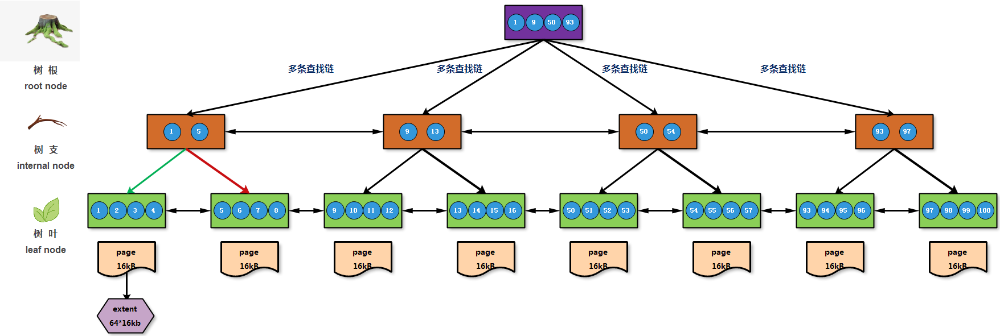
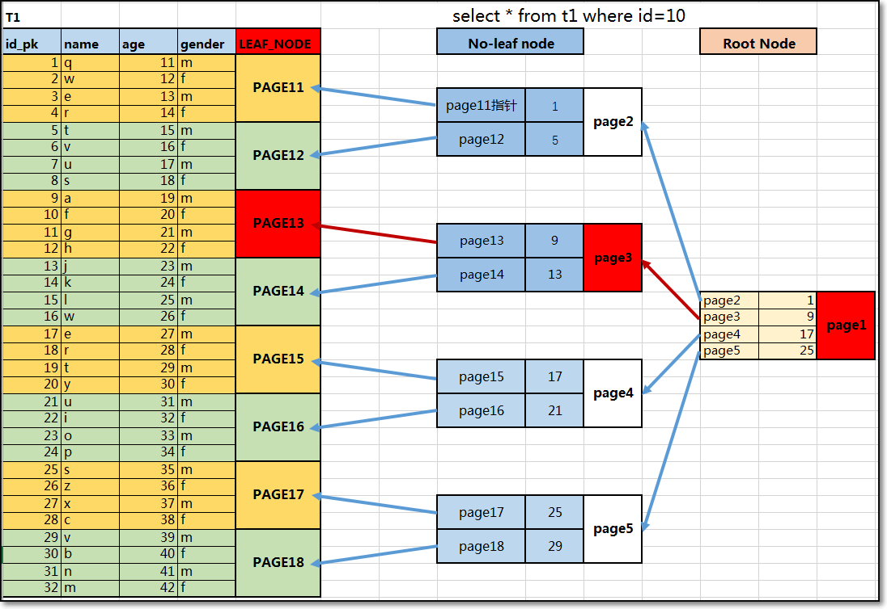
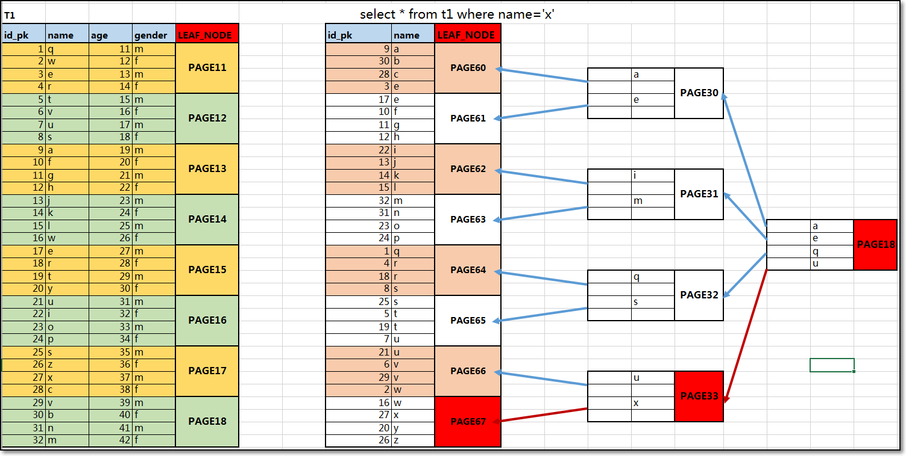

# 1. 数据库索引相关概念

索引概念介绍：

索引是数据库中用来提高数据读取性能的常用工具，所有 mysql 列类型都可以被索引，对相关列使用索引，可以是提高 select 操作性能的最佳途径，可以尽可能快的锁定要查询数据的范围，从而达到加速查询的目的（减少 IO 消耗）；

一般索引设置都是应用在比较大的数据表上，比如百万级别、千万级别或亿级别的数据表中，从而完成一些针对性优化；

可以简单理解：

数据库索引相当于书的目录，可以借助索引有针对的查看相应数据的信息，避免了全盘检索带来的工作量；

主要利用 MySQL 中的索引，可以快速锁定查询范围，mysql 索引比较适合范围查找数据；

# 2. 数据库索引类型介绍

B+Tree  ：擅于等值和区间查询数据 

Hash      ：擅于等值查询数据           

R+Tree  ：擅于区间查询数据

Fulltext：擅于过滤查询数据，条件设置 like %ab% ，搜索引擎  技术博文资料  

# 3. 索引结构模型

## 3.1. hash

索引方式是一种以键-值（key-value）存储数据的结构，只要输入待查找的键即 key，就可以找到其对应的值即 value；

哈希表这种结构适用于只有等值查询的场景，比如 Memcached 及其他一些 NoSQL 引擎。

## 3.2. 有序数组模型  

可以根据存储数据信息，将数据进行有序的连续存储，可以进行范围查询数据

也可以进行等值查询数据，采用二分法等值查询数据，在查询过程中时间代价成本更高；

有序数组索引只适用于静态存储引擎，比如你要保存的是 2017 年某个城市的所有人口信息，这类不会再修改的数据。

## 3.3. 树型模型

二叉搜索树数据检索模型，存储数据信息特点

- 父节点左子树所有结点的值小于父节点的值；
- 父节点右子树所有结点的值大于父节点的值；

其他树形模型 

二叉数 -->二叉搜索树 --> 二叉搜索树 --> 红黑树 --> Btree --> B+tree --> B++tree

举例：游戏

准备 100 个箱子，某一个箱子中放置了 100 元；100 行数据   找寻的数据

奖励标准：

1. 谁能更快速的找到有 100 元箱子  10s 
2. 谁打开的箱子少

每个人会有不同找寻 100 元箱子的方法策略 ，检索算法

### 3.3.1. 遍历查找数据

问题：IO 消耗 时间消耗 最多

### 3.3.2. 二叉树查找数据

```Bash
          50
     30         60
15       45  55     75
# 特殊情况下
17
   18
      19
             20
```

问题：

-  查询数据信息时，消耗 IO 和时间代价不均衡
- 构建基础二叉树时，也会出现结构不均衡情况

### 3.3.3. 红黑树（尽量让树形结构更加平衡）

可以将数据信息用红色和黑色信息进行标记，尽量让树形层次中，左右分支中出现均衡的颜色信息

解决了二叉树结构均衡性 ，避免了树形结构高度

### 3.3.4. Btree （多叉树）

每个节点中会存储多个数据信息，可以改善树形结构高度，从而减少 IO 消耗

### 3.3.5. B+tree （多叉树）

出现了标准的树形层次结构： 

根节点层次（root） 支节点层次（no-leaf node 非页节点层次）  页节点（page node 页节点层次）

根节点和非页节点中只存储数据索引信息，不会存储数据信息

页节点中会存储索引信息和完整数据信息

保证数据查询的 IO 消耗均衡  等值查询  范围查询数据



# 4. 索引构建过程

## 4.1. 聚簇索引

将多个簇（区 -64 个数据页 -1M）聚集在一起就构成了所谓聚簇索引，也可以称之为主键索引；

聚簇索引建立：

- 数据表创建时，显示的构建了主键信息（pk），主键（pk）就是聚簇索引；
- 数据表创建时，没有显示的构建主键信息时，会将第一个不为空的 UK 的列做为聚簇索引；
- 数据表创建时，以上条件都不符合时，生成一个 6 字节的隐藏列作为聚簇索引；

建议创建任意数据表时，必须要显示的设置主键索引列（聚簇索引）



一般情况下，可以将主键列信息设置为自增序列（非空且唯一），数据分布式存储例外， id 重复问题

1. 按照 ID 的逻辑顺序，将数据行有序地存放在同一个区中连续的数据页上；
2. 存放数据行的数据页，直接作为聚簇索引的叶子节点，也就是说，**聚簇索引的叶子节点就是全部的数据行本身**
3. 叶子节点构建完成后，再构建非叶子（支）节点，这些节点用于存储叶子节点对应的 ID 范围和指向叶子节点的指针信息；
4. 非叶子节点构建完成后，最后构建根节点，根节点用于存储非叶子节点对应的 ID 范围和指向非叶子节点的指针信息；
5. 同时，所有叶子节点之间、相邻的非叶子数据页之间，都维护着**双向指针**，以此加速数据的范围查询操作。

## 4.2. 辅助索引

主要用于辅助聚簇索引查询的索引，一般按照业务查找条件，建立合理的索引信息，也可以称之为一般索引；

辅助索引的构建方式：

- 数据表创建时，显示的构建了一般索引信息（mul），一般索引信息（mul）就是辅助索引；
- 数据表创建时，没有显示的构建一般索引信息时，在查询检索指定数据信息，会进行全表扫描查找数据；



1. 提取需要创建的辅助索引列信息，并拼接对应的主键列全部信息，将这些数据存储到指定的内存区域中；
2. 基于提取的辅助索引列信息进行字符顺序排序，以便形成范围查询的区间，再将排序后的数据存入指定的数据页；
3. 叶子节点构建完成后，构建非叶子（支）节点，用于存储叶子节点中的字符范围和指针信息；
4. 非叶子节点构建完成后，构建根节点，用于存储非叶子节点中的字符范围和指针信息
5. 查找到对应的辅助索引数据后，根据辅助索引与聚簇索引的关联关系，获取到对应的主键信息，进而查询到其他完整数据；

### 4.2.1. 辅助索引检索数据产生回表问题分析（回表次数越少性能越高）

产生问题：

回表过程中可能出现多次回表操作，导致磁盘 IOPS 升高（因为回表属于随机 IO 操作）；

回表过程中可能出现多次回表操作，导致磁盘 IO 总量增加。

解决方法：

建立联合索引，优化查询条件，让辅助索引过滤出更精确的主键 ID 信息，减少回表查询次数；

控制查询字段，实现覆盖索引，让辅助索引完全覆盖所需查询结果，避免回表；

调整优化器算法，开启 MRR（多路读功能）、ICP（索引下推功能）

### 4.2.2. 构建索引树高度问题分析（索引树高度越低性能越好）

数据行数量会影响索引树高度（3 层 B 树通常可存储 2000 万行、20～30 列的数据索引）；

解决方法：采用分表、分库或分布式存储方案。

索引字段长度过大会影响索引树高度；

解决方法：使用前缀索引进行优化。

数据类型设置不合理会影响索引树高度；

解决方法：定义字段时，选择长度合适、占用空间小的数据类型。

# 5. 索引应用方法

## 5.1. 聚簇索引配置

```sql
# 创建表时
create table t1 (id int,name varchar(10),age int,primary key (id));

# 添加索引信息
alter table t1 add primary key (id);

# 查看索引信息
desc t1;
show index from t1;

# 删除索引信息
alter table t1 drop primary key;
```

## 5.2. 辅助索引配置

```sql
# 创建普通索引 
# 创建表时
create table t1 (id int,name varchar(10),age int,index (name));
# 添加索引信息 
alter table t1 add index (name);

# 创建唯一索引
# 创建表时
create table t1 (id int,name varchar(10),age int,unique index (name));
create table t1 (id int,name varchar(10),age int,unique index xiaoQ(name));

#添加索引信息 
alter table t1 add unique index xiaoQ(name);

# 创建前缀索引（避免索引树结构层次过高）
create table t1 (id int,name varchar(10),age int,index (name(5)));

# 添加索引信息 
alter table t1 add index xiaoA(name(7));

# 创建联合索引（减少回表次数）
create table t1 (id int,name varchar(10),age int,index name_age(name,age));

alter table t1 add index name_age(name,age);

# 注意观察：Seq_in_index 字段，seq_in_index 显示联合索引列顺序信息，一般创建联合索引时，会将最左列作为联合索引的第一列，索引树结构会根据第一列信息创建索引树


# 删除索引
alter table t1 drop index 索引名称;
```