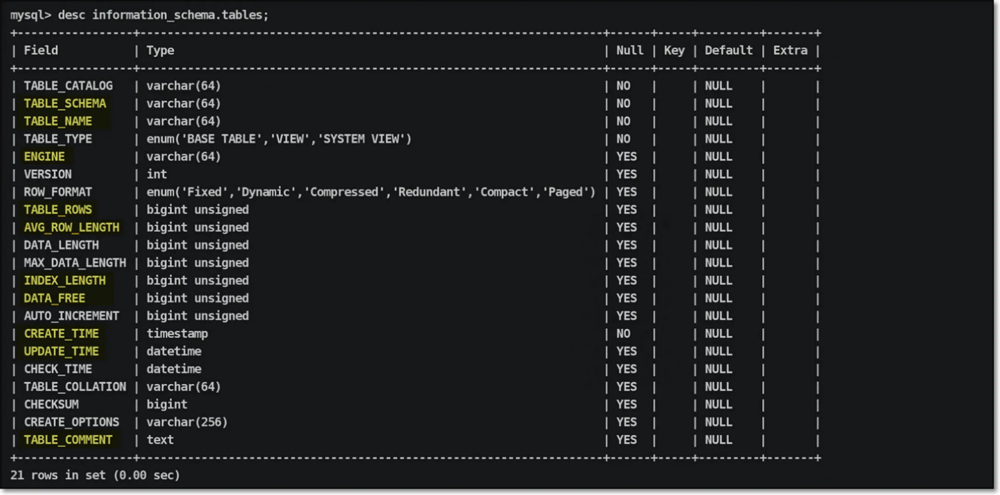

# 1. 数据库元数据概述

数据库元数据是**描述数据的数据**，即除了实际业务数据外的所有系统级信息。这包括表结构、索引信息、存储引擎、权限设置、数据库配置等系统层面信息。元数据如同数据库的"说明书"，帮助数据库系统理解如何管理和操作数据。

# 2. 元数据信息变化

- 数据库服务重启时

- 当视图中涉及的基础表有大量数据变更时

# 3. 数据库中数据表碎片概念

## 3.1. 碎片产生的原因与影响

**表碎片**是指数据在磁盘上存储不连续的现象，主要影响：

1. **性能影响**：碎片导致随机I/O增加，查询效率降低
2. **空间浪费**：删除数据后磁盘空间无法有效回收
3. **内存效率**：增加缓冲池管理的复杂性

## 3.2. 数据存储效率对比

| **存储方式** | **I/O类型** | **效率等级** | **描述**                   |
| :----------- | :---------- | :----------- | :------------------------- |
| 连续扇区存储 | 连续I/O     | ★★★★★        | 数据连续存储，读写效率最高 |
| 部分连续存储 | 混合I/O     | ★★★☆☆        | 有部分碎片，效率中等       |
| 间隔存储     | 随机I/O     | ★☆☆☆☆        | 数据分散存储，效率最低     |

# 4. 查看元数据方法

## 4.1. 使用 show 命令（快速但功能有限）

```SQL
-- 数据库信息
SHOW DATABASES;
SHOW CREATE DATABASE db_name;
SELECT DATABASE();  -- 当前数据库

-- 表信息
SHOW TABLES;
SHOW TABLES FROM mysql;
SHOW CREATE TABLE table_name;
DESC table_name;  -- 表结构
SHOW COLUMNS FROM table_name;

-- 状态与性能
SHOW TABLE STATUS FROM db_name;
SHOW INDEX FROM table_name;
SHOW PROCESSLIST;  -- 当前连接进程
SHOW FULL PROCESSLIST;  -- 详细信息

-- 权限与配置
SHOW GRANTS FOR user@'host';
SHOW VARIABLES;  -- 系统变量
SHOW VARIABLES LIKE '%buffer%';  -- 过滤查询
SHOW STATUS;  -- 运行状态
SHOW STATUS LIKE '%lock%';

-- 复制与日志
SHOW BINARY LOGS;
SHOW MASTER STATUS;
SHOW BINLOG EVENTS IN 'binlog.000001';
SHOW ENGINE INNODB STATUS \G;  -- InnoDB状态
SHOW SLAVE STATUS;  -- 主从复制状态
```

> 说明：使用show语句虽然可以快速得到相应的数据库元数据信息，但是查询功能过于单一，想查询全面信息，就需要执行多条语句；

## 4.2. 使用 select 查询（灵活强大）

视图概念：

将查询基表元数据语句信息方法封装在一个变量或别名中，这个封装好的变量或别名就成为视图，视图信息都是存储在内存中的表。

元数据信息存储在系统基表中，通过一般的 select 命令只能查看数据信息，不能查看到系统基表，以免被随意调整篡改；

而查询基表的语句过于复杂，可以将整个查询基表语句定义为一个视图信息（等价于别名/变量），调取视图等价于调取查询基表语句；information_schema 库中的内存表都是每次数据库服务启动时生成的，里面存储了查询元数据基表的视图信息；

```SQL
select a.tname as '老师名',group_concat(d.sname)  as '不及格学生名'
from teacher as a
join course as b
on a.tno=b.tno 
join sc as c
on b.cno=c.cno 
join student as d
on c.sno=d.sno 
where c.score<60 
group by a.tno;  -- 别名 创建视图 

create view oldboy as select a.tname as '老师名',group_concat(d.sname)  as '不及格学生名'
from teacher as a
join course as b
on a.tno=b.tno 
join sc as c
on b.cno=c.cno 
join student as d
on c.sno=d.sno 
where c.score<60 
group by a.tno;
```

利用视图查询元信息

- 查看 information_schema 的视图表

```SQL
use information_schema;
show tables ;
show create view tables ;

-- 查看information_scheam中的tables表的结构信息；
desc information_schema.tables ;
```



关注的信息

| **字段名**     | **解释说明**               |
| -------------- | -------------------------- |
| TABLE_SCHEMA   | 表示数据表所属库的名称信息 |
| TABLE_NAME     | 表示数据库中所有数据表名称 |
| ENGINE         | 表示数据库服务中的引擎信息 |
| TABLE_ROWS     | 表示数据库相应数据表的行数 |
| AVG_ROW_LENGTH | 表示数据表中每行的平均长度 |
| INDEX_LENGTH   | 表示数据表中索引信息的长度 |
| DATA_FREE      | 表示数据库服务碎片数量信息 |
| CREATE_TIME    | 表示数据表创建的时间戳信息 |
| UPDATE_TIME    | 表示数据表修改的时间戳信息 |
| TABLE_COMMENT  | 表示数据表对应所有注释信息 |

# 5. 数据库资产管理实践

- 获取相应数据库中表的个数，与数据库中拥有的表信息

```SQL
select table_schema,count( * ),group_concat(table_name) from information_schema.tables group by table_schema;
select table_schema,count( * ),group_concat(table_name) from information_schema.tables where table_schema not in ('mysql','sys ','performance_schema','information_') group by table_schema;
```

- 统计数据库资产信息（数据资产），获取每个数据库数据占用磁盘空间

```SQL
select table_schema, sum(table_rows*avg_row_length+index_length)/1024/1024 from information_schema.tables where table_schema not in
('mysql','sys ','performance_schema','information_schema') group by table_schema;
```

- 统计数据库资产信息（数据资产），获取具有碎片信息的表

```SQL
select table_schema,table_name 
from information_schema.tables 
where table_schema not in ('mysql','sys','performance_schema','information_schema') and data_free >0 ;
```

优化碎片：

不同的存储引擎，进行碎片优化的方法会有所不同

```SQL
-- 统计数据库资产信息（数据资产），处理具有碎片信息的表
alter table t1 engine=innodb;

-- 批量碎片优化
select concat("alter table ",table_schema,".",table_name," engine=innodb; ") 
from information_schema.tables 
where table_schema not in ('mysql','sys','performance_schema','information_schema') and data_free >0;


mysql > select concat( "alter table ",table_schema,".",table_name," engine=innodb; " ) 
from information_schema.tables
where table_schema not in ('mysql','sys ','performance_schema','information_schema') and data_free >0
into outfile '/tmp/date_free.sql'; 

mysql > source /tmp/date_free.sql
```

- 统计数据库资产信息（数据资产），获取数据库中非innodb表信息

```SQL
select table_schema,table_name,engine
from information_schema.tables
where table_schema not in ('mysql','sys ','performance_schema','information_') and engine!='innodb';

mysql > select concat("alter table ",table_schema,".",table_name," engine=innodb;") 
from information_schema.tables 
where table_schema not in ('mysql','sys','performance_schema','information_schema') and  engine!='innodb' 
into outfile '/tmp/alter.sql'; 

 mysql > source /tmp/alter.sql
```

> ERROR 1290 (HY000): The MySQL ser ver i s running with the -- secure-file-priv option so it cannot execute thi s statement 
>
> vim /etc/my.cnf
>
> [mysqld]
>
> secure-file-priv=/tmp
>
> -- 修改配置文件参数信息，实现将数据库操作的数据信息导入到系统文件中，配置完毕重启数据库服务
>
> mysql> source /tmp/alter. sql
>
> -- 可以对不是innodb存储引擎的表做操作，实现数据表批量化引擎修改，调用数据库脚本信息