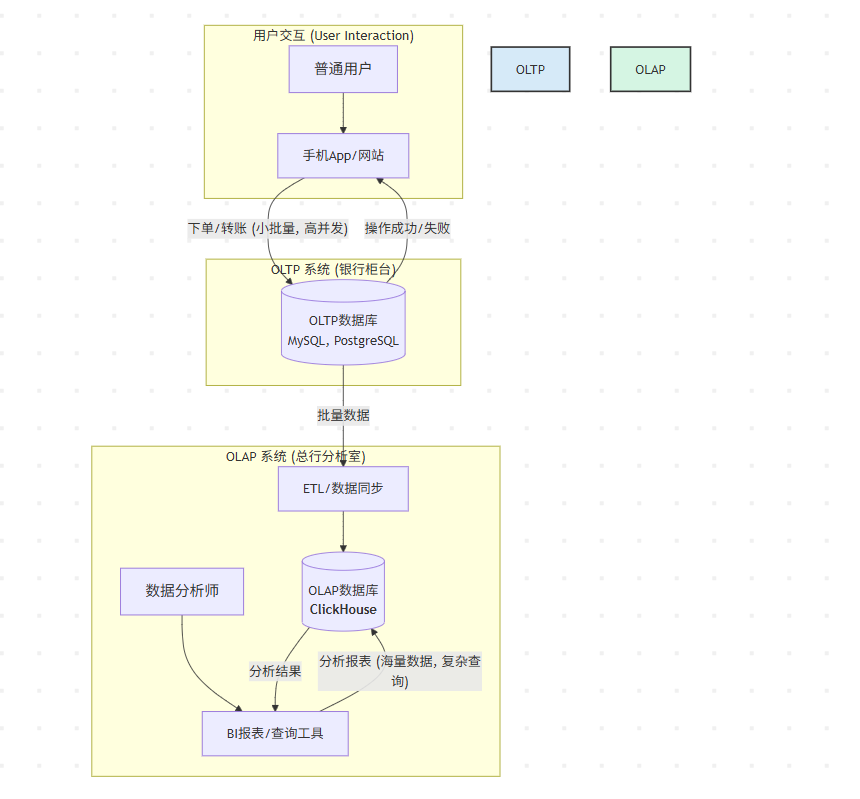

# 1. 什么是 OLAP？
OLAP 的全称是 Online Analytical Processing，即 联机分析处理。它是一种让你能够从不同角度、快速地对大量数据进行分析、查询和报告的技术。它的核心目标不是处理单笔交易，而是支持复杂的分析操作，帮助用户发现数据中的趋势、模式和洞察。

它的核心价值在于：
- 快速响应：让复杂的分析查询能在几秒或几分钟内返回结果。
- 多维分析：让用户能自由地从不同业务维度探索数据。
- 赋能业务：让不懂技术的业务人员也能通过简单的拖拽（下钻、旋转等）进行自助式数据分析，从而做出更明智的业务决策。

# 2. OLAP vs. OLTP 场景对比 (交易处理 vs. 分析处理)
- 现代数据分析的挑战：海量、高速、多维

总结一下它们的区别：

| 特性     | OLTP (在线事务处理)          | OLAP (在线分析处理)                 |
| -------- | ---------------------------- | ----------------------------------- |
| 关注点   | 单笔交易、数据操作(CU)       | 宏观趋势、数据分析                  |
| 操作类型 | 增、删、改、查 (CRUD)        | 大范围的复杂查询 (聚合、分组)       |
| 数据量   | 操作少量数据，通常是几行     | 一次性扫描数百万、数十亿行          |
| 响应时间 | 毫秒级                       | 秒级到分钟级                        |
| 并发     | 高并发                       | 并发量相对较低                      |
| 典型系统 | 关系型数据库 (MySQL, Oracle) | 分析型数据库 (ClickHouse), 数据仓库 |

现代数据分析的挑战就是，**数据量越来越大（TB/PB级）、分析维度越来越多、对实时性的要求越来越高。**传统的解决方案（比如在 MySQL 上跑复杂 `GROUP BY`）已经力不从心，这就是 ClickHouse 等 OLAP 数据库大展身手的舞台。

# 3. Clickhouse 闪亮登场

>* ClickHouse 官方定义：“Blazingly Fast, Open Source, Column-Oriented SQL Database”
>* 核心特性：列式存储、向量化执行、数据压缩、MPP 架构
>* 典型应用场景：用户行为分析、日志与指标监控、BI报表、广告与推荐系统

既然 OLAP 这么重要，那 ClickHouse 又是如何成为这个领域的佼佼者的呢？它的官方口号是：“**Blazingly Fast, Open Source, Column-Oriented SQL Database**”。我们来拆解一下它的“超能力”。

1. **列式存储 (Column-Oriented): 核心秘密武器** 想象一下，我们有一张用户表，包含 `用户ID`, `姓名`, `城市`, `年龄`。

> - **行式存储 (如 MySQL):** 数据是按行存放在磁盘上的，像一本名册。 `[1, '张三', '北京', 30], [2, '李四', '上海', 25], [3, '王五', '北京', 35]`
> - **列式存储 (ClickHouse):** 数据是按列存放在一起的。 `[1, 2, 3], ['张三', '李四', '王五'], ['北京', '上海', '北京'], [30, 25, 35]`
>
> **问题：** 如果我们要计算所有用户的平均年龄，哪种存储方式更快？ **答案：** 显然是列式存储！它只需要读取“年龄”那一列的数据，而行式存储必须把每一行所有的数据都读到内存里，再把不需要的字段丢掉，浪费了大量的 I/O。

.png)

2. **向量化执行 (Vectorized Execution):** 这就像一个高效的工厂流水线。传统数据库是一个个地处理数据（标量执行），而 ClickHouse 是一批批地处理（向量化执行）。它一次性从列中取出一整块数据（一个向量），然后在这个数据块上执行计算，极大地减少了函数调用开销，充分利用了 CPU 的 SIMD 指令。
3. **超高的数据压缩率:** 因为同一列的数据类型相同，具有相似性，所以更容易被压缩。比如一列都是城市名，很多重复值。ClickHouse 默认使用 **`LZ4`** 压缩算法，可以达到很高的压缩比，进一步减少 I/O。
4. **MPP 架构:** 在集群模式下，一个查询会被打散到多台机器（**分片**）上并行执行，最后再汇总结果。人多力量大！

**典型应用场景:**

> - **用户行为分析:** 网站/App 的点击流分析、漏斗分析、留存分析。
> - **日志与指标监控:** 服务器、应用日志的实时查询与聚合。
> - **BI 报表:** 为 Tableau, Superset, Grafana 等 BI 工具提供高速后端。
> - **广告与推荐:** 广告曝光、点击数据的实时分析。

# 4. ClickHouse 架构概览

## 4.1. 单节点架构 vs. 分布式集群架构

ClickHouse 可以单兵作战，也可以集团军出击。

1. **单节点架构 (Single Node):** 这是最简单的模式，所有数据存储和计算都在一台服务器上完成。非常适合学习、开发或中小型数据量的场景。

.png)

2. **分布式集群架构 (Distributed Cluster):**

 这是生产环境的标配。它通过**分片 (Sharding)** 和 **副本 (Replication)** 来实现高可用和水平扩展。

- **分片 (Shard):** 将数据水平切分，分布在不同的节点上，以提高查询性能。（把一本厚书撕成几份，让几个人同时看）
- **副本 (Replica):** 每个分片的数据都有一个或多个备份，保证在一个节点宕机时，服务依然可用。（给每个人看的书都复印一份，防止有人弄丢了）
- **ZooKeeper:** 在集群中扮演着“协调者”的角色，负责管理副本之间的数据同步和一致性。

.png)

## 4.2. 客户端/服务器模型

想象一下去一家高级餐厅吃饭的过程。

> - **你 (Client/客户端):** 你是顾客，你想点一道“澳洲和牛配黑松露”。你不需要知道牛是怎么养的，也不需要知道黑松露是怎么挖的，你只需要用菜单（SQL语言）下达你的指令。
> - **餐厅厨房 (Server/服务器):** 这是 ClickHouse Server。它接收你的订单（SQL 查询），然后厨师们（ClickHouse 核心引擎）开始忙碌：从冷库（磁盘）里取出食材（数据），经过一系列复杂的烹饪（计算、聚合、排序），最后把一道精美的菜肴（查询结果）端给你。
>
> 这就是 **客户端/服务器 (C/S)** 模型。我们用来与 ClickHouse 交互的任何工具，无论是命令行工具 `clickhouse-client`、图形化界面的 DBeaver，还是我们程序代码中的一个库，都扮演着“客户端”的角色。它们通过网络，使用特定的“语言”（协议）与 ClickHouse 服务器进行通信。
>
> **主要通信协议:**
>
> - **TCP 协议 (Native Protocol):** 这是 `clickhouse-client` 和大多数驱动程序使用的默认方式，性能最高，就像餐厅的内部专用通道，效率极快。
> - **HTTP/HTTPS 协议:** ClickHouse 也提供了一个像网站一样的 HTTP 接口，你可以用任何能发网络请求的工具（比如浏览器或者 `curl`）来查询它，非常灵活，就像餐厅的外卖窗口。

.png)

## 4.3. ZooKeeper 的角色（在复制和分布式 DDL 中的作用）

**ZooKeeper** 对于 ClickHouse 集群来说，不是用来存储海量业务数据的，而是用来存储**元数据（Metadata）和协调任务**的。它就像是整个餐饮集团的“董事会”或者“中央计划委员会”，不参与具体做菜，但负责制定规则和同步信息。

**它的核心作用有两个：**

1. **数据复制 (Replication):** 当你在一个副本上 `INSERT` 一批新数据时，过程是这样的：
   1.  该副本把“我插入了某某数据块”这个**操作日志**，发布到 ZooKeeper 的一个共享任务队列里。 
   2. 同一个分片下的其他副本，一直在“监听”这个队列。
   3. 它们看到新任务后，就会从那个副本那里把对应的数据块拉过来，应用到自己身上。 通过这种方式，ZooKeeper 确保了所有副本的数据最终都是一致的。

.png)

2. **分布式 DDL (Distributed DDL - Data Definition Language):** 当你需要在整个集群上创建一个新表时（例如 `CREATE TABLE ... ON CLUSTER my_cluster`），你不可能手动去每个节点上都执行一遍。 a. 你只需要在一个节点上执行这个 `ON CLUSTER` 命令。 b. 这个节点会把“请在 my_cluster 集群上创建这张表”这个**DDL任务**，提交到 ZooKeeper 的一个全局任务队列里。 c. 集群里的**每一个节点**都会监听这个队列，看到新任务后，各自在本地执行这个 `CREATE TABLE` 命令。 这样就保证了整个集群的表结构是一致的。

> **总结一下 ZooKeeper:** 它不存业务数据，但它维护了集群的“生命线”——**一致性**和**协调性**。没有它，分布式集群就是一盘散沙。

# 5. 横向对比：ClickHouse vs. 其他技术

| 技术栈        | 定位                         | 形象比喻 |
| ------------- | ---------------------------- | -------- |
| ClickHouse    | 高性能OLAP分析               | F1赛车   |
| MySQL/PG      | OLTP，通用关系型数据库       | 家用轿车 |
| Elasticsearch | 全文搜索与轻量级分析         | 越野摩托 |
| Hadoop/Spark  | 超大规模批处理与通用计算框架 | 重型货轮 |

**一句话总结:**

- 当你的核心诉求是**对海量结构化数据做极速的聚合分析**时，首选 ClickHouse。
- 不要用 ClickHouse 来做高并发的单行 `UPDATE` 或 `DELETE`，这不是它的强项。

# 6. 生态版图：开源版 vs. ClickHouse Cloud

- 开源自建的优势与挑战 
- ClickHouse Cloud 介绍：Serverless、自动扩缩容、托管服务 
- 实践: 注册并体验 ClickHouse Cloud Playground

