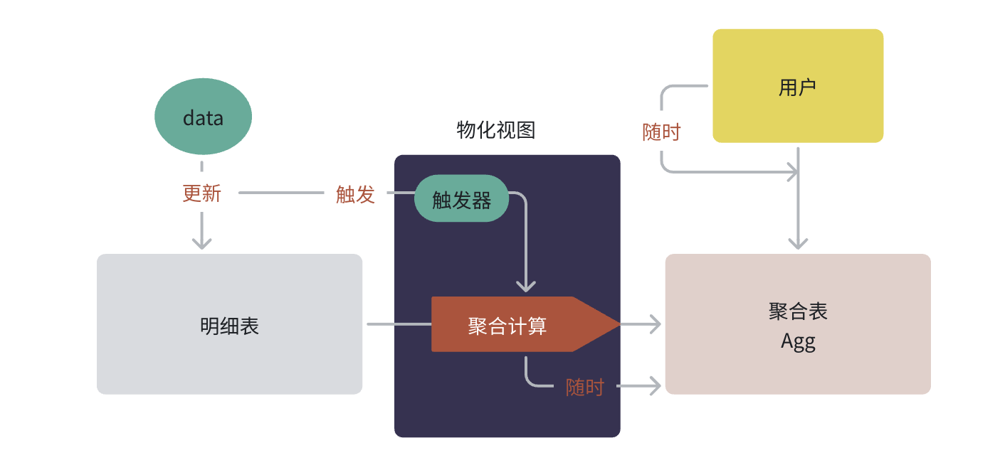
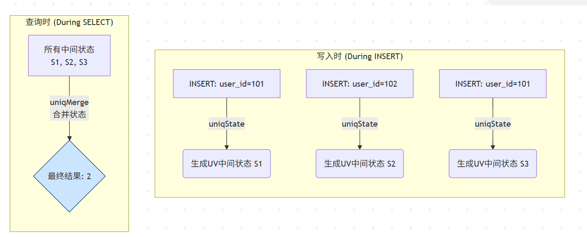
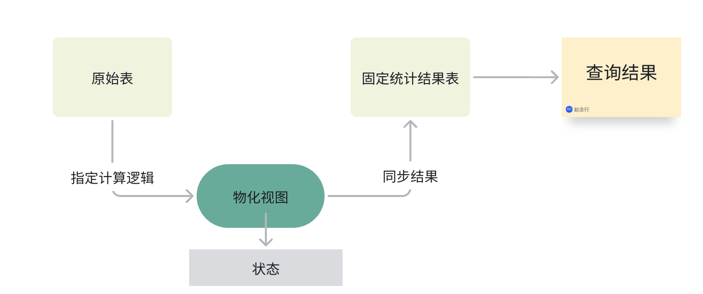
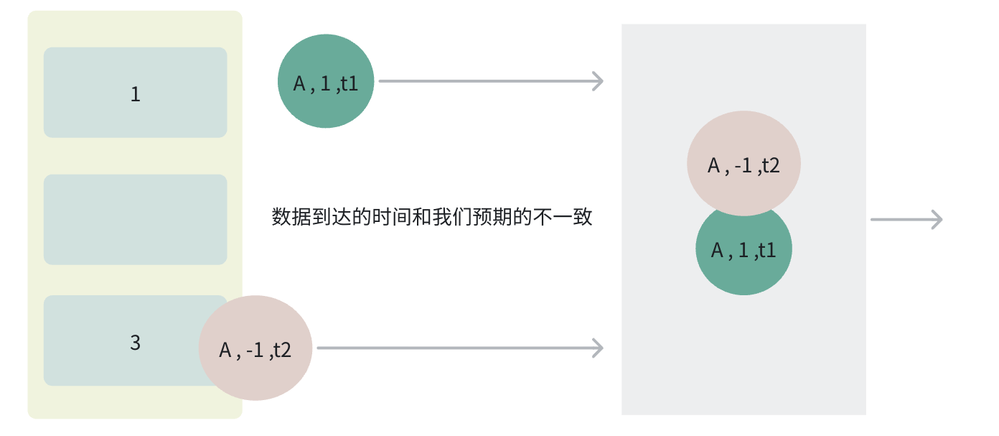

# 1. 表引擎简介：ClickHouse 的心脏

**为什么需要表引擎？** 在传统数据库中，数据的存储和管理方式通常是固定的。但 ClickHouse 面对的场景千变万化：有时是海量的、需要长期保存的日志数据；有时是临时的、用完即弃的中间数据；有时数据甚至不在 ClickHouse 本身，而是在远端的 Kafka 或 S3 上。

为了应对这些多样化的需求，ClickHouse 聪明地将**“数据如何存储和管理”**这个功能，做成了一个个可插拔的模块，这就是**表引擎**。

**生动的比喻：不同材质的储物箱**

- **`MergeTree`** **引擎:** 一个带有自动整理、压缩、打标签功能的**智能保险柜**。适合存放最重要、最庞大的核心数据。
- **`Log`** **引擎:** 一个普通的**纸箱**。东西可以快速扔进去，但找起来很麻烦，也没有整理功能。适合存放临时、不重要的小批量数据。
- **`Memory`** **引擎:** 一个放在桌面上的**透明托盘**。存取速度极快，但电脑一关机（服务重启），里面的东西就全没了。适合存放需要高速访问的临时数据。
- **`Kafka`** **引擎:** 一个神奇的**传送带**。它本身不存储东西，而是直接连接到 Kafka 的生产线，让你能实时看到生产线上的物品。"数据联邦"

# 2. 王者家族：MergeTree

大家好！在上一章，我们学会了驾驶 ClickHouse 这辆“F1赛车”，并成功地在数据赛道上跑了几圈。我们当时创建了一张表，用了一个叫做 ENGINE = MergeTree() 的东西。 大家有没有想过，为什么 ClickHouse 的 CREATE TABLE 语句里，ENGINE 是一个必填项，而在我们熟悉的 MySQL 中却可以省略（默认 InnoDB）？

 这就是今天我们要探索的核心秘密：**表引擎 (Table Engine)**。如果说 ClickHouse 是一辆赛车，那么表引擎就是它的**发动机**。不同的发动机，决定了这辆车是适合跑直线加速赛，还是适合跑崎岖的山路拉力赛。 今天，我们将一起打开发动机盖，深入研究 ClickHouse 最强大、最核心的“V12涡轮增压发动机”—— **MergeTree 家族**。理解了它，你就掌握了 ClickHouse 80% 的性能奥秘！

`MergeTree` 及其变种，是 ClickHouse 中最先进、功能最强大的表引擎，专为海量数据的插入和高性能分析而设计。几乎所有生产环境的核心业务表都应该使用 `MergeTree` 家族。

```sql
CREATE TABLE learning.t_web_hits
( ... )
ENGINE = MergeTree()
PARTITION BY toYYYYMM(timestamp) -- 分区键
ORDER BY (timestamp, user_id);   -- 排序键/主键
```

## 2.1. 分区 (Partition) & 数据片段 (Data Part)

- 分区 (PARTITION BY): 就像一个大书柜里，按照年份把书分成不同的格子（例如 2022年、2023年）。当你查询 WHERE toYYYYMM(timestamp) = 202310 时，ClickHouse 只需要打开 202310 这个分区格子，极大地减少了扫描范围。
- 数据片段 (Data Part): 每次 INSERT 操作，ClickHouse 都会生成一个新的、独立的数据片段 (Part)，存储在对应的分区目录下。每个 Part 都是一小组按列存储的文件，并且内部已经按照 ORDER BY 的规则排好序了。

.png)

## 2.2. 主键/排序键 (Primary Key / `ORDER BY`) 与稀疏索引

- **`ORDER BY`** **才是真正的“指挥官”**: 它规定了每个数据片段内部的数据物理排序规则。**这是 ClickHouse 查询性能的灵魂！**
- **主键 (Primary Key):** 在 `MergeTree` 中，主键就是 `ORDER BY` 定义的键（或者其前缀）。但它和 MySQL 的主键完全不同！它不是唯一的，而是用来创建**稀疏索引 (Sparse Index)** ——其实就是跳表的。
- **稀疏索引的工作方式:** 想象一本很厚的英文字典。
  - **MySQL (密集索引):** 目录里有书中**每一个单词**及它所在的页码。
  - **ClickHouse (稀疏索引):** 目录里只有**每隔10页的第一个单词**及页码（比如 A, An, Apple...）。如果你要找 `Ant`，索引会告诉你“它在 `An` 和 `Apple` 之间”，你只需要去扫描这两页之间的少量数据，而不用翻整本字典。

.png)

这个索引文件很小，可以常驻内存，查找极快。这就是为什么**选择正确的** **`ORDER BY`** **键至关重要**的原因。你应该把你最常用于 `WHERE` 条件过滤的列放在 `ORDER BY` 的最前面。

## 2.3. 合并 (Merge Process)

随着 `INSERT` 次数增多，小的 `Data Part` 会越来越多，这会影响查询性能（因为查询时需要聚合所有 Part 的结果）。ClickHouse 后台有一个**合并线程(手动合并)**，会定期地、智能地选择同一个分区内的一些小 Part，把它们合并成一个更大的、有序的新 Part，然后删除掉旧的 Part。

这个过程就是 `MergeTree` 名字的由来：**它在后台不断地合并（Merge）数据，形成一棵更加健康的“数据之树 (Tree)”**。

# 3. 表引擎

## 3.1. 什么是表引擎？

- **定义**：表引擎决定了数据的存储方式、存储位置、并发访问支持（读/写）、索引支持、多线程请求以及数据复制等。它就像是表的“驱动程序”。
- **与传统数据库对比**：MySQL 有 InnoDB, MyISAM 等；ClickHouse 则提供了几十种，核心思想是“专事专办”，为不同场景提供最优解。
- **查看所有支持的引擎**：

```sql
SHOW ENGINES;
```

 **表引擎的四大分类**

- **MergeTree 家族**：ClickHouse 的核心，用于海量数据分析。
- **Log 家族**：用于轻量级、快速写入的临时数据场景。
- **Integration 引擎**：用于与外部系统（如 MySQL, Kafka, S3）集成。
- **Special 引擎**：用于特殊用途（如 Memory, Distributed, MaterializedView）。

## 3.2. log 家族（轻量级数据写入）

Log 家族是 ClickHouse 中最简单的表引擎，适用于那些"一次写入、多次读取"的轻量级场景。它们的设计目标是快速地将数据追加到磁盘，结构非常简单。

核心特点：

- **不支持索引**：无法利用索引进行快速查询。
- **并发写锁定**：当有写操作时，表会被锁定，所有读写操作都会被阻塞，因此不适合高并发写入。
- **原子性写入**：数据写入是原子性的，要么成功，要么失败。
- **追加式写入**：数据总是以块的形式追加到文件末尾。

适用场景：

- 临时存储中间计算结果。
- 小批量、非核心业务的日志快速写入。
- 数据量不大（通常建议百万行以下）的配置表或元数据表。
- **警告**：绝对不要在生产环境的核心分析业务中使用 Log 家族引擎！

最简单的引擎，它将每一列数据存储在不同的压缩文件中。没有并发控制，适合单线程写入。

```sql
-- 创建一个 TinyLog 表
CREATE TABLE tiny_log_table (
    timestamp DateTime,
    level String,
    message String
) ENGINE = TinyLog;

-- 插入数据
INSERT INTO tiny_log_table VALUES (now(), 'INFO', 'User logged in') ;
INSERT INTO tiny_log_table VALUES (now(), 'WARN', 'Disk space is low') ;

-- 查询数据 (会进行全表扫描)
SELECT * FROM tiny_log_table WHERE level = 'WARN';
-rw-r-----. 1 clickhouse clickhouse 124 Jul 29 18:05 level.bin
-rw-r-----. 1 clickhouse clickhouse 174 Jul 29 18:05 message.bin
-rw-r-----. 1 clickhouse clickhouse 109 Jul 29 18:05 sizes.json
-rw-r-----. 1 clickhouse clickhouse 120 Jul 29 18:05 timestamp.bin
```

表的每列以文件的形式存储，插入数据的时候就是将数据追加到对应的列文件后面。

Log 和 StripeLog 是 TinyLog 的改进版。它们额外包含一个小型的元数据文件（__marks.mrk），记录了每个数据块的偏移量。这使得它们可以支持并发读取，并且在读取时可以跳过数据块，性能略好于 TinyLog。

- Log: 适合处理大量小记录。
- StripeLog: 将所有数据存储在一个文件中，更适合处理列数较多、包含大字段的表。

## 3.3. MergeTree家族

| [MergeTree](https://clickhouse.com/docs/engines/table-engines/mergetree-family/mergetree) | MergeTree-family table engines are designed for high data ingest rates and huge data volumes. |
| ------------------------------------------------------------ | ------------------------------------------------------------ |
| [Data Replication](https://clickhouse.com/docs/engines/table-engines/mergetree-family/replication) | Overview of Data Replication in ClickHouse                   |
| [Custom Partitioning Key](https://clickhouse.com/docs/engines/table-engines/mergetree-family/custom-partitioning-key) | Learn how to add a custom partitioning key to MergeTree tables. |
| [ReplacingMergeTree](https://clickhouse.com/docs/engines/table-engines/mergetree-family/replacingmergetree) | differs from MergeTree in that it removes duplicate entries with the same sorting key value (ORDER BY table section, not PRIMARY KEY). |
| [CoalescingMergeTree](https://clickhouse.com/docs/engines/table-engines/mergetree-family/coalescingmergetree) | CoalescingMergeTree inherits from the MergeTree engine. Its key feature is the ability to automatically store last non-null value of each column during part merges. |
| [SummingMergeTree](https://clickhouse.com/docs/engines/table-engines/mergetree-family/summingmergetree) | SummingMergeTree inherits from the MergeTree engine. Its key feature is the ability to automatically sum numeric data during part merges. |
| [AggregatingMergeTree](https://clickhouse.com/docs/engines/table-engines/mergetree-family/aggregatingmergetree) | Replaces all rows with the same primary key (or more accurately, with the same [sorting key](https://clickhouse.com/docs/engines/table-engines/mergetree-family/mergetree)) with a single row (within a single data part) that stores a combination of states of aggregate functions. |
| [CollapsingMergeTree](https://clickhouse.com/docs/engines/table-engines/mergetree-family/collapsingmergetree) | Inherits from MergeTree but adds logic for collapsing rows during the merge process. |
| [VersionedCollapsingMergeTree](https://clickhouse.com/docs/engines/table-engines/mergetree-family/versionedcollapsingmergetree) | Allows for quick writing of object states that are continually changing, and deleting old object states in the background. |
| [GraphiteMergeTree](https://clickhouse.com/docs/engines/table-engines/mergetree-family/graphitemergetree) | Designed for thinning and aggregating/averaging (rollup) Graphite data. |
| [Exact and Approximate Vector Search](https://clickhouse.com/docs/engines/table-engines/mergetree-family/annindexes) | Documentation for Exact and Approximate Vector Search        |
| [Full-text Search using Text Indexes](https://clickhouse.com/docs/engines/table-engines/mergetree-family/invertedindexes) | Quickly find search terms in text.                           |

### 3.2.1. 概述 (Overview)

MergeTree（合并树）家族是 ClickHouse 中最强大、最核心的表引擎，专为海量数据的高性能在线分析（OLAP）而设计。它是生产环境的首选。

### 3.3.2. Mermaid 图解核心原理：后台合并

MergeTree 的核心思想是将数据写入多个小的、有序的、不可变的数据部分（Data Parts），然后通过后台线程将这些小部分不断地合并（Merge）成更大的部分。


### 3.3.3 核心概念

- **主键与排序键 (ORDER BY)：物理排序键。**数据在磁盘上严格按照 ORDER BY 定义的列进行排序。这是稀疏索引的基础，也是性能的关键。
- **分区 (PARTITION BY)**：逻辑上将表数据拆分成不同的目录。便于数据管理，如快速删除旧分区 (ALTER TABLE ... DROP PARTITION)。
- **稀疏索引 (Primary Key)：基于排序键**，每隔N行（index_granularity）创建一个索引标记。查询时能快速定位到可能包含目标数据的“数据块”，极大减少需要扫描的数据量。
- ORDER BY 必须声明 , 如果只有 order by 字段 , 字段也是主键  可以使用 primary key 声明主键

### 3.3.4. MergeTree

**`MergeTree`** 引擎和 **`MergeTree`** 系列的其他引擎（例如 **`ReplacingMergeTree`**、**`AggregatingMergeTree`** ）是 ClickHouse 中最常用和最健壮的表引擎。

**`MergeTree`** 系列表引擎专为高数据摄取速率和巨大数据量而设计。插入作创建表部件，这些部件由后台进程与其他表部件合并。

**`MergeTree`** 系列表引擎的主要特性。

- 表的主键确定每个表部分（聚集索引）中的排序顺序。主键也不引用单个行，而是引用称为颗粒的 8192 行块。这使得大型数据集的主键足够小，可以继续加载在主内存中，同时仍然提供对磁盘数据的快速访问。
- 可以使用任意分区表达式对表进行分区。分区修剪可确保在查询允许时从读取中省略分区。
- 数据可以跨多个集群节点复制，以实现高可用性、故障转移和零停机升级。请参阅[数据复制 ](https://clickhouse.com/docs/engines/table-engines/mergetree-family/replication)。

- **`MergeTree`** 表引擎支持多种统计类型和采样方式，帮助查询优化。

```sql
CREATE TABLE [IF NOT EXISTS] [db.]table_name [ON CLUSTER cluster]
(
    name1 [type1] [[NOT] NULL] [DEFAULT|MATERIALIZED|ALIAS|EPHEMERAL expr1] [COMMENT ...] [CODEC(codec1)] [STATISTICS(stat1)] [TTL expr1] [PRIMARY KEY] [SETTINGS (name = value, ...)],
    name2 [type2] [[NOT] NULL] [DEFAULT|MATERIALIZED|ALIAS|EPHEMERAL expr2] [COMMENT ...] [CODEC(codec2)] [STATISTICS(stat2)] [TTL expr2] [PRIMARY KEY] [SETTINGS (name = value, ...)],
    ...
    INDEX index_name1 expr1 TYPE type1(...) [GRANULARITY value1],
    INDEX index_name2 expr2 TYPE type2(...) [GRANULARITY value2],
    ...
    PROJECTION projection_name_1 (SELECT <COLUMN LIST EXPR> [GROUP BY] [ORDER BY]),
    PROJECTION projection_name_2 (SELECT <COLUMN LIST EXPR> [GROUP BY] [ORDER BY])
) ENGINE = MergeTree()
ORDER BY expr
[PARTITION BY expr]
[PRIMARY KEY expr]
[SAMPLE BY expr]
[TTL expr
    [DELETE|TO DISK 'xxx'|TO VOLUME 'xxx' [, ...] ]
    [WHERE conditions]
    [GROUP BY key_expr [SET v1 = aggr_func(v1) [, v2 = aggr_func(v2) ...]] ] ]
[SETTINGS name = value, ...]
```

- **PARTITION BY [选填]**：分区键，用于指定表数据以何种标 准进行分区。分区键既可以是单个列字段，也可以通过元组的形式使 用多个列字段，同时它也支持使用列表达式。如果不声明分区键，则 ClickHouse 会生成一个名为 all 的分区。合理使用数据分区，可以有效减少查询时数据文件的扫描范围，更多关于数据分区的细节会在后面的小节中介绍。
- **ORDER BY [必填]**：**排序键，用于指定在一个数据片段内， 数据以何种标准排序。默认情况下主键（PRIMARY KEY）与排序键相同。排序键既可以是单个列字段，例如 ORDER BY CounterID，也可以通过元组的形式使用多个列字段，例如 ORDER BY（CounterID，EventDate）。当使用多个列字段排序时，以 ORDER BY（CounterID，EventDate）为例，在单个数据片段内，数据首先会以 CounterID 排序，相同 CounterID 的数据再按 EventDate 排序。
- **PRIMARY KEY [选填]**：主键，顾名思义，声明后会依照主键字段生成**一级索引**，用于加速表查询。默认情况下，主键与排序键 （ORDER BY）相同，所以通常直接使用 ORDER BY 代为指定主键，无须刻 意通过 PRIMARY KEY 声明。所以在一般情况下，在单个数据片段内，数据与一级索引以相同的规则升序排列。与其他数据库不同，MergeTree 主键允许存在重复数据（**ReplacingMergeTree** 可以去重）
- **SAMPLE BY [选填]**：抽样表达式，用于声明数据以何种标准进行采样。如果使用了此配置项，那么在主键的配置中也需要声明同样的表达式，例如：

```sql
...
(
...
) ENGINE = MergeTree() 
ORDER BY (CounterID, EventDate, intHash32(UserID)
SAMPLE BY intHash32(UserID) 
```

- **SETTINGS**：

  - **index_granularity [选填]**： index_granularity 对于 MergeTree 而言是一项非常重要的参数，它表示索引的粒度，默认值为8192。也就是说，MergeTree 的索引在默认情 况下，每间隔 8192 行数据才生成一条索引，其具体声明方式如下所示：

  - ```sql
    ...
    (
    ...
    ) ENGINE = MergeTree() 
    ... 
    SETTINGS index_granularity = 8192; 
    ```

  - 8192是一个神奇的数字，在 ClickHouse 中大量数值参数都有它的 影子，可以被其整除（例如最小压缩块大小 `min_compress_block_size:65536`）。通常情况下并不需要修改此参数，但理解它的工作原理有助于我们更好地使用 MergeTree。关于索引详细的工作原理会在后续阐述。
  - **index_granularity_bytes [选填]**：在 19.11 版本之前，ClickHouse 只支持固定大小的索引间隔，由 index_granularity 控制，默认为 8192。在新版本中，它增加了自适应间隔大小的特性，即根据每一批次写入数据的体量大小，动态划分间隔大小。而数据的体量大小，正是由 index_granularity_bytes 参数控制的，默认为10M(10×1024×1024)，设置为 0 表示不启动自适应功能。
  - **enable_mixed_granularity_parts [选填]**：设置是否开启自适应索引间隔的功能，默认开启。
  - **merge_with_ttl_timeout [选填]**：从 19.6 版本 开始，MergeTree 提供了数据TTL的功能，关于这部分的详细介绍，留到后续的小节介绍。
  - **storage_policy [选填]**：从 19.15 版本开始， MergeTree 提供了多路径的存储策略，关于这部分的详细介绍，留到后续的小节介绍。

```sql
-- 创建一个标准的 MergeTree 表
CREATE TABLE website_hits (
    EventDate Date,
    CounterID UInt32,
    UserID UInt64,
    URL String,
    Income UInt32
) ENGINE = MergeTree()
PARTITION BY toYYYYMM(EventDate) -- 按月分区
ORDER BY (CounterID, EventDate, UserID); -- 按站点ID,日期,用户ID排序

-- 插入数据
INSERT INTO website_hits VALUES ('2025-10-27', 1, 101, '/pageA', 10);
INSERT INTO website_hits VALUES ('2025-10-27', 1, 102, '/pageB', 0);

-- 高效查询 (利用了排序键)
SELECT count() FROM website_hits WHERE CounterID = 1 AND EventDate = '2025-10-27';

-- 手动合并数据
optimize table website_hits;
```

MergeTree 表引擎中的数据是拥有物理存储的，数据会按照分区目 录的形式保存到磁盘之上。

-2099101.png)

一张数据表的完整物理结构分为3个层级，依次是数据表目录、分区目录及各分区下具体的数据文件。接下来就逐一介绍它们的作用。

**Partition 分区**是ClickHouse MergeTree表引擎组织数据的基本单元。每个分区目录内包含该分区的所有列数据、索引及元数据文件。属于同一分区的数据最终会合并到同一个目录中，而不同分区的数据**永远不会被合并**。

1. 校验与元数据文件

| 文件              | 格式   | 说明                                                         |
| ----------------- | ------ | ------------------------------------------------------------ |
| **checksums.txt** | 二进制 | 校验文件，存储各文件（如 `primary.idx`、`count.txt` 等）的大小及哈希值，用于快速验证文件的完整性与正确性。 |
| **columns.txt**   | 明文   | 列信息文件，记录当前分区下所有列字段的名称与类型。           |
| **count.txt**     | 明文   | 行数计数文件，记录当前分区目录下的数据总行数。               |

2. 索引文件

| 文件                     | 格式   | 说明                                                         |
| ------------------------ | ------ | ------------------------------------------------------------ |
| **primary.idx**          | 二进制 | 一级索引（稀疏索引），由 `ORDER BY` 或 `PRIMARY KEY` 定义，每个表只能声明一个。用于在查询时快速跳过主键范围外的数据块，减少扫描范围。 |
| **minmax_[Column].idx**  | 二进制 | 分区键的极值索引，记录当前分区下某字段的原始数据最小值和最大值（例如 `EventDate` 的 `2019-05-01` 和 `2019-05-05`），与 `partition.dat` 配合使用，帮助快速跳过无关分区。 |
| **skp_idx_[Column].idx** | 二进制 | 二级索引（跳数索引）文件，支持 `minmax`、`set`、`ngrambf_v1`、`tokenbf_v1` 等类型。用于进一步缩小数据扫描范围，加速查询。 |

3. 数据文件

| 文件             | 格式                 | 说明                                                         |
| ---------------- | -------------------- | ------------------------------------------------------------ |
| **[Column].bin** | 压缩格式（默认 LZ4） | 列数据文件，每个列字段独立存储（如 `CounterID.bin`、`EventDate.bin`）。由于采用列式存储，查询时只需读取相关列的文件。 |
| **data.bin**     | 二进制压缩           | 通用的数据存储文件，与 `[Column].bin` 类似，常见于某些特定表引擎或场景。 |

4. 分区辅助文件

| 文件                    | 格式   | 说明                                                         |
| ----------------------- | ------ | ------------------------------------------------------------ |
| **partition.dat**       | 二进制 | 存储当前分区键表达式计算后的最终值。例如 `PARTITION BY toYYYYMM(EventDate)`，则保存值为 `2019-05`。 |
| **minmax_[Column].idx** | 二进制 | 记录当前分区内该字段的原始数据最小值和最大值（如 `2019-05-01` 和 `2019-05-05`）。通过此索引，查询时可快速跳过不匹配的分区目录。 |

5. 标记文件

| 文件                     | 格式   | 说明                                                         |
| ------------------------ | ------ | ------------------------------------------------------------ |
| **[Column].mrk**         | 二进制 | 列标记文件，记录每个数据块在 `.bin` 文件中的偏移量，用于快速定位数据。 |
| **skp_idx_[Column].mrk** | 二进制 | 二级索引的标记文件，与对应的 `.idx` 文件配合，用于索引数据的快速定位。 |

ClickHouse通过分区目录将数据、索引和元数据有序组织在一起。借助**稀疏索引**、**分区裁剪**和**二级跳数索引**等机制，能够在大规模数据场景下显著提升查询效率，同时保持列式存储的高压缩比和I/O优势。

### 3.3.5. ReplacingMergeTree

在后台合并时，对于排序键相同的行，只保留**最新**的版本。(去重)

这个引擎是在 MergeTree的基础上，添加了“处理重复数据”的功能，该引擎和MergeTree的不同之处在于它会删除具有相同主键的重复项。数据的去重只会在合并的过程中出现。合并会在未知的时间在后台进行，所以你无法预先作出计划。有一些数据可能仍未被处理。因此，ReplacingMergeTree 适用于在后台清除重复的数据以节省空间，但是它不保证没有重复的数据出现。

- **机制**：可以指定一个版本列（如 `timestamp` 或 `version`），保留版本最大的行；若不指定，则保留最后插入的行。
- **注意**：去重只在合并时发生，查询时可能仍会看到重复数据，直到 `OPTIMIZE ... FINAL` 执行完毕。

```sql
-- 创建一个带版本号的 ReplacingMergeTree 表
CREATE TABLE user_profiles (
    user_id UInt64,
    profile String,
    updated_ts DateTime
    --ReplacingMergeTree() 没有指定版本 , 按照数据插入时间进行判断取舍
) ENGINE = ReplacingMergeTree(updated_ts) -- updated_ts 是版本列
ORDER BY user_id;

-- 插入旧版本数据
INSERT INTO user_profiles VALUES (1, '{"city": "Beijing"}', '2025-01-01 10:00:00');
-- 插入新版本数据
INSERT INTO user_profiles VALUES (1, '{"city": "Shanghai"}', '2025-01-01 11:00:00');

-- 此时查询可能看到两条
SELECT * FROM user_profiles;

-- 强制合并
OPTIMIZE TABLE user_profiles FINAL;

-- 再次查询，只剩新版本
SELECT * FROM user_profiles;
```

### 3.3.6. SummingMergeTree

在后台合并时，对于排序键相同的行，会将所有**数值类型**的列进行累加。

```sql
-- 创建一个 SummingMergeTree 表
CREATE TABLE daily_stats (
    day Date,
    page_id UInt32,
    visits UInt64,
    clicks UInt64
) ENGINE = SummingMergeTree()
ORDER BY (day, page_id);

-- 插入多批数据
INSERT INTO daily_stats VALUES ('2025-10-27', 1001, 10, 1);
INSERT INTO daily_stats VALUES ('2025-10-27', 1001, 15, 3); 
INSERT INTO daily_stats VALUES ('2025-10-27', 1002, 8, 8); 
INSERT INTO daily_stats VALUES ('2025-10-27', 1002, 8, 8); 
INSERT INTO daily_stats VALUES ('2025-10-27', 1003, 9, 9); 
-- 同样 day 和 page_id-- 强制合并
OPTIMIZE TABLE daily_stats FINAL;

-- 查询结果是自动累加的
- visits 会变成 10 + 15 = 25
- clicks 会变成 1 + 3 = 4
SELECT * FROM daily_stats;
```

### 3.3.7. AggregatingMergeTree

当需要进行更复杂的预聚合（如 `avg`, `uniq`, `quantile`）时使用。

AggregatingMergeTree 就有些许**数据立方体**的意思，它能够在合并分区的时候，按照预先定义的条件聚合数据。同时，根据预先定义的聚合函数计算数据并通过**二进制的格式**存入表内。将同一分组下的多行数据聚合成一行，既减少了数据行，又降低了后续聚合查询的开销。可以说，AggregatingMergeTree 是**SummingMergeTree的升级版**，它们的许多设计思路是一致的，例如同时定义 ORDER BY与PRIMARY KEY的原因和目的。但是在使用方法上，两者存在明显差异，应该说 AggregatingMergeTree 的定义方式是 MergeTree 家族中最为特殊的一个。

- **机制**：它存储聚合函数的“中间状态”（**State**），而不是最终值。查询时需要使用 `-Merge` 函数来获取最终结果。
- **语法**：
  - 建表：列类型为 **`AggregateFunction`**`(function_name, arg_types)`
  - 插入：使用 `-State` 函数，如 **`uniqState`**`(user_id)`
  - 查询：使用 `-Merge` 函数，如 `uniqMerge(state_column)`

AggregatingMergeTree 没有任何额外的设置参数，在分区合并时，在每个数据分区内，会按照 ORDER BY 聚合。而使用何种聚合函数，以及针对哪些列字段计算，则是通过定义 AggregateFunction 数据类型实现的。在 insert 和 select 时，也有独特的写法和要求：写入时需要使用-State语法，查询时使用-Merge语法。

```sql
AggregateFunction(arg1 , arg2) ;
参数一 聚合函数
参数二 数据类型
sum_cnt AggregateFunction(sum, Int64);
```

先创建原始表-->插入数据-->创建预先聚合表-->通过Insert的方式导入数据, 数据会按照指定的聚合函数聚合预先数据。

```sql
-- 1)建立明细表
CREATE TABLE detail_table
(id UInt8,
 ctime Date,
 money UInt64
) ENGINE = MergeTree() 
PARTITION BY toDate(ctime) 
ORDER BY id;

-- 2)插入明细数据INSERT INTO detail_table VALUES(1, '2021-08-06', 100);
INSERT INTO detail_table VALUES(1, '2025-08-06', 100);
INSERT INTO detail_table VALUES(1, '2025-08-06', 300);
INSERT INTO detail_table VALUES(2, '2025-08-07', 200);
INSERT INTO detail_table VALUES(2, '2025-08-07', 200);

-- 3)建立预先聚合表，-- 注意：其中UserID一列的类型为：AggregateFunction(uniq, UInt64)
CREATE TABLE agg_table
(id UInt8,
ctime Date,
cnt AggregateFunction(count, UInt64) ,
total_money AggregateFunction(sum, UInt64) ,
) ENGINE = AggregatingMergeTree() 
PARTITION BY  toDate(ctime) 
ORDER BY id;

-- 4) 从明细表中读取数据，插入聚合表。
-- 注意：子查询中使用的聚合函数为 uniqState， 对应于写入语法<agg>-State
INSERT INTO agg_table
select 
id, 
ctime, 
countState(id) ,
sumState(money)
from detail_table
group by id, ctime ;

-- 不能使用普通insert语句向AggregatingMergeTree中插入数据。
-- 本SQL会报错：Cannot convert UInt64 to AggregateFunction(uniq, UInt64)INSERT INTO agg_table VALUES(1, '2020-08-06', 1);

-- 5) 从聚合表中查询。
-- 注意：select中使用的聚合函数为uniqMerge，对应于查询语法<agg>-Merge
SELECT
    id,
    ctime,
    countMerge(cnt),
    sumMerge(total_money)
FROM agg_table
GROUP BY
    id,
    ctime ;
  
   ┌─id─┬──────ctime─┬─countMerge(cnt)─┬─sumMerge(total_money)─┐
1. │  1 │ 2025-08-06 │               9 │                  1500 │
2. │  2 │ 2025-08-07 │               6 │                  1200 │
   └────┴────────────┴─────────────────┴───────────────────────┘
```

总结：

> 1. 用ORBER BY排序键作为聚合数据的条件Key。
> 2. 使用AggregateFunction字段类型定义聚合函数的类型以及聚合的字 段。
> 3. 只有在合并分区的时候才会触发聚合计算的逻辑。
> 4. 以数据分区为单位来聚合数据。当分区合并时，同一数据分区内聚合 Key相同的数据会被合并计算，而不同分区之间的数据则不会被计算。
> 5. 在进行数据计算时，因为分区内的数据已经基于ORBER BY排序，所以 能够找到那些相邻且拥有相同聚合Key的数据。
> 6. 在聚合数据时，同一分区内，相同聚合Key的多行数据会合并成一 行。对于那些非主键、非AggregateFunction类型字段，则会使用第一行数据的 取值。
> 7. AggregateFunction类型的字段使用二进制存储，在写入数据时，需 要调用*State函数；而在查询数据时，则需要调用相应的*Merge函数。其中，* 表示定义时使用的聚合函数。
> 8. AggregatingMergeTree通常作为物化视图的表引擎，与普通 MergeTree搭配使用。
> 9. 该查询尝试使用[MergeTree]系列中的表引擎初始化表的未计划的数据部分合并。[MaterializedView和[Buffer]引擎OPTMIZE也支持。不支持其他表引擎。
> 10. 当OPTIMIZE与使用[ReplicatedMergeTree]表引擎，ClickHouse创造了合并，并等待所有节点上执行（如果该任务replication_alter_partitions_sync已启用设置）。
>
> - 如果OPTIMIZE由于任何原因未执行合并，则不会通知客户端。要启用通知，请使用[optimize_throw_if_noop]设置。
> - 如果指定PARTITION，则仅优化指定的分区。[如何设置分区表达式]。
> - 如果指定FINAL，即使所有数据已经在一个部分中，也会执行优化。
> - 如果指定DEDUPLICATE，则将对完全相同的行进行重复数据删除（比较所有列），这仅对MergeTree引擎有意义。



**注意:** **`AggregatingMergeTree`**:

- 这个引擎是专门为“增量聚合”设计的。
- 它不会直接存储像`100`这样的最终结果，而是存储一种**中间状态**（`AggregateFunction`类型）。
- 比如，对于`count`，它存储的是计数的中间状态；对于`uniq`，它存储的是去重计数的中间状态（通常是HyperLogLog算法的草图）。
- 这样做的好处是，当ClickHouse在后台合并数据片时，它可以把这些**中间状态也进行合并**，从而得到一个全局正确的聚合结果，而不会重复计算。

### 3.3.8. 使用物化视图同步聚合数据

**核心思想**：物化视图就像一个勤劳的、自动化的“帮厨”，它在你看不见的地方，默默地把原始数据进行预处理（聚合、转换），然后存放到一个“立即可用”的目标表中。这样，当你需要查询分析结果时，直接从这个目标表取数据，速度快得飞起！

和其他数据库（如PostgreSQL）的物化视图不同，ClickHouse的物化视图有一个非常关键的特点：**它是一个“触发器”**。

它本身不存储数据，而是像一个**数据转换的管道**。当数据被`INSERT`到原始表时，物化视图会像一个检查站一样，把这批数据“拦截”下来，按照你预设的规则（SQL查询）进行转换和聚合，然后塞入到你指定的另一张**目标表**中。



**流程分解：**

1. **数据写入 (INSERT)**：你的应用程序向`原始数据表` (Source Table) 中插入一批新的数据。
2. **触发物化视图 (Trigger)**：这个`INSERT`动作会立刻触发与`原始数据表`绑定的`物化视图`。
3. **数据转换 (Transform)**：物化视图执行它内部定义的`SELECT`查询逻辑，对这批新插入的数据进行实时转换或聚合。
4. **写入目标表 (Load)**：转换后的结果被自动写入到`目标表` (Target Table) 中。
5. **数据查询 (SELECT)**：当你要查询分析结果时，你**直接查询的是目标表**，而不是物化视图本身。因为目标表里存放的已经是预计算好的、高度聚合的数据，所以查询速度极快。

**关键点总结：**

- **它是个触发器**：由对源表的`INSERT`操作触发。
- **它不存数据**：它只是一个转换规则的定义。
- **数据存在目标表**：真正的“物化”结果存储在另一张独立的表中。
- **查询目标表**：我们最终查询的是目标表，享受预计算带来的性能提升。



第一步：创建原始表

```SQL
-- 原始访问日志表
CREATE TABLE raw_logs (
    log_time    DateTime,      -- 访问时间
    user_id     UInt64,        -- 用户ID
    url         String         -- 访问的URL
) ENGINE = MergeTree()
PARTITION BY toYYYYMM(log_time) -- 按月分区
ORDER BY log_time;
```

第二步：创建聚合结果表

```sql
-- 每日流量聚合表
CREATE TABLE daily_summary (
    summary_date Date,                         -- 统计日期
    pv           AggregateFunction(count, UInt64),     -- PV (页面浏览量)
    uv           AggregateFunction(uniq, UInt64) -- UV (独立访客数)
) ENGINE = AggregatingMergeTree()
PARTITION BY toYYYYMM(summary_date)
ORDER BY summary_date;
```

第三步：创建物化视图

```sql
-- 创建物化视图，将原始日志实时聚合到每日汇总表
CREATE MATERIALIZED VIEW mv_daily_summary TO daily_summary AS
SELECT
    toDate(log_time) AS summary_date, -- 将时间转换为日期
    countState() AS pv,               -- 计算PV的中间状态
    uniqState(user_id) AS uv          -- 计算UV的中间状态
FROM raw_logs
GROUP BY summary_date;
```

第四步：插入数据 

```sql
-- 插入一些今天的日志数据
INSERT INTO raw_logs VALUES
(now(), 101, '/page/a'),
(now(), 102, '/page/b'),
(now(), 101, '/page/c'), 
(now(), 103, '/page/a'),
-- 插入一些昨天的日志数据
INSERT INTO raw_logs  VALUES
(now() - INTERVAL 1 DAY, 201, '/home'),
(now() - INTERVAL 1 DAY, 202, '/home'),
(now() - INTERVAL 1 DAY, 201, '/profile');
```

第五步：查询结果表

```sql
 SELECT
    summary_date,
    countMerge(pv) AS total_pv, -- 从状态中合并计算出最终的PV
    uniqMerge(uv) AS total_uv   -- 从状态中合并计算出最终的UV
FROM daily_summary
GROUP BY summary_date
ORDER BY summary_date ;

   ┌─summary_date─┬─total_pv─┬─total_uv─┐
1. │   2025-07-18 │        3 │        2 │
2. │   2025-07-19 │        4 │        3 │
   └──────────────┴──────────┴──────────┘
```

#### 3.3.8.1. 历史数据回填

默认情况下，物化视图只对**新插入**的数据生效。如果想让它把历史数据也处理一遍，可以在创建时加上`POPULATE`关键字：

```sql
CREATE MATERIALIZED VIEW mv_daily_summary TO daily_summary
POPULATE -- <<<<<<<<<<<<<<<< 加上这个 AS
SELECT ...
```

> **警告**：`POPULATE`会对源表进行一次全量扫描，如果源表数据量巨大，会非常消耗资源和时间，请在业务低峰期执行。

#### 3.3.8.2. 物化视图无法修改 (`ALTER`)

一旦创建，物化视图的`SELECT`逻辑就不能修改了。如果业务逻辑变更，你只能：

1. `DROP VIEW mv_daily_summary;` (删除旧的)
2. `CREATE MATERIALIZED VIEW ...` (创建新的)

#### 3.3.8.3. 目标表引擎的选择

**`AggregatingMergeTree`**: 最常用，适合需要去重（`uniq`）、计算平均值（`avg`）等复杂聚合的场景。

**`SummingMergeTree`**: 如果你的聚合逻辑只有求和（`sum`）和计数（`count`），可以用它，更简单高效。

普通`MergeTree`: 如果你的物化视图只是对数据做一些转换（比如字段清洗、格式化），而没有聚合，那么目标表用普通的`MergeTree`即可。

####  3.3.8.4. 使用与否的对比

| 优点 (Pros) 👍                                                | 缺点 (Cons) 👎                                                |
| ------------------------------------------------------------ | ------------------------------------------------------------ |
| 查询性能极大提升：查询的是预计算结果，避免了对海量原始数据的扫描。 | 额外的存储成本：目标表需要占用磁盘空间。                     |
| 实时性高：数据写入即触发计算，聚合结果几乎没有延迟。         | 灵活性差：一旦创建，聚合逻辑无法修改，只能重建。             |
| 简化应用逻辑：将复杂的聚合逻辑从应用层移到数据库层，对用户透明。 | 只对新数据生效：默认不处理历史数据，回填(POPULATE)成本高。   |
| 后台自动维护：无需手动调度任务来更新视图，由ClickHouse自动管理。 | 增加了写入负担：每次INSERT不仅要写源表，还要触发计算并写入目标表，写入的整体压力会变大。 |

### 3.3.9. CoalescingMergeTree

引擎继承自 [MergeTree](https://clickhouse.com/docs/engines/table-engines/mergetree-family/versionedcollapsingmergetree)。不同之处在于，在合并 **`CoalescingMergeTree`** 表的数据部分时，ClickHouse 将具有相同主键（或更准确地说，具有相同[排序键 ](https://clickhouse.com/docs/engines/table-engines/mergetree-family/mergetree)）的所有行替换为包含每列的最新非空值的行。如果排序键的组成方式是单个键值对应大量行，则可以显著减少存储量并加快数据选择速度。

我们建议将引擎与 **`MergeTree`** 一起使用。将完整数据存储在 **`MergeTree`** 表中，并使用 **`CoalescingMergeTree`** 进行聚合数据存储，例如，在准备报表时。这种方法将防止您因主键组合不正确而丢失有价值的数据。

```sql
CREATE TABLE [IF NOT EXISTS] [db.]table_name [ON CLUSTER cluster]
(
    name1 [type1] [DEFAULT|MATERIALIZED|ALIAS expr1],
    name2 [type2] [DEFAULT|MATERIALIZED|ALIAS expr2],
    ...
) ENGINE = CoalescingMergeTree([columns])
[PARTITION BY expr]
[ORDER BY expr]
[SAMPLE BY expr]
[SETTINGS name=value, ...]
```

- **`columns`** - 一个元组，其中包含将联合值的列的名称。可选参数。列必须是数字类型，并且不能位于分区键或排序键中。
- 如果未指定 **`columns`**，则 ClickHouse 会将不在排序键中的所有列中的值合并。

保留数字键的最新数据

```sql
CREATE TABLE test_table
(
    id UInt32,
    name String ,
    age UInt32 
    
)
ENGINE = CoalescingMergeTree()
ORDER BY id;

INSERT INTO test_table VALUES(1,'zss',21),(1,'zss',22),(2,'ls',20);
SELECT * FROM test_table FINAL;
```

### 3.3.10. CollapsingMergeTree

ClickHouse 在处理海量数据分析时速度飞快，这得益于它的列式存储和 `MergeTree` 引擎。但 `MergeTree` 主要为追加写入（Append-only）设计。如果遇到需要频繁变更或删除少量数据的业务场景，怎么办？

- **举例说明:**
  - **用户行为追踪:** 记录用户进入和离开一个直播间。一条“进入”记录，一条“离开”记录。我们只关心当前在线的用户。
  - **订单状态流转:** 一个订单从“已创建”变为“已支付”，再变为“已发货”。我们通常只关心订单的最终状态。
  - **配置项管理:** 一个配置项被创建，然后可能被修改，最后被删除。
- **点出痛点:**
  - 在传统 OLTP 数据库中，我们会用 `UPDATE` 或 `DELETE`。
  - 但在 ClickHouse 中，`ALTER TABLE ... UPDATE/DELETE` 是一个非常“重”的异步操作（**Mutation**），它会重写整个数据分区，不适合高频、小范围的修改。
- **引出解决方案:**
  - “为了解决这类问题，ClickHouse 提供了一系列特殊的表引擎，它们通过一种巧妙的方式在应用层模拟了‘更新’和‘删除’。今天，我们就来深入学习其中最经典的一个——`CollapsingMergeTree`。”

> **`CollapsingMergeTree`** 引擎继承自 [MergeTree](https://clickhouse.com/docs/engines/table-engines/mergetree-family/mergetree) 并添加了在合并过程中折叠行的逻辑。 如果排序键 （**`ORDER BY`**） 中的所有字段都相同，则 **`CollapsingMergeTree`** 表引擎会异步删除（折叠）行对，但特殊字段 **`Sign`** 除外，该字段可以具有 **`1`** 或 **`-1`** 的值。保留没有一对相反值**`符号`**的行。
>
> CollapsingMergeTree 就是一种通过**以增代删**的思路，支持行级数据修改和删除的表引擎。它通过定义一个 sign 标记位字段，记录数据行的状态。如果 sign 标记为1，则表示这是一行有效的数据；如果 sign 标记为-1，则表示这行数据需要被删除。当CollapsingMergeTree 分区合并时，同一数据分区内，sign标记为1和-1的一组数据会被抵消删除。 这种 1 和 -1 相互抵消的操作，犹如将一张瓦楞纸折叠了一般。这种直观的比喻，想必也正是折叠合并树（CollapsingMergeTree）名称的由来，
>
> 多行的排序相同的状态为1的数据会折叠成一行 , 保留最后一行
>
> 两行排序相同的数据, 状态为 1 和 -1 删除这两行数据
>
> ENGINE = CollapsingMergeTree(sign)

#### 3.3.10.1. 核心机制

- **核心机制：Sign 列**
  - 定义: CollapsingMergeTree 要求表中必须有一个特殊的 Sign 列，类型为 Int8，且只能存 1 或 -1 这两个值。
  - Sign = 1: 代表一个“状态行”或“常规数据行”。可以理解为一次 “增加” 操作。
  - Sign = -1: 代表一个“取消行”。它用于 “抵消” 或 “删除” 具有相同排序键（ORDER BY 字段）的 Sign = 1 的行。

- **折叠（Collapsing）的规则:**
  - **触发时机:** 折叠操作只在后台的数据分区合并（Merge）过程中发生。这意味着，刚写入的数据（包括 `+1` 和 `-1` 的行）是同时存在的，不会立即消失。
  - **配对规则:**
    - 当一个 `Sign = -1` 的行和一个 `Sign = 1` 的行具有 **完全相同的排序键** 时，它们会配对。
    - 在合并时，如果一个数据块内，相同排序键的 `Sign=1` 和 `Sign=-1` 的行数相等，则它们都会被删除。
    - **重要:** 如果 `Sign=-1` 的行比 `Sign=1` 的行多，或者 `Sign=1` 的行比 `Sign=-1` 的行多一个，系统会保留 **最后一条** **`Sign=1`** **的行** 和 **第一条** **`Sign=-1`** **的行**。这个规则保证了即使数据乱序写入，逻辑也是健壮的。（*讲师注：这个细节比较复杂，可以简化为“成对的会被删除，未成对的会被保留”，重点强调乱序写入可能导致折叠失败*）。

```sql
// 1. 写入 User A 进入 (Sign=1)
user_id | event_time | Sign
---------------------------
'A'     | 10:00      | 1

// 2. 写入 User A 离开 (Sign=-1)
user_id | event_time | Sign
---------------------------
'A'     | 10:00      | 1
'A'     | 10:00      | -1  <-- 在合并前，两条记录都存在！

// 3. 后台 Merge 发生后
(表中无 'A' 的记录)
```

#### 3.3.10.2. **示例**

```sql
-- 创建 CollapsingMergeTree 表
-- Sign 必须是最后一个字段
-- ORDER BY 定义了哪些行是“相同”的，需要一起折叠
CREATE TABLE user_sessions
(
    user_id String,
    session_id String,
    start_time DateTime,
    -- 其他一些维度或指标
    Sign Int8
)
ENGINE = CollapsingMergeTree(Sign)
ORDER BY (user_id, session_id); -- 排序键是折叠的依据！

-- 用户 'Alice' 开始了一个会话
INSERT INTO user_sessions VALUES ('Alice', 'session_1', now(), 1);

-- 此时查询，Alice 是在线的
-- 但是用普通 SELECT 会看到什么？
SELECT * FROM user_sessions;

   ┌─user_id─┬─session_id─┬──────────start_time─┬─Sign─┐
1. │ Alice   │ session_1  │ 2025-07-19 14:49:41 │    1 │
   └─────────┴────────────┴─────────────────────┴──────┘

-- 用户 'Bob' 也开始了会话
INSERT INTO user_sessions VALUES ('Bob', 'session_abc', now(), 1);

-- 用户 'Alice' 的会话结束了
-- 注意：必须插入一条与开始时排序键完全相同的记录，只是 Sign 为 -1
INSERT INTO user_sessions VALUES ('Alice', 'session_1', now(), -1);

-- 再次查询，看看发生了什么？
SELECT * FROM user_sessions ORDER BY user_id;
/*
┌─user_id─┬─session_id─┬──────────start_time─┬─Sign─┐
│ Alice   │ session_1  │ 2023-10-27 10:30:00 │    1 │
│ Alice   │ session_1  │ 2023-10-27 10:31:00 │   -1 │  <-- Alice 的两条记录都还在！
│ Bob     │ session_abc│ 2023-10-30:45       │    1 │
└─────────┴────────────┴─────────────────────┴──────┘
*/
```

 这是最容易让新手困惑的地方！`CollapsingMergeTree` 不会立即删除数据。我们的查询逻辑必须能处理这种情况。

方法一：`GROUP BY ... HAVING` (推荐的通用方法)

- “我们如何只看‘当前有效’的会话？可以通过对 `Sign` 求和来判断。”

```sql
SELECT
    user_id,
    session_id,
    max(start_time) AS latest_start_time, -- 可以取任意聚合值
    sum(Sign) AS state
FROM user_sessions
GROUP BY user_id, session_id
HAVING state > 0; -- 或者 sum(Sign) > 0
```

- **优点:** 逻辑清晰，总是返回正确的结果，性能通常不错。
- **缺点:** 写法稍显复杂。

**方法二：使用** **`FINAL`** **修饰符 (方便但需谨慎)**

- “ClickHouse 提供了一个‘语法糖’来简化这个过程。”

```sql
SELECT * FROM user_sessions FINAL;
```

- **优点:** 写法非常简单。
- **缺点:**
  - **性能开销:** `FINAL` 会在查询时强制在内存中进行合并计算，如果涉及的数据分区很多，会导致查询变慢，并且会消耗更多资源。
  - **并行度限制:** `FINAL` 会让查询以单线程模式执行（在数据合并阶段）。

**手动触发合并** 

- “我们可以通过 `OPTIMIZE` 命令来手动触发后台合并，模拟真实环境下的折叠过程。”

```SQL
OPTIMIZE TABLE user_sessions FINAL;

-- 再次用普通 SELECT 查询
SELECT * FROM user_sessions;

现在 Alice 的记录已经物理上被清除了。这就是 CollapsingMergeTree 最终达成的效果。”
```

#### 3.3.10.3. 总结

- 何时使用 `CollapsingMergeTree`？ (适用场景)
  - **对象状态不频繁变化:** 比如用户注册/注销、订阅开始/结束。如果一个对象状态每秒变化几十次，这个模型就不太适合。
  - **只关心对象的最终状态:** 查询主要是为了获取“当前是什么”，而不是历史变化路径。
  - **写入逻辑可控:** 应用层程序能够保证，每次状态变更都能正确地写入 `+1` 和 `-1` 的配对行。
  - **软删除:** 实现数据的“软删除”是一个绝佳的场景。
- 何时避免使用 `CollapsingMergeTree`？ (不适用场景)
  - **需要查看历史版本:** 如果你想知道 Alice 是在什么时间进入，又在什么时间离开的，这个引擎不直接提供。
  - **数据写入顺序无法保证:** `CollapsingMergeTree` 对行的写入顺序有一定敏感性，如果 `-1` 的行比 `+1` 的行先到，折叠可能不会按预期发生。（补充：`VersionedCollapsingMergeTree` 解决了这个问题）。
  - **高频更新:** 写入量巨大且状态变化极快，会导致未合并的数据部分非常臃肿，查询性能下降。
- **最佳实践 & 对比**
  - **查询首选** **`GROUP BY ... HAVING`** ：性能更可控，更稳定。仅在小表或对性能要求不高的临时查询中使用 `FINAL`。
  - **`ORDER BY`** **键的选择:** 必须包含能够唯一标识一个“可变实体”的所有字段。
  - **与** **`ReplacingMergeTree`** **对比:**
    1. `ReplacingMergeTree` 更简单，它只保留排序键相同的最后一条记录，**适合“更新”场景**，但不适合“删除”。
    2. **`CollapsingMergeTree`** 通过 `Sign` 列，明确地支持了“删除”或“抵消”的语义。

### 3.3.11. VersionedCollapsingMergeTree

 `CollapsingMergeTree`，它通过 `Sign` 列（+1 和 -1）巧妙地实现了数据的‘软删除’和状态变更。但它有一个致命的弱点，对写入顺序敏感

- “想象一个分布式系统，比如 Kafka。由于网络延迟或分区 **rebalance**，消息的顺序可能会被打乱。”



- 场景: 用户 Alice 的会话。
  1. T1 时刻: 会话开始 (session_id=s1, Sign=1)。
  2. T2 时刻: 会话结束 (session_id=s1, Sign=-1)。
- 问题: 如果“会话结束”的消息 (Sign=-1) 比“会话开始”的消息 (Sign=1) 先到达 ClickHouse，会发生什么？
- 推演 CollapsingMergeTree 的失败过程:
  1. 写入: (s1, -1) 先被写入。
  2. 写入: (s1, +1) 后被写入。
  3. 合并: 在后台合并时，ClickHouse 的规则是“保留第一条 -1 的行和最后一条 +1 的行”。因为这两条记录不在同一个批次，或顺序不对，它们可能都无法找到配对，最终导致两条记录都被保留下来。
  4. 查询: SELECT ... GROUP BY ... HAVING sum(Sign) > 0 的结果可能是错误的，或者 FINAL 查询也无法正确折叠。最终 Alice 的会话可能被错误地认为是“活跃”的。
- “为了解决这个在真实世界中非常常见的问题，ClickHouse 提供了 CollapsingMergeTree 的增强版——VersionedCollapsingMergeTree。它增加了一个维度来保证无论数据何时到达，逻辑都是正确的。”

#### 3.3.11.1. 核心机制

 `Version` 列

- **定义:** `VersionedCollapsingMergeTree` 除了 `Sign` 之外，还要求一个 `Version` 列。这个列必须是数值类型（如 `UInt8`, `UInt32`, **`UInt64`**）。
- **作用:** `Version` 列代表了数据的“版本号”。它可以是时间戳、序列 ID 或任何单调递增的数字。

新的折叠（Collapsing）规则

  - 规则1 (删除): Sign = -1 的行只会取消具有 相同排序键 和 相同 Version 的 Sign = 1 的行。
  - 规则2 (更新/保留最新): 对于具有相同排序键但 Version 不同的行，只有 Version 最高 的那一行（如果 Sign=1）会被保留。
  - 组合起来的逻辑: 这个引擎同时具备了 CollapsingMergeTree（删除）和 ReplacingMergeTree（保留最新版本）的特性，但比它们都更健壮。
  - `ENGINE = VersionedCollapsingMergeTree(Sign, Version)`，顺序不能错。`Version` 列的数据源必须是可靠的、单调递增的。

#### 3.3.11.2. 示例

场景设定: 一个健壮的配置管理系统。配置项可以被创建、更新和删除，并且操作指令可能从不同的地方乱序到达。

```sql
-- Version 列必须作为引擎的第二个参数
CREATE TABLE app_configs
(
    config_key String,
    config_value String,
    -- 使用时间戳作为版本号，非常常见的做法
    Version UInt64,
    Sign Int8
)
ENGINE = VersionedCollapsingMergeTree(Sign, Version)
ORDER BY config_key; -- 排序键依然是对象的唯一标识


-- 1. 创建配置项 'timeout'
-- 假设当前时间戳是 1677610000
INSERT INTO app_configs VALUES ('timeout', '30s', 1677610000, 1);

-- 2. 创建配置项 'retries'
INSERT INTO app_configs VALUES ('retries', '3', 1677610010, 1);

-- 3. 更新配置项 'timeout' 为 '60s' (关键操作！)
-- 假设新时间戳是 1677610025
-- 必须插入两条！
INSERT INTO app_configs VALUES('timeout', '30s', 1677610000, -1),
('timeout', '60s', 1677610025, 1);  

-- 查询未合并的数据
SELECT * FROM app_configs ORDER BY config_key, Version;
```

- **核心要点总结:**
  - **解决了什么？** 乱序写入导致的数据不一致问题。
  - **如何解决？** 引入 `Version` 列，让抵消和替换操作有了明确的版本依据。
  - **更新操作的铁律:** 必须是 **“取消旧版 + 创建新版”** 的原子写入。应用层逻辑必须保证这一点。
  - **`Version`** **的来源:** 必须是单调递增的。Unix 时间戳、数据库序列、业务事件 ID 都是很好的选择。

- 与其它引擎的终极对比:

| 引擎                         | 用途                          | 优点                     | 缺点                                   |
| ---------------------------- | ----------------------------- | ------------------------ | -------------------------------------- |
| ReplacingMergeTree           | 保留最新版本（更新）          | 简单，只需插入新数据     | 不支持“删除”；如果版本相同，行为不确定 |
| CollapsingMergeTree          | 支持状态的“开始/结束”（删除） | 语义清晰                 | 对写入顺序敏感，乱序可能导致数据错误   |
| VersionedCollapsingMergeTree | 健壮的更新与删除              | 处理乱序写入，逻辑最完备 | 写入逻辑最复杂（特别是更新操作）       |

