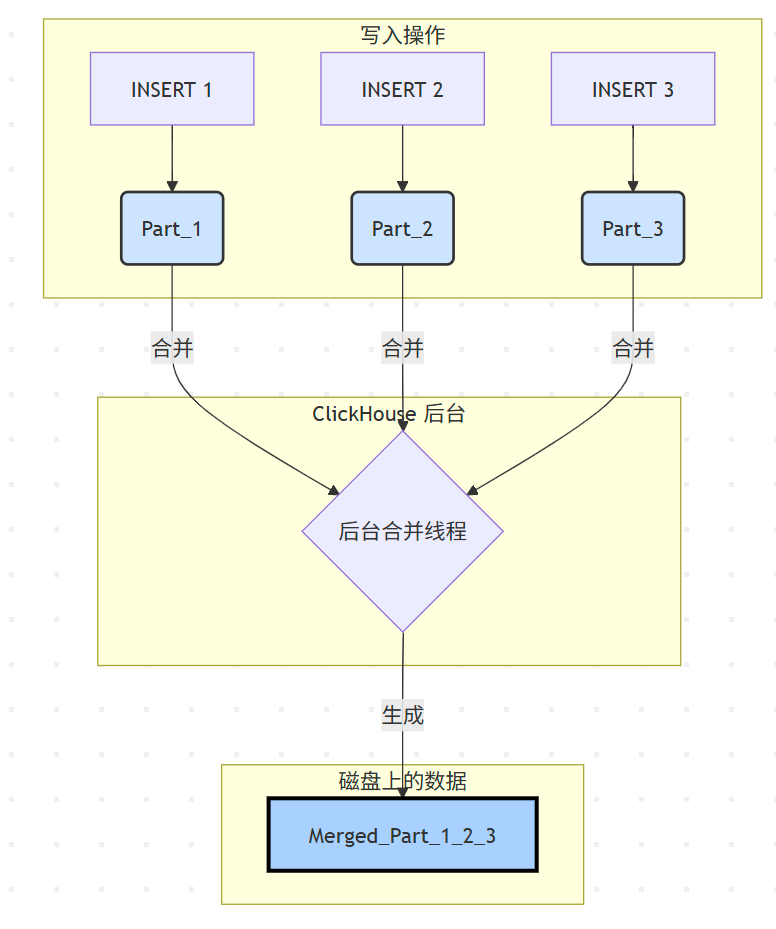

# 1. 表引擎简介：ClickHouse 的心脏

**为什么需要表引擎？** 在传统数据库中，数据的存储和管理方式通常是固定的。但 ClickHouse 面对的场景千变万化：有时是海量的、需要长期保存的日志数据；有时是临时的、用完即弃的中间数据；有时数据甚至不在 ClickHouse 本身，而是在远端的 Kafka 或 S3 上。

为了应对这些多样化的需求，ClickHouse 聪明地将**“数据如何存储和管理”**这个功能，做成了一个个可插拔的模块，这就是**表引擎**。

**生动的比喻：不同材质的储物箱**

- **`MergeTree`** **引擎:** 一个带有自动整理、压缩、打标签功能的**智能保险柜**。适合存放最重要、最庞大的核心数据。
- **`Log`** **引擎:** 一个普通的**纸箱**。东西可以快速扔进去，但找起来很麻烦，也没有整理功能。适合存放临时、不重要的小批量数据。
- **`Memory`** **引擎:** 一个放在桌面上的**透明托盘**。存取速度极快，但电脑一关机（服务重启），里面的东西就全没了。适合存放需要高速访问的临时数据。
- **`Kafka`** **引擎:** 一个神奇的**传送带**。它本身不存储东西，而是直接连接到 Kafka 的生产线，让你能实时看到生产线上的物品。"数据联邦"

# 2. 王者家族：MergeTree

大家好！在上一章，我们学会了驾驶 ClickHouse 这辆“F1赛车”，并成功地在数据赛道上跑了几圈。我们当时创建了一张表，用了一个叫做 ENGINE = MergeTree() 的东西。 大家有没有想过，为什么 ClickHouse 的 CREATE TABLE 语句里，ENGINE 是一个必填项，而在我们熟悉的 MySQL 中却可以省略（默认 InnoDB）？

 这就是今天我们要探索的核心秘密：**表引擎 (Table Engine)**。如果说 ClickHouse 是一辆赛车，那么表引擎就是它的**发动机**。不同的发动机，决定了这辆车是适合跑直线加速赛，还是适合跑崎岖的山路拉力赛。 今天，我们将一起打开发动机盖，深入研究 ClickHouse 最强大、最核心的“V12涡轮增压发动机”—— **MergeTree 家族**。理解了它，你就掌握了 ClickHouse 80% 的性能奥秘！

`MergeTree` 及其变种，是 ClickHouse 中最先进、功能最强大的表引擎，专为海量数据的插入和高性能分析而设计。几乎所有生产环境的核心业务表都应该使用 `MergeTree` 家族。

```sql
CREATE TABLE learning.t_web_hits
( ... )
ENGINE = MergeTree()
PARTITION BY toYYYYMM(timestamp) -- 分区键
ORDER BY (timestamp, user_id);   -- 排序键/主键
```

## 2.1. 分区 (Partition) & 数据片段 (Data Part)

- 分区 (PARTITION BY): 就像一个大书柜里，按照年份把书分成不同的格子（例如 2022年、2023年）。当你查询 WHERE toYYYYMM(timestamp) = 202310 时，ClickHouse 只需要打开 202310 这个分区格子，极大地减少了扫描范围。
- 数据片段 (Data Part): 每次 INSERT 操作，ClickHouse 都会生成一个新的、独立的数据片段 (Part)，存储在对应的分区目录下。每个 Part 都是一小组按列存储的文件，并且内部已经按照 ORDER BY 的规则排好序了。

.png)

## 2.2. 主键/排序键 (Primary Key / `ORDER BY`) 与稀疏索引

- **`ORDER BY`** **才是真正的“指挥官”**: 它规定了每个数据片段内部的数据物理排序规则。**这是 ClickHouse 查询性能的灵魂！**
- **主键 (Primary Key):** 在 `MergeTree` 中，主键就是 `ORDER BY` 定义的键（或者其前缀）。但它和 MySQL 的主键完全不同！它不是唯一的，而是用来创建**稀疏索引 (Sparse Index)** ——其实就是跳表的。
- **稀疏索引的工作方式:** 想象一本很厚的英文字典。
  - **MySQL (密集索引):** 目录里有书中**每一个单词**及它所在的页码。
  - **ClickHouse (稀疏索引):** 目录里只有**每隔10页的第一个单词**及页码（比如 A, An, Apple...）。如果你要找 `Ant`，索引会告诉你“它在 `An` 和 `Apple` 之间”，你只需要去扫描这两页之间的少量数据，而不用翻整本字典。

.png)

这个索引文件很小，可以常驻内存，查找极快。这就是为什么**选择正确的** **`ORDER BY`** **键至关重要**的原因。你应该把你最常用于 `WHERE` 条件过滤的列放在 `ORDER BY` 的最前面。

## 2.3. 合并 (Merge Process)

随着 `INSERT` 次数增多，小的 `Data Part` 会越来越多，这会影响查询性能（因为查询时需要聚合所有 Part 的结果）。ClickHouse 后台有一个**合并线程(手动合并)**，会定期地、智能地选择同一个分区内的一些小 Part，把它们合并成一个更大的、有序的新 Part，然后删除掉旧的 Part。

这个过程就是 `MergeTree` 名字的由来：**它在后台不断地合并（Merge）数据，形成一棵更加健康的“数据之树 (Tree)”**。

# 3. 表引擎

## 3.1. 什么是表引擎？

- **定义**：表引擎决定了数据的存储方式、存储位置、并发访问支持（读/写）、索引支持、多线程请求以及数据复制等。它就像是表的“驱动程序”。
- **与传统数据库对比**：MySQL 有 InnoDB, MyISAM 等；ClickHouse 则提供了几十种，核心思想是“专事专办”，为不同场景提供最优解。
- **查看所有支持的引擎**：

```sql
SHOW ENGINES;
```

 **表引擎的四大分类**

- **MergeTree 家族**：ClickHouse 的核心，用于海量数据分析。
- **Log 家族**：用于轻量级、快速写入的临时数据场景。
- **Integration 引擎**：用于与外部系统（如 MySQL, Kafka, S3）集成。
- **Special 引擎**：用于特殊用途（如 Memory, Distributed, MaterializedView）。

## 3.2. log 家族（轻量级数据写入）

Log 家族是 ClickHouse 中最简单的表引擎，适用于那些"一次写入、多次读取"的轻量级场景。它们的设计目标是快速地将数据追加到磁盘，结构非常简单。

核心特点：

- **不支持索引**：无法利用索引进行快速查询。
- **并发写锁定**：当有写操作时，表会被锁定，所有读写操作都会被阻塞，因此不适合高并发写入。
- **原子性写入**：数据写入是原子性的，要么成功，要么失败。
- **追加式写入**：数据总是以块的形式追加到文件末尾。

适用场景：

- 临时存储中间计算结果。
- 小批量、非核心业务的日志快速写入。
- 数据量不大（通常建议百万行以下）的配置表或元数据表。
- **警告**：绝对不要在生产环境的核心分析业务中使用 Log 家族引擎！

最简单的引擎，它将每一列数据存储在不同的压缩文件中。没有并发控制，适合单线程写入。

```sql
-- 创建一个 TinyLog 表
CREATE TABLE tiny_log_table (
    timestamp DateTime,
    level String,
    message String
) ENGINE = TinyLog;

-- 插入数据
INSERT INTO tiny_log_table VALUES (now(), 'INFO', 'User logged in') ;
INSERT INTO tiny_log_table VALUES (now(), 'WARN', 'Disk space is low') ;

-- 查询数据 (会进行全表扫描)
SELECT * FROM tiny_log_table WHERE level = 'WARN';
-rw-r-----. 1 clickhouse clickhouse 124 Jul 29 18:05 level.bin
-rw-r-----. 1 clickhouse clickhouse 174 Jul 29 18:05 message.bin
-rw-r-----. 1 clickhouse clickhouse 109 Jul 29 18:05 sizes.json
-rw-r-----. 1 clickhouse clickhouse 120 Jul 29 18:05 timestamp.bin
```

表的每列以文件的形式存储，插入数据的时候就是将数据追加到对应的列文件后面。

Log 和 StripeLog 是 TinyLog 的改进版。它们额外包含一个小型的元数据文件（__marks.mrk），记录了每个数据块的偏移量。这使得它们可以支持并发读取，并且在读取时可以跳过数据块，性能略好于 TinyLog。

- Log: 适合处理大量小记录。
- StripeLog: 将所有数据存储在一个文件中，更适合处理列数较多、包含大字段的表。

## 3.3. MergeTree家族

| [MergeTree](https://clickhouse.com/docs/engines/table-engines/mergetree-family/mergetree) | MergeTree-family table engines are designed for high data ingest rates and huge data volumes. |
| ------------------------------------------------------------ | ------------------------------------------------------------ |
| [Data Replication](https://clickhouse.com/docs/engines/table-engines/mergetree-family/replication) | Overview of Data Replication in ClickHouse                   |
| [Custom Partitioning Key](https://clickhouse.com/docs/engines/table-engines/mergetree-family/custom-partitioning-key) | Learn how to add a custom partitioning key to MergeTree tables. |
| [ReplacingMergeTree](https://clickhouse.com/docs/engines/table-engines/mergetree-family/replacingmergetree) | differs from MergeTree in that it removes duplicate entries with the same sorting key value (ORDER BY table section, not PRIMARY KEY). |
| [CoalescingMergeTree](https://clickhouse.com/docs/engines/table-engines/mergetree-family/coalescingmergetree) | CoalescingMergeTree inherits from the MergeTree engine. Its key feature is the ability to automatically store last non-null value of each column during part merges. |
| [SummingMergeTree](https://clickhouse.com/docs/engines/table-engines/mergetree-family/summingmergetree) | SummingMergeTree inherits from the MergeTree engine. Its key feature is the ability to automatically sum numeric data during part merges. |
| [AggregatingMergeTree](https://clickhouse.com/docs/engines/table-engines/mergetree-family/aggregatingmergetree) | Replaces all rows with the same primary key (or more accurately, with the same [sorting key](https://clickhouse.com/docs/engines/table-engines/mergetree-family/mergetree)) with a single row (within a single data part) that stores a combination of states of aggregate functions. |
| [CollapsingMergeTree](https://clickhouse.com/docs/engines/table-engines/mergetree-family/collapsingmergetree) | Inherits from MergeTree but adds logic for collapsing rows during the merge process. |
| [VersionedCollapsingMergeTree](https://clickhouse.com/docs/engines/table-engines/mergetree-family/versionedcollapsingmergetree) | Allows for quick writing of object states that are continually changing, and deleting old object states in the background. |
| [GraphiteMergeTree](https://clickhouse.com/docs/engines/table-engines/mergetree-family/graphitemergetree) | Designed for thinning and aggregating/averaging (rollup) Graphite data. |
| [Exact and Approximate Vector Search](https://clickhouse.com/docs/engines/table-engines/mergetree-family/annindexes) | Documentation for Exact and Approximate Vector Search        |
| [Full-text Search using Text Indexes](https://clickhouse.com/docs/engines/table-engines/mergetree-family/invertedindexes) | Quickly find search terms in text.                           |

### 3.2.1. 概述 (Overview)

MergeTree（合并树）家族是 ClickHouse 中最强大、最核心的表引擎，专为海量数据的高性能在线分析（OLAP）而设计。它是生产环境的首选。

### 3.3.2. Mermaid 图解核心原理：后台合并

MergeTree 的核心思想是将数据写入多个小的、有序的、不可变的数据部分（Data Parts），然后通过后台线程将这些小部分不断地合并（Merge）成更大的部分。



### 3.3.3 核心概念

- **主键与排序键 (ORDER BY)：物理排序键。**数据在磁盘上严格按照 ORDER BY 定义的列进行排序。这是稀疏索引的基础，也是性能的关键。
- **分区 (PARTITION BY)**：逻辑上将表数据拆分成不同的目录。便于数据管理，如快速删除旧分区 (ALTER TABLE ... DROP PARTITION)。
- **稀疏索引 (Primary Key)：基于排序键**，每隔N行（index_granularity）创建一个索引标记。查询时能快速定位到可能包含目标数据的“数据块”，极大减少需要扫描的数据量。
- ORDER BY 必须声明 , 如果只有 order by 字段 , 字段也是主键  可以使用 primary key 声明主键

### 3.3.4. MergerTree

**`MergeTree`** 引擎和 **`MergeTree`** 系列的其他引擎（例如 **`ReplacingMergeTree`**、**`AggregatingMergeTree`** ）是 ClickHouse 中最常用和最健壮的表引擎。

**`MergeTree`** 系列表引擎专为高数据摄取速率和巨大数据量而设计。插入作创建表部件，这些部件由后台进程与其他表部件合并。

**`MergeTree`** 系列表引擎的主要特性。

- 表的主键确定每个表部分（聚集索引）中的排序顺序。主键也不引用单个行，而是引用称为颗粒的 8192 行块。这使得大型数据集的主键足够小，可以继续加载在主内存中，同时仍然提供对磁盘数据的快速访问。
- 可以使用任意分区表达式对表进行分区。分区修剪可确保在查询允许时从读取中省略分区。
- 数据可以跨多个集群节点复制，以实现高可用性、故障转移和零停机升级。请参阅[数据复制 ](https://clickhouse.com/docs/engines/table-engines/mergetree-family/replication)。

- **`MergeTree`** 表引擎支持多种统计类型和采样方式，帮助查询优化。

```sql
CREATE TABLE [IF NOT EXISTS] [db.]table_name [ON CLUSTER cluster]
(
    name1 [type1] [[NOT] NULL] [DEFAULT|MATERIALIZED|ALIAS|EPHEMERAL expr1] [COMMENT ...] [CODEC(codec1)] [STATISTICS(stat1)] [TTL expr1] [PRIMARY KEY] [SETTINGS (name = value, ...)],
    name2 [type2] [[NOT] NULL] [DEFAULT|MATERIALIZED|ALIAS|EPHEMERAL expr2] [COMMENT ...] [CODEC(codec2)] [STATISTICS(stat2)] [TTL expr2] [PRIMARY KEY] [SETTINGS (name = value, ...)],
    ...
    INDEX index_name1 expr1 TYPE type1(...) [GRANULARITY value1],
    INDEX index_name2 expr2 TYPE type2(...) [GRANULARITY value2],
    ...
    PROJECTION projection_name_1 (SELECT <COLUMN LIST EXPR> [GROUP BY] [ORDER BY]),
    PROJECTION projection_name_2 (SELECT <COLUMN LIST EXPR> [GROUP BY] [ORDER BY])
) ENGINE = MergeTree()
ORDER BY expr
[PARTITION BY expr]
[PRIMARY KEY expr]
[SAMPLE BY expr]
[TTL expr
    [DELETE|TO DISK 'xxx'|TO VOLUME 'xxx' [, ...] ]
    [WHERE conditions]
    [GROUP BY key_expr [SET v1 = aggr_func(v1) [, v2 = aggr_func(v2) ...]] ] ]
[SETTINGS name = value, ...]
```

- **PARTITION BY [选填]**：分区键，用于指定表数据以何种标 准进行分区。分区键既可以是单个列字段，也可以通过元组的形式使 用多个列字段，同时它也支持使用列表达式。如果不声明分区键，则 ClickHouse 会生成一个名为 all 的分区。合理使用数据分区，可以有效减少查询时数据文件的扫描范围，更多关于数据分区的细节会在后面的小节中介绍。
- **ORDER BY [必填]**：**排序键，用于指定在一个数据片段内， 数据以何种标准排序。默认情况下主键（PRIMARY KEY）与排序键相同。排序键既可以是单个列字段，例如 ORDER BY CounterID，也可以通过元组的形式使用多个列字段，例如 ORDER BY（CounterID，EventDate）。当使用多个列字段排序时，以 ORDER BY（CounterID，EventDate）为例，在单个数据片段内，数据首先会以 CounterID 排序，相同 CounterID 的数据再按 EventDate 排序。
- **PRIMARY KEY [选填]**：主键，顾名思义，声明后会依照主键字段生成**一级索引**，用于加速表查询。默认情况下，主键与排序键 （ORDER BY）相同，所以通常直接使用 ORDER BY 代为指定主键，无须刻 意通过 PRIMARY KEY 声明。所以在一般情况下，在单个数据片段内，数据与一级索引以相同的规则升序排列。与其他数据库不同，MergeTree 主键允许存在重复数据（**ReplacingMergeTree** 可以去重）
- **SAMPLE BY [选填]**：抽样表达式，用于声明数据以何种标准进行采样。如果使用了此配置项，那么在主键的配置中也需要声明同样的表达式，例如：

```sql
...
(
...
) ENGINE = MergeTree() 
ORDER BY (CounterID, EventDate, intHash32(UserID)
SAMPLE BY intHash32(UserID) 
```

- **SETTINGS**：

  - **index_granularity [选填]**： index_granularity 对于 MergeTree 而言是一项非常重要的参数，它表示索引的粒度，默认值为8192。也就是说，MergeTree 的索引在默认情 况下，每间隔 8192 行数据才生成一条索引，其具体声明方式如下所示：

  - ```sql
    ...
    (
    ...
    ) ENGINE = MergeTree() 
    ... 
    SETTINGS index_granularity = 8192; 
    ```

  - 8192是一个神奇的数字，在 ClickHouse 中大量数值参数都有它的 影子，可以被其整除（例如最小压缩块大小 `min_compress_block_size:65536`）。通常情况下并不需要修改此参数，但理解它的工作原理有助于我们更好地使用 MergeTree。关于索引详细的工作原理会在后续阐述。
  - **index_granularity_bytes [选填]**：在 19.11 版本之前，ClickHouse 只支持固定大小的索引间隔，由 index_granularity 控制，默认为 8192。在新版本中，它增加了自适应间隔大小的特性，即根据每一批次写入数据的体量大小，动态划分间隔大小。而数据的体量大小，正是由 index_granularity_bytes 参数控制的，默认为10M(10×1024×1024)，设置为 0 表示不启动自适应功能。
  - **enable_mixed_granularity_parts [选填]**：设置是否开启自适应索引间隔的功能，默认开启。
  - **merge_with_ttl_timeout [选填]**：从 19.6 版本 开始，MergeTree 提供了数据TTL的功能，关于这部分的详细介绍，留到后续的小节介绍。
  - **storage_policy [选填]**：从 19.15 版本开始， MergeTree 提供了多路径的存储策略，关于这部分的详细介绍，留到后续的小节介绍。

```sql
-- 创建一个标准的 MergeTree 表
CREATE TABLE website_hits (
    EventDate Date,
    CounterID UInt32,
    UserID UInt64,
    URL String,
    Income UInt32
) ENGINE = MergeTree()
PARTITION BY toYYYYMM(EventDate) -- 按月分区
ORDER BY (CounterID, EventDate, UserID); -- 按站点ID,日期,用户ID排序

-- 插入数据
INSERT INTO website_hits VALUES ('2025-10-27', 1, 101, '/pageA', 10);
INSERT INTO website_hits VALUES ('2025-10-27', 1, 102, '/pageB', 0);

-- 高效查询 (利用了排序键)
SELECT count() FROM website_hits WHERE CounterID = 1 AND EventDate = '2025-10-27';

-- 手动合并数据
optimize table website_hits;
```

MergeTree 表引擎中的数据是拥有物理存储的，数据会按照分区目 录的形式保存到磁盘之上。

-2099101.png)

一张数据表的完整物理结构分为3个层级，依次是数据表目录、分区目录及各分区下具体的数据文件。接下来就逐一介绍它们的作用。

**Partition 分区**是ClickHouse MergeTree表引擎组织数据的基本单元。每个分区目录内包含该分区的所有列数据、索引及元数据文件。属于同一分区的数据最终会合并到同一个目录中，而不同分区的数据**永远不会被合并**。

1. 校验与元数据文件

| 文件              | 格式   | 说明                                                         |
| ----------------- | ------ | ------------------------------------------------------------ |
| **checksums.txt** | 二进制 | 校验文件，存储各文件（如 `primary.idx`、`count.txt` 等）的大小及哈希值，用于快速验证文件的完整性与正确性。 |
| **columns.txt**   | 明文   | 列信息文件，记录当前分区下所有列字段的名称与类型。           |
| **count.txt**     | 明文   | 行数计数文件，记录当前分区目录下的数据总行数。               |

2. 索引文件

| 文件                     | 格式   | 说明                                                         |
| ------------------------ | ------ | ------------------------------------------------------------ |
| **primary.idx**          | 二进制 | 一级索引（稀疏索引），由 `ORDER BY` 或 `PRIMARY KEY` 定义，每个表只能声明一个。用于在查询时快速跳过主键范围外的数据块，减少扫描范围。 |
| **minmax_[Column].idx**  | 二进制 | 分区键的极值索引，记录当前分区下某字段的原始数据最小值和最大值（例如 `EventDate` 的 `2019-05-01` 和 `2019-05-05`），与 `partition.dat` 配合使用，帮助快速跳过无关分区。 |
| **skp_idx_[Column].idx** | 二进制 | 二级索引（跳数索引）文件，支持 `minmax`、`set`、`ngrambf_v1`、`tokenbf_v1` 等类型。用于进一步缩小数据扫描范围，加速查询。 |

3. 数据文件

| 文件             | 格式                 | 说明                                                         |
| ---------------- | -------------------- | ------------------------------------------------------------ |
| **[Column].bin** | 压缩格式（默认 LZ4） | 列数据文件，每个列字段独立存储（如 `CounterID.bin`、`EventDate.bin`）。由于采用列式存储，查询时只需读取相关列的文件。 |
| **data.bin**     | 二进制压缩           | 通用的数据存储文件，与 `[Column].bin` 类似，常见于某些特定表引擎或场景。 |

4. 分区辅助文件

| 文件                    | 格式   | 说明                                                         |
| ----------------------- | ------ | ------------------------------------------------------------ |
| **partition.dat**       | 二进制 | 存储当前分区键表达式计算后的最终值。例如 `PARTITION BY toYYYYMM(EventDate)`，则保存值为 `2019-05`。 |
| **minmax_[Column].idx** | 二进制 | 记录当前分区内该字段的原始数据最小值和最大值（如 `2019-05-01` 和 `2019-05-05`）。通过此索引，查询时可快速跳过不匹配的分区目录。 |

5. 标记文件

| 文件                     | 格式   | 说明                                                         |
| ------------------------ | ------ | ------------------------------------------------------------ |
| **[Column].mrk**         | 二进制 | 列标记文件，记录每个数据块在 `.bin` 文件中的偏移量，用于快速定位数据。 |
| **skp_idx_[Column].mrk** | 二进制 | 二级索引的标记文件，与对应的 `.idx` 文件配合，用于索引数据的快速定位。 |

ClickHouse通过分区目录将数据、索引和元数据有序组织在一起。借助**稀疏索引**、**分区裁剪**和**二级跳数索引**等机制，能够在大规模数据场景下显著提升查询效率，同时保持列式存储的高压缩比和I/O优势。

### 3.3.5. ReplacingMergeTree

在后台合并时，对于排序键相同的行，只保留**最新**的版本。(去重)

这个引擎是在 MergeTree的基础上，添加了“处理重复数据”的功能，该引擎和MergeTree的不同之处在于它会删除具有相同主键的重复项。数据的去重只会在合并的过程中出现。合并会在未知的时间在后台进行，所以你无法预先作出计划。有一些数据可能仍未被处理。因此，ReplacingMergeTree 适用于在后台清除重复的数据以节省空间，但是它不保证没有重复的数据出现。

- **机制**：可以指定一个版本列（如 `timestamp` 或 `version`），保留版本最大的行；若不指定，则保留最后插入的行。
- **注意**：去重只在合并时发生，查询时可能仍会看到重复数据，直到 `OPTIMIZE ... FINAL` 执行完毕。

```sql
-- 创建一个带版本号的 ReplacingMergeTree 表
CREATE TABLE user_profiles (
    user_id UInt64,
    profile String,
    updated_ts DateTime
    --ReplacingMergeTree() 没有指定版本 , 按照数据插入时间进行判断取舍
) ENGINE = ReplacingMergeTree(updated_ts) -- updated_ts 是版本列
ORDER BY user_id;

-- 插入旧版本数据
INSERT INTO user_profiles VALUES (1, '{"city": "Beijing"}', '2025-01-01 10:00:00');
-- 插入新版本数据
INSERT INTO user_profiles VALUES (1, '{"city": "Shanghai"}', '2025-01-01 11:00:00');

-- 此时查询可能看到两条
SELECT * FROM user_profiles;

-- 强制合并
OPTIMIZE TABLE user_profiles FINAL;

-- 再次查询，只剩新版本
SELECT * FROM user_profiles;
```

### 3.3.6. SummingMergeTree

在后台合并时，对于排序键相同的行，会将所有**数值类型**的列进行累加。

```sql
-- 创建一个 SummingMergeTree 表
CREATE TABLE daily_stats (
    day Date,
    page_id UInt32,
    visits UInt64,
    clicks UInt64
) ENGINE = SummingMergeTree()
ORDER BY (day, page_id);

-- 插入多批数据
INSERT INTO daily_stats VALUES ('2025-10-27', 1001, 10, 1);
INSERT INTO daily_stats VALUES ('2025-10-27', 1001, 15, 3); 
INSERT INTO daily_stats VALUES ('2025-10-27', 1002, 8, 8); 
INSERT INTO daily_stats VALUES ('2025-10-27', 1002, 8, 8); 
INSERT INTO daily_stats VALUES ('2025-10-27', 1003, 9, 9); 
-- 同样 day 和 page_id-- 强制合并
OPTIMIZE TABLE daily_stats FINAL;

-- 查询结果是自动累加的
- visits 会变成 10 + 15 = 25
- clicks 会变成 1 + 3 = 4
SELECT * FROM daily_stats;
```

### 3.3.7. AggregatingMergeTree

当需要进行更复杂的预聚合（如 `avg`, `uniq`, `quantile`）时使用。

AggregatingMergeTree 就有些许**数据立方体**的意思，它能够在合并分区的时候，按照预先定义的条件聚合数据。同时，根据预先定义的聚合函数计算数据并通过**二进制的格式**存入表内。将同一分组下的多行数据聚合成一行，既减少了数据行，又降低了后续聚合查询的开销。可以说，AggregatingMergeTree 是**SummingMergeTree的升级版**，它们的许多设计思路是一致的，例如同时定义 ORDER BY与PRIMARY KEY的原因和目的。但是在使用方法上，两者存在明显差异，应该说 AggregatingMergeTree 的定义方式是 MergeTree 家族中最为特殊的一个。

- **机制**：它存储聚合函数的“中间状态”（**State**），而不是最终值。查询时需要使用 `-Merge` 函数来获取最终结果。
- **语法**：
  - 建表：列类型为 **`AggregateFunction`**`(function_name, arg_types)`
  - 插入：使用 `-State` 函数，如 **`uniqState`**`(user_id)`
  - 查询：使用 `-Merge` 函数，如 `uniqMerge(state_column)`

AggregatingMergeTree 没有任何额外的设置参数，在分区合并时，在每个数据分区内，会按照 ORDER BY 聚合。而使用何种聚合函数，以及针对哪些列字段计算，则是通过定义AggregateFunction数据类型实现的。在insert和select时，也有独特的写法和要求：写入时需要使用-State语法，查询时使用-Merge语法。

```sql
AggregateFunction(arg1 , arg2) ;
参数一 聚合函数
参数二 数据类型
sum_cnt AggregateFunction(sum, Int64);
```

先创建原始表-->插入数据-->创建预先聚合表-->通过Insert的方式导入数据, 数据会按照指定的聚合函数聚合预先数据。


