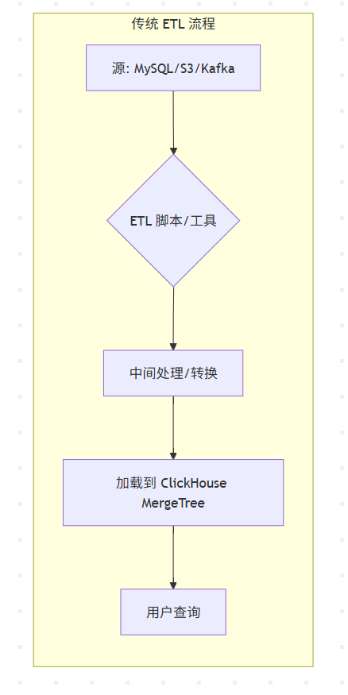

# 1. 引言

“在真实的企业环境中，数据往往不是集中存放在一个地方的。我们的用户信息可能在 `MySQL` 或 `PostgreSQL` 里，日志文件可能存储在 `S3` 或 `HDFS` 上，而实时的业务事件则通过 `Kafka` 传输。要把这些数据汇集到 ClickHouse 进行分析，传统的方法是什么？「ETL」

ETL 流程通常需要独立的工具（如 Spark, Flink, Airflow, Kettle），它有几个明显的缺点：

- **延迟高：** T+1 或 T+H，无法实时分析。
- **链路复杂：** 需要开发和维护额外的ETL任务。
- **存储冗余：** 同一份数据在源系统和 ClickHouse 中各存一份。”



ClickHouse 的集成引擎提出了一种全新的思路：**为什么不让 ClickHouse 直接去查询这些外部系统呢？** 这就是数据联邦的核心思想——查询发生在数据原地，无需（或极大简化）数据移动。

-2804717.png)

# 2. 核心概念

ClickHouse 集成引擎是一类特殊的表引擎，它不把数据存储在 ClickHouse 本地，而是充当一个**“代理”或“连接器”**。当你查询一个集成引擎表时，ClickHouse 会：

- 解析你的 SQL 查询。
- 将查询转换为对外部系统的请求（如，一个 MySQL 查询、一个 S3 GET 请求或一个 Kafka Consumer 拉取）。
- 从外部系统获取数据。
- 在 ClickHouse 内部进行后续的计算（如 `GROUP BY`, `JOIN` 等）。

主要类别：

- **数据库类:** `MySQL`, `PostgreSQL`, `JDBC`, `ODBC`。用于连接其他数据库。
- **文件系统/对象存储类:** `File`, `URL`, `HDFS`, `S3`。用于直接读取文件。
- **消息队列类:** `Kafka`, `RabbitMQ`。用于消费实时消息流。

# 3. 连接关系型数据库 (MySQL)

- **场景:** 我们的用户维度表存储在生产环境的 MySQL 中，我们希望在 ClickHouse 中直接用它来关联事实表，而无需每日同步。


- **准备工作:**
  - 一个运行中的 MySQL 服务器。
  - 在 MySQL 中创建一个表并插入数据。

```sql
-- 在 MySQL 中执行:
CREATE DATABASE my_app;
USE my_app;
CREATE TABLE users (
    user_id INT PRIMARY KEY,
    user_name VARCHAR(50),
    registration_city VARCHAR(50)
);

INSERT INTO users VALUES 
(1, 'AO', 'Beijing'), 
(2, 'BO', 'Shanghai'), 
(3, 'AB', 'HongKong');
-- 在clickhouse中建表
CREATE TABLE mysql_users
(
    user_id UInt32,
    user_name String,
    registration_city String
)
ENGINE = MySQL('linux01:3306', 'my_app', 'users', 'root', 'root');
...
```

注意: 在clickhouse表中可以查询对应的mysql表数据 ,**也可以对数据进行修改(插入)!**

进行关联查询

```sql
-- 先创建一张 ClickHouse 本地表
CREATE TABLE local_orders (
    order_id String,
    user_id UInt32,
    amount Float64
) ENGINE = MergeTree() ORDER BY order_id;
INSERT INTO local_orders VALUES ('order1', 1, 99.9), ('order2', 3, 45.0), ('order3', 1, 120.5);

-- 联邦查询！
SELECT
    o.order_id,
    o.amount,
    u.user_name,
    u.registration_city
FROM local_orders AS o
JOIN mysql_users AS u ON o.user_id = u.user_id;

   ┌─order_id─┬─amount─┬─user_name─┬─registration_city─┐
1. │ order1   │   99.9 │ AO        │ Beijing           │
2. │ order2   │     45 │ AB        │ HongKong          │
3. │ order3   │  120.5 │ AO        │ Beijing           │
   └──────────┴────────┴───────────┴───────────────────┘
```

-2813758.png)

# 4. HDFS 引擎

clickhouse 可以直接加载 HDFS 中的数据(结构化数据), 来进行处理性能低! 

-2813802.png)

- **两种使用方式：**
  - **`hdfs()`** **表函数:** 用于一次性的、临时的查询。无需创建表，语法灵活。
  - **`HDFS`** **引擎表:** 用于需要频繁查询的固定路径。创建一个永久的表结构，简化后续查询。

```sql
SELECT *
FROM hdfs(
    'hdfs://your-namenode-host:9000/user/clickhouse/logs/dt=2023-11-15/log1.parquet',
    'Parquet',
    'event_time DateTime, level String, message String' -- 必须手动定义 Schema
)
LIMIT 10;
```

- `URI`: 完整的 HDFS 文件路径。
- `Format`: 文件格式，如 `Parquet`, `ORC`, `CSV`, `JSONEachRow` 等。
- `Structure`: 表的结构定义，`'col1 type1, col2 type2, ...'`。

**利用路径通配符 (Globs) 查询多个文件:**

- “`HDFS` 引擎的强大之处在于支持通配符，这让我们能轻松处理分区数据。”

