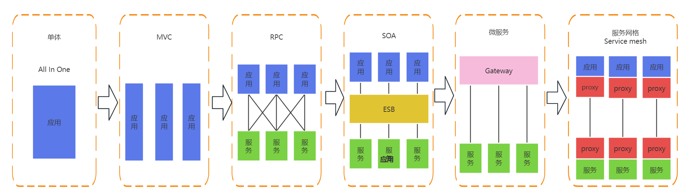
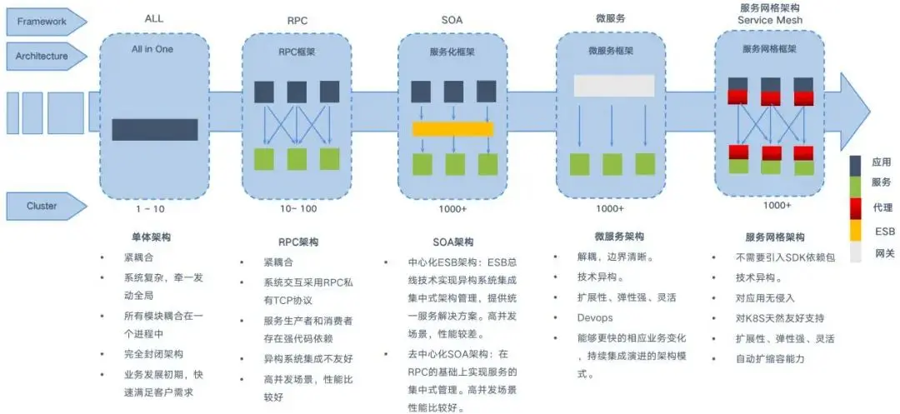
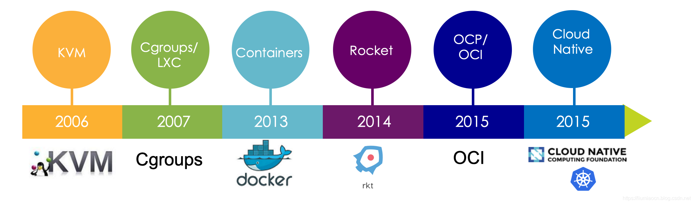
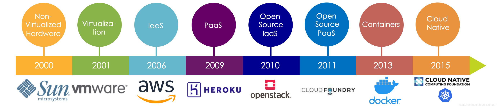
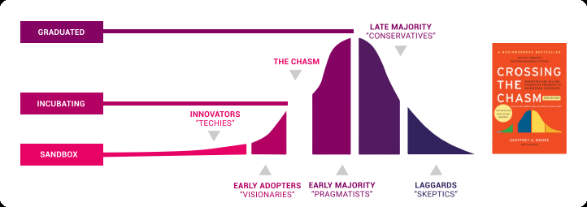

# 1. 软件架构的演进

软件架构的模式

软件架构的特点

- 单体架色：All in One

传统架构，都部署在单机系统，一个项目一个工程：比如商品、订单、支付、库存、登录、注册等等，统一部署，一个进程。

- MVC：

JAVA 开发中 MVC 是一种软件设计规范。是将业务逻辑、数据、显示分离的方法来组织代码。MVC 主要作用是降低了视图与业务逻辑间的双向偶合。即模型(Model)、视图(View)、控制器(Controller)的简写。

Python开发中MTV为Model-Template-View（模型-模板-视图）模式只是从开发者角度实现了模块化的独立开发，但运维角度还是单体。

- RPC： Remote Procedure Call 

将各个功能拆分为独立的服务和应用，以独立项目分别开发和部署，各个服务和应用相关通过RPC方式调用，远程过程调用解决远程调用服务的一种技术，使得调用者像调用本地服务一样方便透明。

- SOA： Service Oriented Architecture

各个服务之间通过 **ESB(Enterprise Service Bus)**进行通信。ESB是一个由大量规则和原则集成的软件架构，可以将一系列不同的应用程序集成到单个基础架构中，此外ESB属于重量级产品，部署规划异常笨重。ESB的单点依赖和商业ESB的费用问题反而成为了所有服务的瓶颈。

- 微服务:  microservices

微服务架构风格是一种将单个应用程序拆分为多个极至微型的服务的方法，每个服务都在自己的进程中运行并与轻量级机制（通常是 HTTP 资源 API）进行通信。

这些服务围绕业务功能构建，并可通过全自动部署机制独立部署。对这些服务进行最低限度的集中管理，这些服务可能用不同的编程语言编写并使用不同的数据存储技术。

开发者需要使用各种开发框架，比如调用 JAVA 的 spring cloud的 SDK 实现功能性和非功能性代码，非业务性的基础功能仍然需要依赖开发者的能力实现。

---

传统 Spring Cloud 与 Kubernetes 提供的解决方案对比

|          | Kubernetes              | Spring Cloud              |
| -------- | ----------------------- | ------------------------- |
| 弹性伸缩 | Autoscaling             | N/A                       |
| 服务发现 | KubeDNS / CoreDNS       | Spring Cloud Eureka,Nacos |
| 配置中心 | ConfigMap / Secret      | Spring Cloud Config       |
| 服务网关 | Ingress Controller      | Spring Cloud Zuul         |
| 负载均衡 | Load Balancer           | Spring Cloud Ribbon       |
| 服务安全 | RBAC API                | Spring Cloud Security     |
| 跟踪监控 | Metrics API / Dashboard | Spring Cloud Turbine      |
| 降级熔断 | N/A                     | Spring Cloud Hystrix      |

Kubernetes 成为容器战争胜利者标志着后微服务时代的开端，但 Kubernetes 仍然没有能够完美

解决全部的分布式问题。

> “不完美”是指，仅从功能上看，单纯的 Kubernetes 反而不如之前的 Spring Cloud 方案。
>
> 这是因为有一些问题处于应用系统与基础设施的边缘，使得完全在基础设施层面中确实很难精细化
>
> 地处理。

---

- 服务网格 service Mesh 

将功能性和非功能代码彻底分离，把原本程序员需要关注的安全策略、负载均衡。流量控制、路由选择等基础能力下沉到了底层组件。

边车代理模式”（Sidecar Proxy）中，并提供了自动恢复的能力，让开发人员只需关注业务本身即可。

# 2. 云计算

## 2.1. 虚拟化技术与标准的变迁

2006年：在2006年12月19由Avi Kivity宣告了KVM的诞生，而在2007年2月，KVM发布到内核2.6.20中

2007年：cgroups最早是由Google的工程师在2006年发起，早期名称为proccess containers，为了和其他Linux内核的名词产生混乱，2007年被重命名为cgroup，合并到了2.6.24版的内核中。LXC正式在cgroups和namespace的基础上实现的隔离与控制。

2013年：docker诞生。

2014年：coreos与docker分道扬镳，另起炉灶起了一套容器的机制Rocket，并得到了Google等公司的大力支持。而随后也直接成为CNCF的项目之一，然而现在已经由于无人更新淡出人们的视野了，也成为了CNCF 第一个剔除的项目。

2015年：在2015年，由Docker和Linux基金会携手发布了OCP（Open Container Project），后来此项目被Linux基金会的执行董事Jim Zemlin宣布更名为开放容器计划OCI（Open Container Initiative），后续有更多的公司诸如CoreOS、Redhat等加入一起支持该计划，维护并推进Docker的规范，以建立一个容器的通用标准。

2015年：CNCF成立，建议以Kubernetes为中心的云原生解决方案。

## 2.2. 技术的发展带来的变迁

- 基本构建单元的变迁

应用构建单元的变迁过程：物理机 -> 虚拟机 -> Buildpacks -> 容器

- 隔离方式的变迁

隔离方式从重量级变为轻量级，速度更快，尺寸更小

- 提供上的变迁

服务商的变迁也实现了从闭源到开源，从单一开源服务上到多服务商提供服务的过程

## 2.3. 最小构建单位的变迁

[开源简史基础：CNCF的诞生_cncf项目历史-CSDN博客](https://blog.csdn.net/liumiaocn/article/details/100749302)

2000年：应用程序的运行还是在物理机上运行的时代，以sun的非虚拟化的硬件为代表，当我们需要启动一个新的应用时，往往需要购买一台或者多台新的物理服务器来解决所需要的资源问题，物理机器是构建应用的最小单元。

2001年：vmware的虚拟技术使得构建应用的最小单元变成了一台虚拟机，可以通过在一台物理机器上运行多个VM，意味着使用者需要更少的硬件资源投入。

2006年：在这一年，Amazon的AWS（Amazon Web Services）通过EC2（Elastic Compute Cloud）在IaaS获得成功，虽然构建应用的最小单元仍然是VM（被成为AMI：Amazon Machine Image），已经可以做到按小时来出租服务器。

2009年：在这一年Heroku在PaaS（Platform-as-a-Service）获得成功，构建应用的最小单位被成为buildpack，在buildpack中应用满足12要素，部署新的版本在Heroku上已经非常简单，只需要执行git push heroku即可。

2010年：OpenStack召集了大量的供应商提供了开源的IaaS与AWS和VMWare来进行对抗，而构建应用的最小单位仍然是VM。

2011年：Pivotal提供了一个开源的可以与Heroku的PaaS相抗衡的开源PaaS，这就是后来2014年启动的CF（Cloud Foundry），在这种方式下，构建应用的最小单位被称为Garden containers，其中可以包含Heroku的buildpack、Docker容器甚至非Linux操作系统。

2013年：Docker将LXC、Union File System和cgroups结合起来形成了容器标准，得到了全世界数百万开发者的极大认可，几乎是一夜之间红遍大江南北，使得隔离、重用性以及一致性得到了保证，构建应用的最小单位变成了容器。

2015年：CNCF成立，云原生计算通过使用一系列的开源软件实现了三个主要的目的将应用拆分为微服务方式将每一部分打包形成各自的容器提供动态编排机制从而对容器的资源利用率进行优化.

> 美国国家标准与技术研究院（NIST）定义：
>
> 云计算是一种按使用量付费的模式，这种模式提供可用的、便捷的、按需的网络访问，进入可配置的计算资源共享池（资源包括网络，服务器，存储，应用软件，服务），这些资源能够被快速提供，只需投入很少的管理工作，或与服务供应商进行很少的交互。

云计算是指服务的交付和使用模式，指通过网络以按需、易扩展的方式获得所需的资源（可以是IT和软件、互联网相关的，也可以使任意其他的服务）。提供资源的网络被称为“云”。

“云”中的资源在使用者看来是可以无限扩展的，并且可以随时获取，按需使用，随时扩展，按使用付费。意味着计算能力也可以作为一种商品进行流通，就像煤气、水电一样，取用方便，费用低廉。最大的不同在于，它是通过网络进行传输的。

# 3. CNCF 和云原生

## 3.1. CNCF

Cloud Native Computing Foundation，云原生计算基金会（以下简称CNCF）成立于2015年7月，是Linux 基金会旗下的一个开源软件基金会，它致力于云原生（Cloud Native）技术的普及和可持续发展，其口号是坚持和整合开源技术来让编排容器作为微服务架构的一部分。

官方网站: [Cloud Native Computing Foundation](https://www.cncf.io/)

关于CNCF的使命主要包括以下三点：

- 容器化包装
- 通过中心编排系统的动态资源管理
- 面向微服务

CNCF 这个组织的作用是推广技术，形成社区，开源项目管理与推进生态系统健康发展。很多公司都参与 CNCF 组织成为其成员。当前CNCF的成员有:

https://landscape.cncf.io/?group=members

CNCF 组织由以下部分组成：

- 会员：白金Platinum、金牌Glod、银牌silver、最终用户、学术和非赢利成员，不同级别的会员在治理委员会中的投票权不同。
- 理事会：负责事务管理
- TOC（技术监督委员会）：技术管理
- 最终用户社区：推动CNCF技术的采纳并选举最终用户技术咨询委员会
- 最终用户技术咨询委员会：为最终用户会议或向理事会提供咨询
- 营销委员会：市场推广

## 3.2. 云原生

随着云计算的红火发展，云原生（Cloud Native）的概念应运而生。

自从Pivotal公司的Matt Stine于2013年首次提出云原生的概念以来，随之经过多年的推广,但是可惜的是，云原生却没有一个标准的定义，因为云原生本身一直在发展变化之中，所谓的解释权不归某个人或组织所有。

### 3.2.1. 云原生概念的发展历程

- 2013年：Pivotal公司的 [Matt Stine](https://www.mattstine.com/)于首次提出此概念
- 2015年：Matt Stine《迁移到云原生架构》云原生包括：12因素、微服务、自敏捷架构、基于API 协作、扛脆弱性
- 2015年：CNCF的云原生初始定义包括：容器化封装、自动化管理、面向微服务
- 2017年：Matt Stine 采访梳理了云原生架构：模块化、可观察、可部署、可测试、可替换、可处理6特质
- 2018年：CNCF 把服务网格(Service Mesh)和声明式API给加入到云原生的概念中。

### 3.2.2. CNCF **官方定义云原生**

https://github.com/cncf/toc/blob/main/DEFINITION.md#%E4%B8%AD%E6%96%87%E7%89%88%E6%9C%AC

云原生技术有利于各组织在公有云、私有云和混合云等新型动态环境中，构建和运行可弹性扩展的应用。云原生的代表技术包括容器、服务网格、微服务、不可变基础设施和声明式API。

这些技术能够构建容错性好、易于管理和便于观察的松耦合系统。结合可靠的自动化手段，云原生技术使工程师能够轻松地对系统作出频繁和可预测的重大变更。

云原生计算基金会（CNCF）致力于培育和维护一个厂商中立的开源生态系统，来推广云原生技术。我们通过将最前沿的模式民主化，让这些创新为大众所用。

### 3.2.3. VMware 云原生定义

https://tanzu.vmware.com/cloud-native

什么是云原生，什么是云原生应用？

云原生是一种构建和运行应用程序的方法，它利用了云计算交付模型的优势。当公司使用云原生架构构建和运营应用程序时，他们可以更快地将新想法推向市场，并更快地响应客户需求。

虽然公共云已经影响了几乎每个行业的基础设施投资思维，但类似云的交付并不是公共环境独有的。云原生开发适用于公有云和私有云；它是关于如何创建和部署应用程序，而不是在哪里。

更重要的是能够为开发人员提供对计算能力的按需访问以及现代数据和应用程序服务。云原生开发融合了DevOps、持续交付、微服务和容器的概念。

---

云原生技术出现的背景是组织在推行云计算时，由于公有云、私有云和混合云的复杂环境已经变得越来越普及，所以在这种基础架构之下如何保证松耦合的系统能够更好地被监控和管理，是云原生技术需要面对和解决的问题。

---

### 3.2.4. 云原生的发展带来的价值

- 避免Vendor Lock-in：完整和逐步完善的开源软件技术栈使得在任何公有云、私有云以及混合云上的部署的能力得到了落实，避免了供应商依赖 Vendor Lock-in。

- 无限的横向扩展性：可以获得从几台节点横向扩展至数千台具有自愈能力的多租户节点，以Google 为例，仅仅根据2014年的统计数据信息，Google每周启动20亿个容器，这意味每秒钟的数量是3300个左右，已经有企业在这个方面做出了强大的示例，以这个统计数据为例，基本上对绝大多数的企业来说，这份能力就是无限的横向扩展性。

- 速度和可维护性的同时提高：通过将应用进行分割为微服务化，从而使得速度和可维护性都能有所提高。

- 获得弹性的能力：无论是容器、机器甚至是数据中心级别的故障，弹性的能力都能够有相应的机制和方式得到保障，很多企业已经在这方面作出了很多实践。

- 提高效率和资源利用率：通过对编排机制，能够对微服务进行动态的管理和调度，从而更好地提高了效率与资源的利用率。

### 3.3. CNCF 项目

CNCF是旨在推动以容器为中心的云原生系统。从 2016 年 11 月，CNCF 开始维护了一个名为云原生全景图 Cloud Native Landscape 的仓库，汇总目前比较流行的云原生技术，如Kubernetes、Prometheus、Envoy等 ,加以分类，希望能为企业构建云原生体系提供参考。

### 3.3.1. CNCF 全景图

CNCF的全景图（Landscape）包含了CNCF中托管的项目，还有很多是非CNCF项目。当前一直持续更新中，可以参看如下连接获得更加详细的内容和及时更新的内容：https://landscape.cncf.io/

### 3.3.2. CNCF **项目成熟度分级**

当前所有的CNCF项目可以访问 https://www.cncf.io/projects

CNCF 当前包含著名的项目有 Containerd、Kubernetes、Prometheus 、Etcd、Harbor、CoreDNS、Envoy、Helm 等

每个CNCF项目都需要有个成熟度等级，申请成为CNCF项目的时候需要确定项目的成熟度级别。

成熟度级别（ Maturity Level）包括以下三种：

- sandbox 沙箱
- incubating 孵化
- graduated 毕业

是否可以成为 CNCF 项目需要通过 Technical Oversight Committee (技术监督委员会）简称 TOC ，投票采取回退策略fallback策略，先从最高级别（graduated）开始，如果2/3多数投票通过的话则确认为该级别，如果没通过的话，则进行下一低级别的投票，如果一直到沙箱级别都没得到2/3多数投票通过的话，则拒绝其进入CNCF项目。

成熟度是 CNCF 的一个信号，表明什么样的企业应该采用不同的项目。

### 3.3.3. CNCF 路线图 Trail Map

https://github.com/cncf/landscape/blob/master/README.md#trail-map 

在复杂的基础架构之上如何推动云原生应用的更好落地，从而更好地适应环境与业务的发展，CNCF给出了路线图Trail Map用于对于用户在整体上给出了指导建议，分成十个步骤进行实施，而在不同的步骤都可以结合Landscape中列出的产品或服务进行选择。

**步骤1: 容器化**

方式：虽然容器化可以选择多种方式，一般仍以Docker为主要方式进行容器化。

类型：各种类型应用和依赖（甚至模拟器上运行的代码）都可以进行容器化，容器化的类型得到广泛的支持

演进：对于新的功能，可以进行应用的分割并将其进行微服务化

**步骤2: CI/CD**

容器化：创建持续集成CI与持续部署CD环境，从而使得代码的修改可以自动从源码进行容器化的构建和测试，

并可以部署至准生产或者生产环境。

自动化：创建可以用于自动部署、自动回滚和自动测试的方式

**步骤3: 应用定义与编排**

应用编排：Kubernetes作为容器化的应用编排的解决方案，在目前的市场上处于领先地位。

管理应用：Helm Charts能帮助使用者对复杂的Kubernetes应用进行定义、安装和升级。

CNCF项目：Kubernetes、HELM

**步骤4: 监控&分析**

范围：解决方案应该包含监控、日志和追踪

工具：推荐的工具可以选择使用Prometheus进行监控和告警，Fluentd用于日志，而Jaeger则用于调用链的跟踪

兼容性：调用链跟踪建议选择诸如Jaeger那样对OpenTracing有兼容性的方案或者工具

CNCF项目：Prometheus、fluentd、OPENTRACING、JAEGER

> 注意：从步骤4开始为可选内容。

**步骤5: 服务代理、服务发现和服务网格**

服务发现：可以使用CoreDNS进行服务发现，兼具快速和灵活的特点。

服务网格：Envoy和Linkerd都能够提供服务网格的相关能力。

管理功能：提供健康检查、请求陆游以及负载均衡等常用功能。

CNCF项目：envoy、CoreDNS、LINKERD

**步骤6: 网络&策略**

网络兼容：为了能够更加灵活地对应网络需求，使用CNI兼容的网络解决方案诸如Calico、Flannel或者Weave Net等。

策略：OPA（Open Policy Agent）秉承着“策略即代码”的原则，完成了一个通用的策略引擎的基本功能，可以帮助使用者控制策略和权限以保证合规性。

CNCF项目：CNI、Open Policy Agent

**步骤7: 分布式数据库与存储**

横向扩展性：当需要获取更多的弹性和横向扩展性时，相较于从单一数据库来获取信息，通过sharding的方式保证MySQL的横向扩展性，Vitess是一个不错的选择。

存储编排：通过集成多种Kubernetes的存储解决方案，可以使用提供了存储的编排方式的Rook进行管理。

数据存储：作为Kubernetes的“大脑”，etcd提供了在集群中以可靠的方式存储数据的能力。

KV存储：当需要key-value存储方案时，可以考虑使用TiKV，TiKV使用Rust编写的高性能的分布式事务级key-value解决方案。

CNCF项目：Vitess）、ROOK、etcd、TiKV

**步骤8: 流与消息处理**

性能需求：当需要比JSON-RESt更高的性能时，gRPC或者NATS能够助你一臂之力。

通用框架：gRPC时一个通用的RPC框架。而NATS是一个包含了请求/大幅、发布/订阅和负载均衡队列的多模型消息系统。

CNCF项目：gRPC、NATS

**步骤9: 镜像私库&运行环境**

镜像私库：可以使用Harbor作为镜像私库进行存储以及对镜像的内容进行扫描。

运行环境：容器并非仅仅Docker一种，容器的运行环境更是如此，可以选择不同的容器运行环境，但需要注意选择具有OCI兼容性的的方案，比如containerd或者cri-o

CNCF项目：containerd、HABOR、cri-o

**步骤10: 软件分发**

安全性：TLS能够保护通信的安全，但是当服务器出现问题后，自然就会出现问题。而使用Notary可以解决这一问题，是的软件的分发和更新更加安全。TUF项目则是Notary所基于的项目，也是针对软件分发和更新的安全性的解决方案。

CNCF项目：Notary、TUF

# 4. 容器编排工具

## 4.1. Docker-Compose

Docker-Compose 是一个单机版的容器编排工具,用来管理一个主机上的多个容器，即单个主机上容器管家。

如果当主机上中有几十成百的容器,而且需要按一定的次序启动时，如果手动执行docker命令去一个一个的启动那将非常麻烦。利用 Docker-Compose后只需要编写一个文件，在这个文件里面声明好要启动的容器和次序，配置相关一些参数，最后只需要执行一下这个文件，Docker就会按照提前声明的配置去把所有的容器启动起来。

但是Docker-Compose只能管理当前主机上的Docker容器，即不能去启动和管理其他主机上的Docker 容器。

## 4.2. Docker Swarm

Docker Swarm则是由Docker 公司自行研发的一款用来管理多主机上的Docker容器的工具。

可以负责帮用户启动容器，监控容器状态，如果容器的状态不正常它自动重新启动一个新的容器，来提供服务，同时也提供服务之间的负载均衡，而这些功能是Docker-Compose 是无法实现的

Swarm 现在与Docker Engine完全集成，并使用标准API和网络。Swarm模式内置于Docker CLI中，无需额外安装，并且易于获取新的Swarm命令。

## 4.3. Marathon

编排框架 Marathon 基于 Apache Mesos 项目。Apache Mesos 通过 API提供了跨数据中心的资源管理和调度抽象，而这些数据中心可能是物理上分散的。Mesos 上的系统可以使用底层的计算、网络和存储资源，就像虚拟机通过虚拟机管理程序使用底层资源一样。Marathon 使用了Mesos 并在它上面运行，针对长期运行的应用程序提供了容器编排功能。它既支持Mesos 容器运行时，也支持Docker 容器运行时。

## 4.4. Kubernetes

Kubernetes就由Google的内部项目Borg发展而来，用go语言实现，后捐献给CNCF成为开源项目。

它本身的角色定位是和 Docker Swarm 是一样的，也是一个跨主机的容器管理平台。Kubernetes当前已成为容器编排领域的领导者，甚至是行业标准。

