# 1. Kubernetes 介绍

Kubernetes其实源于希腊语意思（舵手，领航员）。由于名称长所以既不太好读也不太好写，因为首字母k和末尾字母s之间共有8个字母，经常简称为k8s。

Kubernetes 是谷歌在2014年开始实施的一个开源项目，当时google已经有了大规模服务容器管理的经验，使用内部Borg系统负责对google内部的一些服务进行调度和管理，它的目的是让用户不必操心资源管理的问题，让他们专注自己的核心业务，并且最大化数据中心的利用率。Kubernetes被认为是Borg的开源版本（研发团队有重合、功能简化聚焦、架构类似）。

当前很多工程师现在投身Kubernetes 的系统研究，推进K8S的发展。2019年5月4日，Twitter宣布弃用使用了长达数十年的Mesos系统，全面拥抱Kubernetes ，足可见Kubernetes 在目前云计算生态和环境下的重要地位。越来越多的服务以 Docker 的方式进行运行通过Kubernetes 进行编排。

Kubernetes 建立在 Google 公司超过十余年的运维经验基础之上，Google 所有的应用都运行在容器上, 再与社区中最好的想法和实践相结合，Google 每周运行数十亿个容器，Kubernetes 基于与之相同的原则来设计，能够在不扩张运维团队的情况下进行规模扩展，当前已成为最受欢迎和行业最主流的容器管理平台。

Kubernetes 用于管理云平台中多个主机上的容器化的应用，Kubernetes的目标是让部署容器化的应用简单并且高效,Kubernetes提供了应用部署，规划，更新，维护的强大和灵活的机制。

Kubernetes一个核心的特点就是能够自主的管理容器来保证云平台中的容器按照用户的期望状态运行着,用户可以运行一个微型服务，让规划器来找到合适的位置节点，后续用户不需要关心怎么去做，Kubernetes会自动去监控，然后去重启，新建等，总之让应用可以一直提供服务，同时，Kubernetes系提供了人性化的相关工具,可以让用户能够方便的部署自己的应用。

官网：https://kubernetes.io/

Github：https://github.com/kubernetes/kubernetes

Kubernetes 特性：https://kubernetes.io/zh-cn/docs/concepts/overview/#why-you-need-kubernetes-and-what-can-it-do

# 2. Kubernetes 架构

https://kubernetes.io/zh-cn/docs/concepts/architecture/

# 3. Kubernetes 组件

https://kubernetes.io/zh/docs/concepts/overview/components/

## 3.1 控制平面组件

控制平面的组件做出有关集群的全局决策（例如，调度），以及检测和响应集群事件（例如，当部署的 replicas 无法达到要求时，自动启动新的Pod）。Control Plane 组件可以在群集中的任何计算机上运行。但是，为简单起见，通常在同一台计算机上启动所有 Control Plane组件，并且不在该计算机上运行用户容器。

### 3.1.1. Kube-apiserver

https://kubernetes.io/zh-cn/docs/reference/command-line-tools-reference/kube-apiserver/

Kubernetes API server 是整个集群的访问入口, 为 API 对象验证并配置数据，包括 pods、 services、replication controllers和其它 api 对象 ,API Server 提供 REST 操作和到集群共享状态的前端，所有其他组件通过它进行交互。

API server  对应的程序为 **kube-apiserver**，利用6443/tcp对外提供服务。

API server 相当于公司的前台接待,是整个Kubernetes集群的唯一入口

客户端和API Server需要通过基于 https 协议连接,如果使用前端使用LB, 需要使用四层负载均衡

> API Server 本身无状态,集群数据存储在ETCD中

### 3.1.2 kube-controller-manager

https://kubernetes.io/zh-cn/docs/reference/command-line-tools-reference/kube-controller-manager/

Controller Manager作为集群内部的管理控制中心，负责集群内的 NodeNode、PodPod副本、服务端点（ Endpoint）、命名空间（Namespace）、服务账号（ tServiceAccount）、资源定额（ResourceQuota）的管理，当某个 Node异常宕机时， Controller Manager会及时发现并执行自动化修复流程，确保kubernetes集群尽可以处于预期的工作状态。

Controller Manager 负责实现客户端通过API提交的终态声明，由相关代码通过一系列步骤驱动API对象的“实际状态”接近或等同“期望状态”

Controller Manager 对应的程序为 **kube-controller-manager**

Kubernetes 控制器管理器是一个守护进程，内嵌随 Kubernetes 一起发布的核心控制回路。在机器人和自动化的应用中，控制回路是一个永不休止的循环，用于调节系统状态。在 Kubernetes 中，每个控制器是一个控制回路，通过 API 服务器监视集群的共享状态，并尝试进行更改以将当前状态转为期望状态。目前，Kubernetes 自带的控制器例子包括副本控制器、节点控制器、命名空间控制器和服务账号控制器等。

Controller Manager 相当于公司的管理层或大管家,负责管理kubernetes所有资源。

### 3.1.3. kube-scheduler

https://kubernetes.io/zh-cn/docs/reference/command-line-tools-reference/kube-scheduler/

kube-scheduler 调度器，负责为Pod挑选出评估这一时刻相应的最合适的运行节点

kube-scheduler 对应的程序为**kube-scheduler**

kube-scheduler 相当于公交系统的调度室,负责分配工作给相应的worker节点

> 调度程序如何分配这些Pod？
>
> 调度程序会查看每个 Pod，并尝试为其找到最佳节点。
>
> **在第一阶段，调度程序尝试筛选出不符合此 Pod 要求的节点**
>
> **在第二阶段,调度程序尝试筛选出符合此 Pod要求的最优节点**

### 3.1.4. etcd

https://github.com/etcd-io/etcd

Kubernetes 需要使用 key/value数据存储系统 Clustrer Store，用于保存所有集群状态数据，支持分布式集群功能

通常为奇数个节点实现,如3,5,7等,通过节点间通过 raft 协议进行选举

Kubernetes 当前使用etcd来实现集群数据存储功能,生产环境使用时需要为 etcd数据提供定期备份机制。

etcd 由CoreOS公司用GO语言开发,仅会同API Server交互

etcd 对应的程序为**etcd**

Etcd 硬件要求：https://etcd.io/docs/v3.5/op-guide/hardware/

### 3.1.5. cloud-controller-manager（可选）

cloud-controller-manager 运行与基础云提供商交互的控制器。

cloud-controller-manager 二进制文件是 Kubernetes 1.6版中引入的alpha功能。

cloud-controller-manager 允许云供应商的代码和Kubernetes代码彼此独立地发展。在以前的版本中，核心的Kubernetes代码依赖于特定于云提供商的代码来实现功能。在将来的版本中，云供应商专用的代码应由云供应商自己维护，并在运行Kubernetes时链接到云控制器管理器。

以下控制器具有云提供程序依赖性：

- 节点控制器：用于检查云提供程序以确定节点停止响应后是否已在云中删除该节点
- 路由控制器：用于在基础云基础架构中设置路由
- 服务控制器：用于创建，更新和删除云提供商负载平衡器
- 卷控制器：用于创建，附加和安装卷，以及与云提供商交互以编排卷

## 3.2. 工作平面组件

节点组件在每个worker节点上运行，维护运行中的Pod，并提供Kubernetes运行时环境。

### 3.2.1. Kubelet

https://kubernetes.io/zh-cn/docs/reference/command-line-tools-reference/kubelet/

kubelet是运行worker节点的集群代理

它会监视已分配给worker 节点的 pod,主要负责监听节点上 Pod的状态,同时负责上报节点和节点上面Pod的状态

负责与Master节点通信，并管理节点上面的Pod。具体功能如下：

- 向 master 节点报告 node 节点的状态
- 接受master的指令并在 Pod 中创建容器
- 在 node 节点执行容器的健康性检查
- 返回 Pod 运行状态
- 准备 Pod 所需的数据卷

kubelet 支持三个主要标准接口

- CRI: Container Runtime Interface, 当前使用 Containerd 实现容器管理
- CNI: Container Network Interface,Network Plugin通过此接口提供Pod 网络功能
- CSI:  Container Storage Interface, 提供存储服务标准接口

kubelet  对应的程序为**kubelet**

### 3.2.2. Kube-proxy

https://kubernetes.io/zh-cn/docs/reference/command-line-tools-reference/kube-proxy/

kube-proxy 是运行在每个 node 上的集群的网络代理，通过在主机上维护网络规则并执行连接转发来实现 Kubernetes 服务访问。

kube-proxy 专用于负责将Service资源的定义转为node本地的实现,是打通Pod网络在Service网络的关键所在

Kube-proxy 即负责Pod之间的通信和负载均衡，将指定的流量分发到后端正确的机器，有两种模式实现:

- iptables模式：将Service资源的定义转为适配当前节点视角的iptables规则
- ipvs模式：将Service资源的定义转为适配当前节点视角的ipvs和少量iptables规则

kube-proxy  对应的程序为**kube-proxy**

### 3.2.3. Container runtime

容器运行时是负责运行容器的软件

Kubernetes支持几种容器运行时：Docker， containerd，CRI-O专为Kubernetes以及Kubernetes 

CRI（容器运行时接口）的任何实现而设计的轻量级容器运行时

## 3.3. 附件Addons

插件负责扩展Kubernetes集群的功能的应用程序，通常以Pod形式托管运行于Kubernetes集群之上.

插件使用Kubernetes资源来实现集群功能。因为它们提供了集群级功能，所以插件的命名空间资源属于kube-system命名空间。

以下 Network 和 DNS 插件是必选插件,其余是可选的重要插件.

### 3.3.1. Network 附件

网络插件，经由 CNI(Container Network Interface)接口，负责为Pod提供专用的通信网络

当前网络插件有多种实现,目前常用的CNI网络插件有calico和flannel

### 3.3.2. DNS 域名解析

虽然并非严格要求其他附加组件，但是所有Kubernetes群集都应具有群集DNS，因为许多示例都依赖它。

除了传统IT环境中的DNS服务器之外，Kubernetes集群DNS 也是一个专用DNS服务器，它为Kubernetes服务提供DNS记录。

由Kubernetes启动的容器会在其DNS搜索中自动包括此DNS服务器，目前常用DNS应用：CoreDNS，kube-dns。

### 3.3.3. 外网入口

为服务提供外网入口，如：Ingress Controller，nginx，Contour等。

### 3.3.4. Web UI

Dashboard仪表板是Kubernetes集群的通用基于Web的UI。它允许用户管理集群中运行的应用程序以及集群本身并进行故障排除。

### 3.3.5. Container Resource Monitoring 容器资源监控

容器资源监视在中央数据库中记录有关容器的一般时间序列指标，并提供用于浏览该数据的用户界面UI。

常用的监控系统: Prometheus

### 3.3.6. Cluster-level Logging 集群级日志

一个集群级别的日志记录机制是负责保存容器日志到提供有搜索和浏览接口的中央日志存储，如：Fluentd-elasticsearch,PLG等

### 3.3.7. 负载均衡器

OpenELB 是适用于非云端部署的Kubernetes环境的负载均衡器，可利用BGP和ECMP协议达到性能最优和高可用性。

# 4. Kuberntes 安全通信

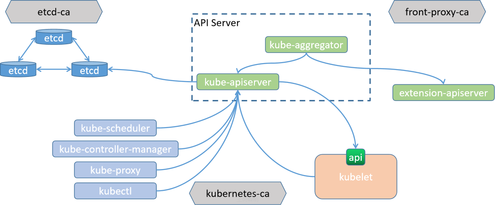

Kubernetes集群中有三套CA机制：

- etcd-ca   ETCD集群内部的 TLS 通信
- kubernetes-ca  kubernetes集群内部节点间的双向 TLS 通信
- front-proxy-ca Kubernetes集群与外部扩展服务简单双向 TLS 通信

# 5. Kubernetes 相关术语

## 5.1. Pod

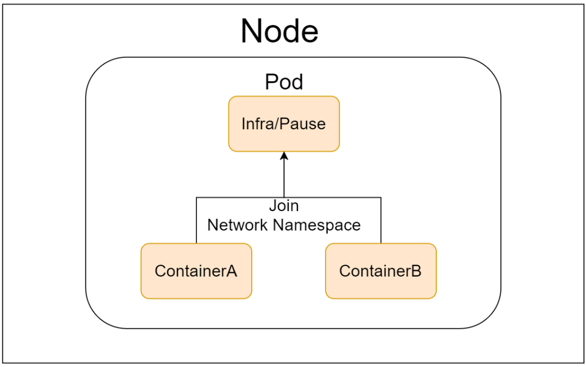

Pod 是其运行应用及应用调度的最小逻辑单元。

本质上是共享 Network、IPC 和 UTS名称空间以及存储资源的容器集。

可将其想象成一台物理机或虚拟机，各容器就是该主机上的进程。

各容器共享网络协议栈、网络设备、路由、IP地址和端口等，但Mount、PID和USER仍隔离。

每个Pod上还可附加一个存储卷（Volume）作为该主机的外部存储，独立于Pod的生命周期，可由Pod 内的各容器共享。

模拟“不可变基础设施”，删除后可通过资源清单重建。

具有动态性，可容忍误删除或主机故障等异常。

存储卷可以确保数据能超越Pod的生命周期。

在设计上，仅应该将具有“超亲密”关系的应用分别以不同容器的形式运行于同一 Pod 内部。

## 5.2. Service

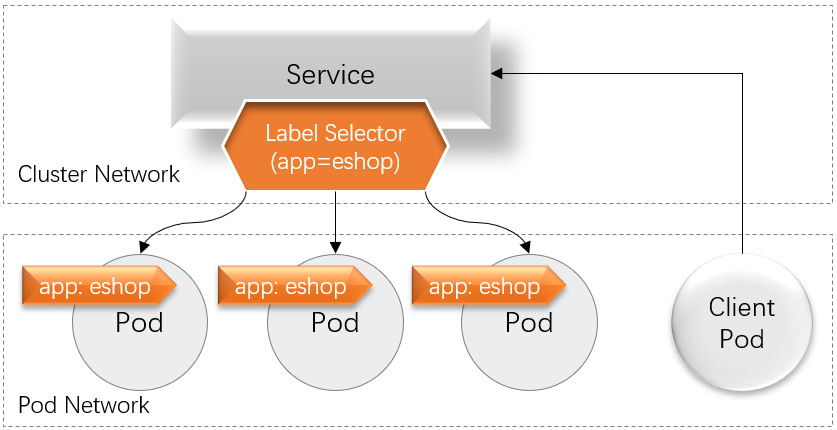

Pod具有动态性，其IP地址也会在基于配置清单重构后重新进行分配，因而需要服务发现机制的支撑。

Kubernetes使用Service资源和DNS服务（CoreDNS）进行服务发现。

Service能够为一组提供了相同服务的Pod提供负载均衡机制，其IP地址（Service IP，也称为Cluster IP）即为客户端流量入口。

一个Service对象存在于集群中的各节点之上，不会因个别节点故障而丢失，可为Pod提供固定的前端入口。

Service使用标签选择器（Label Selector）筛选并匹配Pod对象上的标签（Label），从而发现Pod仅具有符合其标签选择器筛选条件的标签的Pod才可由Service对象作为后端端点使用。

## 5.3. Workloads

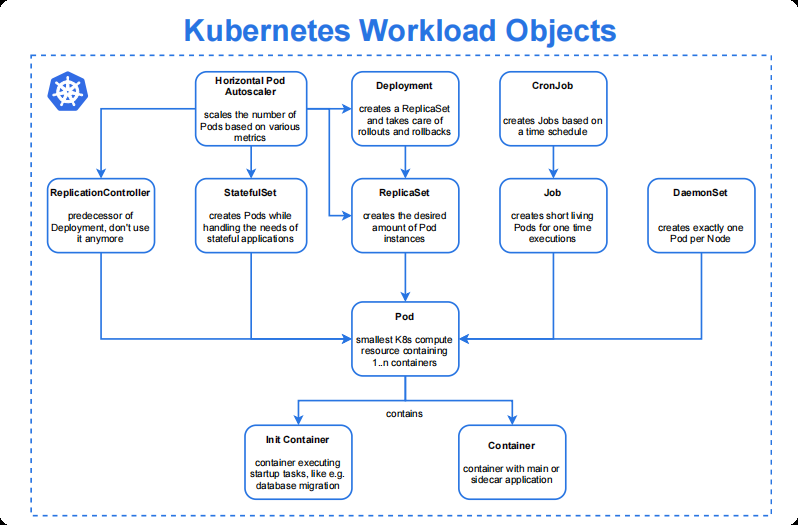

Pod虽然是运行应用的原子单元，并不需要我们直接管理每个 Pod。

可以使用负载资源 workload resources  来替你管理一组 Pods。这些资源配置控制器来确保合适类型的、处于运行状态的 Pod 个数是正确的，与你所指定的状态相一致。

其生命周期管理和健康状态监测由kubelet负责完成，而诸如更新、扩缩容和重建等应用编排功能需要由专用的控制器实现，这类控制器即工作负载型控制器

Kubernetes 提供若干种内置的工作负载资源：

- ReplicaSet和Deployment
- DaemonSet
- StatefulSet
- Job和CronJob

工作负载型控制器也通过标签选择器筛选Pod 标签从而完成关联

工作负载型控制器的主要功能

- 确保选定的 Pod 精确符合期望的数量,数量不足时依据 Pod 模板创建，超出时销毁多余的对象
- 按配置定义进行扩容和缩容
- 依照策略和配置进行应用更新

## 5.4. Network Model

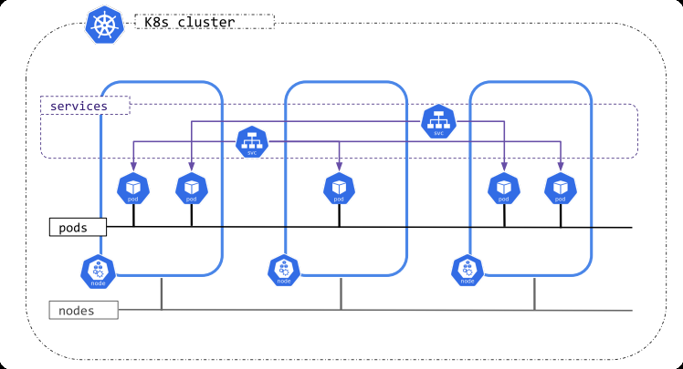

Kubernetes 集群上默认会存在三个分别用于Node、Pod 和 Service 的网络。

三个网络于worker节点上完成交汇，由 node 内核中的路由模块，以及iptables/netfilter和 ipvs 等完成网络间的流量转发。

安装 Kubernetes 时,需要分别指定三个网络的网段地址。

### 5.4.1. 节点网络

集群节点间的通信网络，并负责打通与集群外部端点间的通信。

节点网络的IP地址配置在集群节点主机的物理接口上。

网络及各节点地址需要于Kubernetes部署前完成配置，非由Kubernetes管理。

因而，需要由**管理员或借助于主机虚拟化管理程序实现**。

### 5.4.2. Pod 网络

为集群上的 Pod 对象提供的网络。

Pod 网络 IP 地址配置在 Pod 的虚拟网络接口上。

每个 pod 从此网络动态获取地址，且每次重启 pod 后 IP 地址可能会变化。

虚拟网络，需要经由 CNI 网络插件实现，例如 Flannel、Calico、Cilium 等。

使用某此 CNI 插件也可以支持和节点网络使用相同的网络。

### 5.4.3. Service 网络

主要用于解决 pod 使用动态地址问题。

在部署 Kubernetes 集群时指定，各 Service 对象使用的地址将从该网络中分配。

Service 网络的 IP 地址并不配置在任何物理接口,而是存在于每个节点内核中其相关的iptables 或 ipvs规则中。

由 Kubernetes 集群自行管理。

#### 5.4.4. 网络流量

Kubernetes网络中主要存在4种类型的通信流量

- 同一 Pod 内的容器间通信
- Pod 间的通信
- Pod 与 Service 间的通信
- 集群外部流量与Service间的通信

Pod网络需要借助于第三方兼容CNI规范的网络插件完成，这些插件需要满足以下功能要求

- 所有Pod间均可不经NAT机制而直接通信
- 所有节点均可不经NAT机制直接与所有Pod通信
- 所有Pod对象都位于同一平面网络中

## 5.5. 部署流程

- 依照编排需求，选定合适类型的工作负载型控制器
- 创建工作负载型控制器对象，由其确保运行合适数量的Pod对象
- 创建 Service 对象，为该组 Pod 对象提供固定的访问入口

# 6. Kubernetes 分层架构

Kubernetes设计理念和功能其实就是一个类似Linux的分层架构，如下图所示

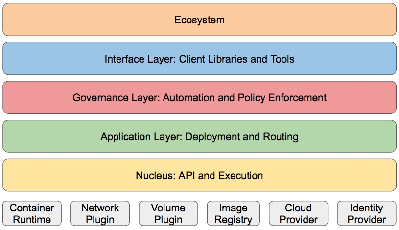

- 核心层：对应上图的最下面的黄色部分,Kubernetes最核心的功能，对外提供API构建高层的应用，对内提供插件式应用执行环境

- 应用层：部署（无状态应用、有状态应用、批处理任务、集群应用等）和路由（服务发现、DNS解析等）

- 管理层：系统度量（如基础设施、容器和网络的度量），自动化（如自动扩展、动态Provision等）以及策略管理RBAC、Quota、PSP、NetworkPolicy等）

- 接口层：kubectl命令行工具、客户端 SDK 以及集群联邦

- 生态系统：在接口层之上的庞大容器集群管理调度的生态系统，可以划分为两个范畴

   - Kubernetes外部：日志、监控、配置管理、CI、CD、Workflow、FaaS、OTS应用、ChatOps等

   - Kubernetes内部：CRI、CNI、CSI、镜像仓库、Cloud Provider、集群自身的配置和管理等

# 7. Kubernetes 版本

Kubernetes 在2014年10月15日在Github上首次开源发布 v0.4版

## 7.1. 支持的版本

通常每年更新四个大版本,从v1.22后已经修改为每年发布3个大版本

Kubernetes 的版本以 X.Y.Z 模式命名，其中 X 是主版本号，Y 是小版本号，Z 是补丁版本号。

Kubernetes 一次支持三个小版本，也就是只支持包含当前的发布版本和两个之前的版本。

参阅 GitHub 上的 Kubernetes Release 页面以获取最新的发布信息。

## 7.2. 小版本

master 组件、node 组件和 kubectl 客户端之间允许有一定的版本偏差。Node 可能落后 master 两个小版本，但是不能超过 master 版本。客户端可能落后也可能超过 master 一个小版本。

例如，一个 v1.8 的 master 将和 v1.6、v1.7 和 v1.8 的 node 兼容，并且和 v1.7、v1.8 和 v1.9 的客户端兼容。

生产环境建议各个组件都采用相同的版本

## 7.3. 补丁版本

补丁版本通常包含对关键错误的修复。您应该运行给定小版本的最新补丁版本。

# 8. Kubernetes 扩展接口

Kubernete s的设计初衷是支持可插拔架构，从而利于扩展 kubernetes 的功能。

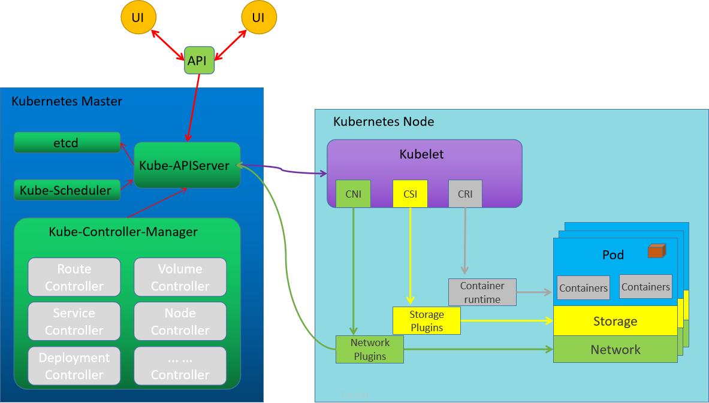

Kubernetes 提供了三个特定功能的接口，kubernetes通过调用这几个接口，来完成相应的功能。

- 容器运行时接口CRI: Container Runtime Interface

CRI 首次发布于2016年12月的Kubernetes 1.5 版本。

在此版本之前，Kubernetes 直接与 Docker 通信，没有标准化的接口。

从 Kubernetes 1.5 开始，CRI 成为 Kubernetes 与容器运行时交互的标准接口，使得 Kubernetes 。

可以与各种容器运行时进行通信，从而增加了灵活性和可移植性。

kubernetes 对于容器的解决方案，只是预留了容器接口，只要符合CRI标准的解决方案都可以使用。

- 容器网络接口CNI: Container Network Interface

kubernetes 对于网络的解决方案，只是预留了网络接口，只要符合CNI标准的解决方案都可以使用。

- 容器存储接口CSI: Container Storage Interface

kubernetes 对于存储的解决方案，只是预留了存储接口，只要符合CSI标准的解决方案都可以使用。

此接口非必须。

# 9. 容器运行时接口（CRI）

CRI是kubernetes定义的一组gRPC服务。Kubelet作为客户端，基于gRPC协议通过Socket和容器运行时通信。

CRI 是一个插件接口，它使 kubelet 能够使用各种容器运行时，无需重新编译集群组件。

Kubernetes 集群中需要在每个节点上都有一个可以正常工作的容器运行时， 这样 kubelet 能启动 Pod 及其容器。

容器运行时接口（CRI）是 kubelet 和容器运行时之间通信的主要协议。

CRI 包括两类服务：

- 镜像服务（Image Service）：镜像服务提供下载、检查和删除镜像的远程程序调用。

- 运行时服务（Runtime Service）：运行时服务包含用于管理容器生命周期，以及与容器交互的调用的远程程序调用。

## 9.1. 开放容器计划 Open Container Initiative

OCI 是一个轻量级的开放治理结构（项目），在 Linux 基金会的支持下形成，其明确目的是围绕容器格式和运行时创建开放行业标准。 OCI 于 2015 年 6 月 22 日由 Docker、CoreOS 和容器行业的其他领导者发起。

OCI目前包含两个规范：创建容器的格式和运行时的开源行业标准，包括镜像规范（Image Specification）和运行时规范(Runtime Specification)。 运行时规范概述了如何运行在磁盘上解压的“文件系统包”。 在高层次上，OCI 实现将下载 OCI Image，然后将该镜像解压缩到 OCI Runtime 文件系统包中。 此时 OCI Runtime Bundle 将由 OCI Runtime 运行。

2015年6月22日，由Docker公司牵头，CoreOS、Google、RedHat等公司共同宣布，Docker公司将 Libcontainer 捐给 OCI，并更名为 runC，一个轻量级的跨平台的容器运行时。 这基本上就是一个命令行小工具，可以直接利用 libcontainer 运行容器，而无需通过 docker engine。runC 的目标是使标准容器在任何地方都可用。与此同时，除了runc之外，Kata、gVisor也符合OCI规范。

## 9.2. 容器运行时

对于容器运行时主要有两个级别：Low Level(使用接近内核层) 和 High Level(使用接近用户层)目前，市面上常用的容器引擎有很多，主要有下图的那几种。

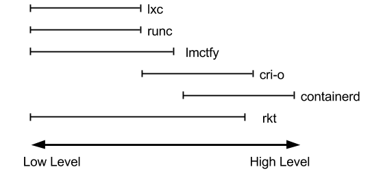

dockershim, containerd 和 cri-o 都是遵循 CRI 的容器运行时，称为高层级运行时（High-level Runtime）。

其他的容器运营厂商最底层的 runc 提供，并由 Open Container Initiative 组织维护

Google，CoreOS，RedHat都推出自已的运行时：lmctfy，rkt，cri-o，但到目前 Docker的 containerd 仍然是最主流的容器引擎技术。

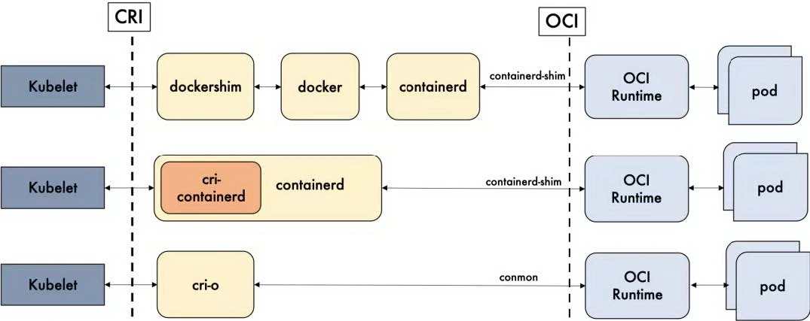

Kubernetes 和容器运行时通信的方式

- unix:///var/run/dockershim.sock  #基于docker,k8s-v1.23前
- unix:///var/run/cri-dockerd.sock  #基于docker,k8s-v1.24后
- unix:///run/containerd/containerd.sock #基于containerd
- unix:///var/run/crio/crio.sock       #基于cri-o

## 9.3. kubernetes v1.24 不再支持 docker？

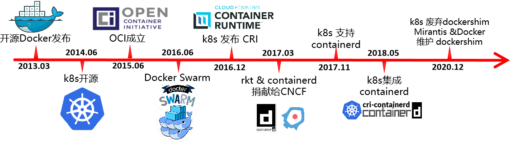

2014年 Docker & Kubernetes 蜜月期

2015~2016年 Kubernetes & RKT vs Docker, 最终Docker 胜出

2016年 Kubernetes逐渐赢得任务编排的胜利

2017年 rkt 和 containerd 捐献给 CNCF

2020年 kubernetes宣布废弃dockershim，但 Mirantis 和 Docker 宣布维护 dockershim

2022年5月3日，Kubernetes v1.24正式发布，此版本提供了很多重要功能。该版本涉及46项增强功能：其中14项已升级为稳定版，15项进入beta阶段，13项则刚刚进入alpha阶段。此外，另有2项功能被弃用、2项功能被删除。v1.24 之前的 Kubernetes 版本包括与 Docker Engine 的直接集成，使用名为**dockershim** 的组件。 值得注意的是v1.24 的 Kubernetes 正式移除对 Dockershim 的支持，即默认不再支持 docker。

https://kubernetes.io/zh-cn/docs/setup/production-environment/container-runtimes/

移除 Dockershim 的说明：https://kubernetes.io/zh-cn/blog/2022/02/17/dockershim-faq/

> [Dockershim的历史背景](https://mp.weixin.qq.com/s/elkfBVzN8-zC30111zFpMw)
>
> 作者：Kat Cosgrove
>
> 从 Kubernetes v1.24 开始，Dockershim 会给移除，这对于项目来说是个积极的举措。然而，无论是在社会上，还是在软件开发中，上下文对于完全理解某些东西都是很重要的，这值得更深入的研究。在 Kubernetes v1.24 中移除 dockershim 的同时，我们在社区中看到了一些困惑（有时达到恐慌的程度），和对这一决定的不满，很大程度上是由于缺乏关于这移除的上下文。弃用并最终将 dockershim 从 Kubernetes 移除的决定，并不是迅速或轻率做出的。尽管如此，它已经操作了很长时间，以至于今天的许多用户都比这个决定更新，当然也比导致 dockershim 首先成为必要的选择更新。
>
> 那么，dockershim 是什么，为什么它会消失？
>
> 在 Kubernetes 的早期，我们只支持一个容器运行时。那个运行时是 Docker Engine。当时，没有太多其他选择，Docker 是处理容器的主要工具，所以这不是个有争议的选择。最终，我们开始添加更多的容器运行时，比如 rkt 和 hypernetes，很明显 Kubernetes 用户希望选择最适合他们的运行时。因此 Kubernetes 需要种方法，来允许集群操作者灵活地使用他们选择的任何运行时。
>
> 发布**CRI**[1]（Container Runtime Interface，容器运行时接口）就是为了提供这种灵活性。CRI 的引入对项目和用户来说都很棒，但它也引入了一个问题：Docker Engine 作为容器运行时的使用早于 CRI，Docker Engine 与 CRI 不兼容。为了解决这个问题，引入了一个小软件垫片（"shim"，dockershim）作为 kubelet 组件的一部分，专门用于填补 Docker Engine 和 CRI 之间的空白，允许集群运营商继续使用 Docker Engine 作为他们的容器运行时，基本上不会给中断。
>
> 然而，这个小小的软件垫片从来就不是永久的解决方案。多年来，它的存在给 kubelet 本身带来了许多不必要的复杂性。由于这个垫片，Docker 的一些集成实现不一致，导致维护人员的负担增加，并且维护特定于供应商的代码不符合我们的开源理念。为了减少这种维护负担，并向一个支持开放标准的更具协作性的社区发展，**KEP-2221 获引入**[2]，它建议去掉 dockershim。随着 Kubernetes v1.20 的发布，这一弃用成为正式。
>
> 我们没有很好地传达这一点，不幸的是，弃用声明导致了社区内的一些恐慌。对于 Docker 作为一家公司来说这意味着什么，由 Docker 构建的容器镜像能否运行，以及 Docker Engine 实际是什么导致了社交媒体上的一场大火。这是我们的过失；我们应该更清楚地沟通当时发生了什么以及原因。为了解决这个问题，我们发布了一个**博客**[3]和相关的**常见问题**[4]，以减轻社区的恐惧，并纠正一些关于 Docker 是什么，以及容器如何在 Kubernetes 中工作的误解。由于社区的关注，Docker 和 Mirantis 共同同意以**cri-docker**[5]的形式继续支持 dockershim 代码，允许你在需要时继续使用 Docker Engine 作为你的容器运行时。为了让那些想尝试其他运行时（如 containerd 或 cri-o）的用户感兴趣，编写了**迁移文档**[6]。
>
> 我们后来对社区进行了**调查**[7]，发现仍然有许多用户有**问题和顾虑**[8]。作为回应，Kubernetes 维护者和 CNCF 致力于通过扩展文档和其他程序来解决这些问题。事实上，这篇博文就是这个计划的一部分。随着如此多的最终用户成功地迁移到其他运行时，以及文档的改进，我们相信现在每个人都有了迁移的道路。
>
> 无论是作为工具还是作为公司，Docker 都不会消失。它是云原生社区和 Kubernetes 项目历史的重要组成部分。没有他们我们不会有今天。也就是说，从 kubelet 中移除 dockershim 最终对社区、生态系统、项目和整个开源都有好处。这是我们所有人一起支持开放标准的机会，我们很高兴在 Docker 和社区的帮助下这样做。
>
> ### 参考资料
>
> [1] CRI: *https://kubernetes.io/blog/2016/12/container-runtime-interface-cri-in-kubernetes/*
>
> [2] KEP-2221 获引入: *https://github.com/kubernetes/enhancements/tree/master/keps/sig-node/2221-remove-dockershim*
>
> [3] 博客: *https://kubernetes.io/blog/2020/12/02/dont-panic-kubernetes-and-docker/*
>
> [4] 常见问题: *https://kubernetes.io/blog/2020/12/02/dockershim-faq/*
>
> [5] cri-docker: *https://www.mirantis.com/blog/the-future-of-dockershim-is-cri-dockerd/*
>
> [6] 迁移文档: *https://kubernetes.io/docs/tasks/administer-cluster/migrating-from-dockershim/change-runtime-containerd/*
>
> [7] 调查: *https://kubernetes.io/blog/2021/11/12/are-you-ready-for-dockershim-removal/*
>
> [8] 问题和顾虑: *https://kubernetes.io/blog/2022/01/07/kubernetes-is-moving-on-from-dockershim*

### 9.3.1. Kubernetes 调用 Docker 的变化

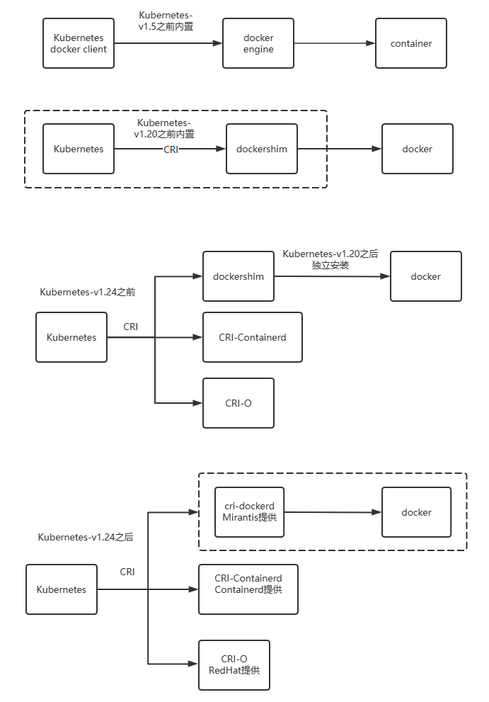

### 9.3.2. cri-dockerd 项目

https://github.com/Mirantis/cri-dockerd

Mirantis 和 Docker 已同意合作，在 Kubernetes 之外独立维护 shim 代码，作为 Docker 引擎 API 的一致 CRI 接口。 对于 Mirantis 客户，这意味着 Docker Engine 的商业支持版本 Mirantis Container Runtime (MCR) 将符合 CRI。 这意味着您可以像以前一样继续基于 Docker 引擎构建 Kubernetes，只需从内置的 dockershim 切换到外部的。

Mirantis 和 Docker 打算共同努力确保它继续像以前一样工作，并且它通过所有一致性测试并继续像内置版本一样工作。 Mirantis 将在 Mirantis Kubernetes Engine 中使用它，而 Docker 将继续在 Docker Desktop 中发布这个 shim。

### 9.3.3. Kubernetes 的 CRI 方案

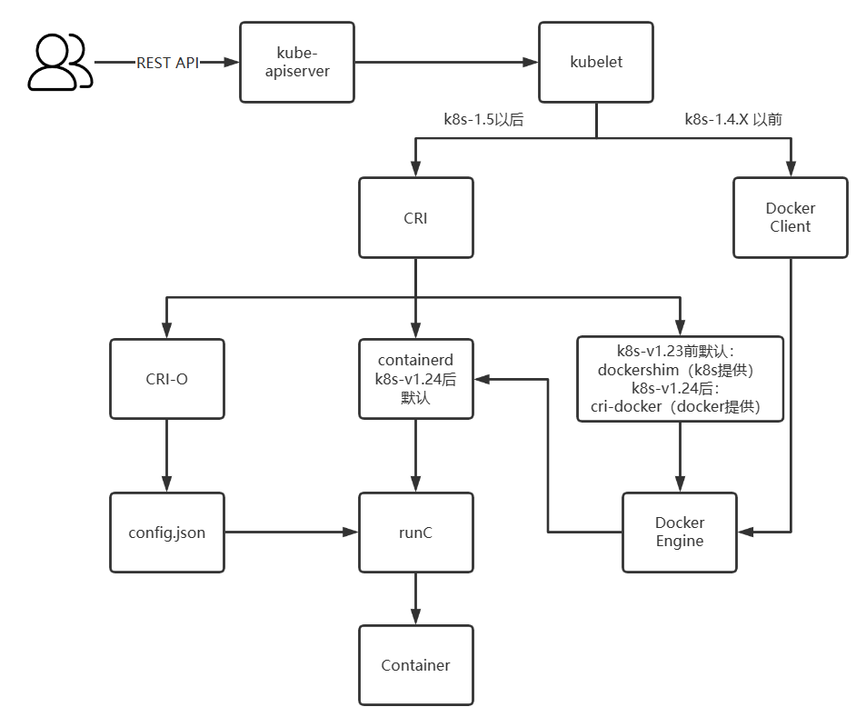

方式1: Containerd

默认情况下,Kubernetes在创建集群的时候,使用的就是Containerd 方式。

方式2: Docker

Docker Engine 没有实现 CRI， 而这是容器运行时在 Kubernetes 中工作所需要的。

因此必须安装一个额外的服务,早期使用由k8s提供的dockershim,但它在 1.24 版本从 kubelet 中被移除。

还可以借助于Mirantis维护的cri-dockerd插件方式来实现Kubernetes集群的创建。

cri-dockerd 项目站点: https://github.com/Mirantis/cri-dockerd

方式3: CRI-O

2016年成立,2019年4月8号加入CNCF孵化。

CRI-O的方式是Kubernetes创建容器最直接的一种方式。

在创建集群的时候,需要借助于cri-o插件的方式来实现Kubernetes集群的创建。