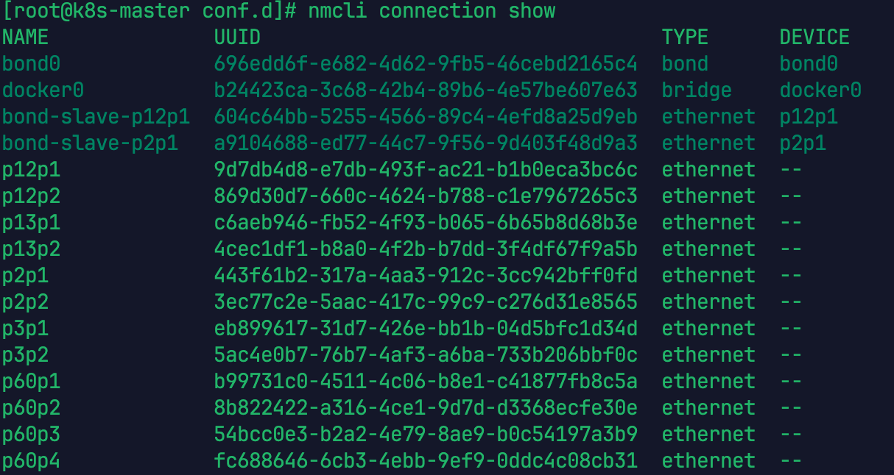

# 1. 节点拓扑规划

```shell
cat /etc/os-release
uname -a
```

如下：


| 角色                    | ip          | OS                | 配置                                    |
| ----------------------- | ----------- | ----------------- | --------------------------------------- |
| k8s-master              | 172.16.1.14 | Kylin V10, x86-64 | mem:1T,cpu:256,1T[sas SSD]+6T[nvme SSD] |
| k8s-node1，时钟主服务器 | 172.16.1.15 | Kylin V10, x86-64 | mem:1T,cpu:256,1T[sas SSD]+6T[nvme SSD] |

# 2. 版本

| 工具       | 版本    |
| ---------- | ------- |
| docker     | 20.10.8 |
| cri-docker | 0.3.15  |
| k8s        | 1.27.6  |

# 3. 准备工作

## 3.1. 主机域名解析

```shell
######################################## master 执行
hostnamectl set-hostname k8s-master
######################################## node 执行
hostnamectl set-hostname k8s-node1
######################################## 所有节点执行
cat >> /etc/hosts << EOF
172.16.1.14 k8s-master
172.16.1.15 k8s-node1
EOF
```

## 3.2. 关闭防火墙

```shell
######################################## 所有节点执行
systemctl status firewalld
systemctl stop firewalld && systemctl disable firewalld
systemctl status firewalld

iptables -L # 查看
iptables -F # 清空
iptables -L # 查看
```

## 3.3. 关闭 SELinux

```shell
######################################## 所有节点执行

# 临时
setenforce 0
# 永久
setenforce 0 && sed -i 's/SELINUX=enforcing/SELINUX=disabled/' /etc/selinux/config

getenforce # 查看
```

## 3.4. 关闭 swap

```shell
######################################## 所有节点执行
# 查看
free -h

# 临时关闭
swapoff -a

# 永久
swapoff -a && sed -ri 's/.*swap.*/#&/' /etc/fstab
```

## 3.5. 时间同步

```shell
######################################## 所有节点执行
yum install -y chrony
timedatectl set-timezone Asia/Shanghai
```

### 3.5.1. 配置时钟主服务器

```shell
######################################## 时钟主服务器

# 让节点能自己从外网同步时间，然后把时间提供给内网其它服务器
# 如果该节点不能向外网同步时间，手动校验时间
# 调整时间，默认慢了12s
date -s "$(date -d '+12 seconds' '+%Y-%m-%d %H:%M:%S')"
hwclock --systohc

vim /etc/chrony.conf
# ...
server ntp1.aliyun.com iburst
server ntp2.aliyun.com iburst
server ntp3.aliyun.com iburst
server ntp4.aliyun.com iburst
# ...
allow 172.16.1.0/24
# ...

systemctl enable --now chronyd

# 验证同步是否成功，如果有外网，它应该会显示外面的时间源
chronyc sources -v
```

### 3.5.2. 配置时钟从服务器

```shell
######################################## 时钟从服务器

vim /etc/chrony.conf
# 指向主服务器 S1
server 172.16.1.15 iburst prefer
server ntp1.aliyun.com iburst
server ntp2.aliyun.com iburst
server ntp3.aliyun.com iburst
server ntp4.aliyun.com iburst

systemctl enable --now chronyd
# 验证同步是否成功，应该能看到主服务器的 IP 地址（172.16.1.15），前面有 ^* 标志，说明它被选作时间源
```

## 3.6. 修改内核参数

```shell
######################################## 所有节点执行

# 添加网桥过滤
cat >> /etc/sysctl.conf <<EOF
net.ipv4.ip_forward = 1
net.bridge.bridge-nf-call-iptables = 1
EOF

cat > /etc/sysctl.d/k8s.conf << EOF
net.ipv4.ip_forward = 1
net.bridge.bridge-nf-call-iptables = 1
vm.swappiness = 0
vm.overcommit_memory = 1
vm.panic_on_oom = 0
EOF

modprobe br_netfilter && sysctl --system
lsmod|grep br_netfilter
```

# 4. 安装 docker

## 4.1. 查看是否有残留

```shell
######################################## 所有节点执行

# 查看是否安装过
rpm -qa |grep podman
rpm -qa |grep docker

# 查看是否有 runc, 判断runc 是不是系统自带的，自带的后续连接到自己安装的
which runc
```

## 4.2. 安装

```shell
######################################## 所有节点执行

执行 instsall.sh
```

# 5. 安装 docker-cri

> *Kubernetes v1.24 移除 docker-shim 的够支持到 CRI  规范的支持，而 Docker Engine 默认又不支持 CRI 标准，因此二者默认无法再直接集成。为此，Mirantis 和 Docker 联合创建了 cri-dockerd 项目，用于为 Docker Engine 提供一个能从而能够让 Docker 作为 Kubernetes 容器引擎。*

## 5.1. 下载 docker-cri

```shell
######################################## 所有节点执行
wget https://github.com/Mirantis/cri-dockerd/releases/download/v0.3.15/cri-dockerd-0.3.15.amd64.tgz

tar zxvf cri-dockerd-0.3.15.amd64.tgz

cp -a cri-dockerd/* /usr/bin/
```

## 5.2. 配置服务

```shell
######################################## 所有节点执行
cat > /usr/lib/systemd/system/cri-docker.service <<'EOF'
[Unit]
Description=CRI Interface for Docker Application Container Engine
Documentation=https://docs.mirantis.com
After=network-online.target docker.service
Wants=network-online.target
Requires=cri-docker.socket
[Service]
Type=notify
ExecStart=/usr/bin/cri-dockerd --network-plugin=cni --pod-infra-container-image=registry.aliyuncs.com/google_containers/pause:3.9
ExecReload=/bin/kill -s HUP $MAINPID
TimeoutSec=0
RestartSec=2
Restart=always
StartLimitBurst=3
StartLimitInterval=60s
LimitNOFILE=infinity
LimitNPROC=infinity
LimitCORE=infinity
TasksMax=infinity
Delegate=yes
KillMode=process
[Install]
WantedBy=multi-user.target
EOF

######################################## 所有节点执行
cat > /usr/lib/systemd/system/cri-docker.socket <<'EOF'
[Unit]
Description=CRI Docker Socket for the API
PartOf=cri-docker.service

[Socket]
ListenStream=%t/cri-dockerd.sock
SocketMode=0660
SocketUser=root
SocketGroup=root

[Install]
WantedBy=sockets.target
EOF
```

## 5.3. 启动

```shell
######################################## 所有节点执行
systemctl daemon-reload
systemctl enable cri-docker --now
systemctl status cri-docker
```

# 6. 安装 k8s

## 6.1. 拉取 kubelet，kubeadm，kubectl

https://developer.aliyun.com/mirror/kubernetes/?spm=a2c6h.25603864.0.0.1244274fSGXoGH

> CentOS7.9 内核 3.10，CentOS8.5 内核4,18，CentOS9内核5.14

根据情况替换下方的版本为el7还是el8

```shell
######################################## 找一台可以联网的机器执行
# arm 版本
cat <<EOF > /etc/yum.repos.d/kubernetes.repo
[kubernetes]
name=Kubernetes
baseurl=https://mirrors.aliyun.com/kubernetes/yum/repos/kubernetes-el7-aarch64/
enabled=1
gpgcheck=1
repo_gpgcheck=1
gpgkey=https://mirrors.aliyun.com/kubernetes/yum/doc/yum-key.gpg https://mirrors.aliyun.com/kubernetes/yum/doc/rpm-package-key.gpg
EOF

# x86-64 版本
cat <<EOF >/etc/yum.repos.d/kubernetes.repo
[kubernetes]
name=Kubernetes
baseurl=https://mirrors.aliyun.com/kubernetes/yum/repos/kubernetes-el7-x86_64/
enabled=1
gpgcheck=1
repo_gpgcheck=1
gpgkey=https://mirrors.aliyun.com/kubernetes/yum/doc/yum-key.gpg https://mirrors.aliyun.com/kubernetes/yum/doc/rpm-package-key.gpg
EOF

######################################## 找一台可以联网的机器执行
yum install -y --downloadonly --downloaddir=./k8s-1.27.6 \
    kubelet-1.27.6-0 \
    kubeadm-1.27.6-0 \
    kubectl-1.27.6-0 \
    --enablerepo=kubernetes

######################################## 找一台可以联网的机器执行
yum list available --showduplicates kubelet kubeadm kubectl --disablerepo=* --enablerepo=kubernetes 
```

如果有索引 gpg 检查失败的情况， 请用  yum install -y --nogpgcheck kubelet kubeadm kubectl 安装。

将以上 rpm 包拷贝到需要安装 kubeadm 的机器，执行即完成安装

```shell
######################################## 所有节点执行
rpm -ivh libnetfilter_cthelper-1.0.0-11.el7.x86_64.rpm
rpm -ivh libnetfilter_cttimeout-1.0.0-7.el7.x86_64.rpm
rpm -ivh libnetfilter_queue-1.0.2-2.el7_2.x86_64.rpm
rpm -ivh conntrack-tools-1.4.4-7.el7.x86_64.rpm
# 从华为欧拉仓库中下载，https://dl-cdn.openeuler.openatom.cn/openEuler-20.03-LTS-SP3/everything/x86_64/Packages/
rpm -ivh socat-1.7.3.2-8.oe1.x86_64.rpm

######################################## 所有节点执行
rpm -ivh 873fd10acbb0d4c6fa1041c70a733cc99f403dbce8fb3f3c825a11ebbe0792aa-kubectl-1.27.6-0.x86_64.rpm
rpm -ivh 3f5ba2b53701ac9102ea7c7ab2ca6616a8cd5966591a77577585fde1c434ef74-cri-tools-1.26.0-0.x86_64.rpm
rpm -ivh 12592ba0c35220af878a91ded391d796243155f29032739b0a7b4f53f2134cf9-kubelet-1.27.6-0.x86_64.rpm
rpm -ivh 0f2a2afd740d476ad77c508847bad1f559afc2425816c1f2ce4432a62dfe0b9d-kubernetes-cni-1.2.0-0.x86_64.rpm
rpm -ivh b551bc583f95854dd3f0e3cb8361cc1cef57ada75aef31b709c63f0da37b1fbd-kubeadm-1.27.6-0.x86_64.rpm
```

## 6.2. 下载需要的镜像

由于默认的镜像仓库 k8s.cgr.io 国内一般无法访问，因此我们需要先使用国内镜像源拉下来，再改镜像的 tag，执行`kubeadm config images list`，查看安装所需镜像。

```shell
######################################## 任意节点执行
kubeadm config images list

registry.k8s.io/kube-apiserver:v1.27.6
registry.k8s.io/kube-controller-manager:v1.27.6
registry.k8s.io/kube-scheduler:v1.27.6
registry.k8s.io/kube-proxy:v1.27.6
registry.k8s.io/pause:3.9
registry.k8s.io/etcd:3.5.7-0
registry.k8s.io/coredns/coredns:v1.10.1
```

从阿里云镜像中心拉取镜像

```shell
######################################## 找一台可以联网的机器执行
docker pull registry.aliyuncs.com/google_containers/kube-apiserver:v1.27.6 --platform amd64
docker pull registry.aliyuncs.com/google_containers/kube-controller-manager:v1.27.6 --platform amd64
docker pull registry.aliyuncs.com/google_containers/kube-scheduler:v1.27.6 --platform amd64
docker pull registry.aliyuncs.com/google_containers/kube-proxy:v1.27.6 --platform amd64
docker pull registry.aliyuncs.com/google_containers/pause:3.9 --platform amd64
docker pull registry.aliyuncs.com/google_containers/etcd:3.5.7-0 --platform amd64
docker pull registry.aliyuncs.com/google_containers/coredns/coredns:v1.10.1 --platform amd64
######################################## 找一台可以联网的机器执行
docker tag registry.aliyuncs.com/google_containers/coredns/coredns:v1.10.1 registry.aliyuncs.com/google_containers/coredns:v1.10.1
######################################## 找一台可以联网的机器执行
docker save \
  registry.aliyuncs.com/google_containers/kube-apiserver:v1.27.6 \
  registry.aliyuncs.com/google_containers/kube-controller-manager:v1.27.6 \
  registry.aliyuncs.com/google_containers/kube-scheduler:v1.27.6 \
  registry.aliyuncs.com/google_containers/kube-proxy:v1.27.6 \
  registry.aliyuncs.com/google_containers/pause:3.9 \
  registry.aliyuncs.com/google_containers/etcd:3.5.7-0 \
  registry.aliyuncs.com/google_containers/coredns:v1.10.1 \
  -o k8s-v1.27.6-images.tar
```

导入镜像

```shell
######################################## 所有节点执行
docker load -i k8s-v1.27.6-images.tar
```

## 6.3. 启动 kubelet

```shell
######################################## 所有节点执行
systemctl enable kubelet --now
systemctl start kubelet
```

## 6.4. Master 初始化 k8s 集群

- `apiserver-advertise-address` 集群通告地址，此处填写`master`节点`IP`
- `image-repository` 由于默认拉取镜像地址`registry.aliyuncs.com/google_containers`国内无法访问，这里指定阿里云镜像仓库地址
- `kubernetes-version`  k8s 版本，与上面安装的一致
- `service-cidr` 集群内部虚拟网络，`Pod`统一访问入口
- `pod-network-cidr Pod`网络，与下面部署的`CNI`网络组件`yaml`中保持一致

```shell
######################################## master 节点执行
kubeadm init \
--apiserver-advertise-address=172.16.1.14 \
--image-repository registry.aliyuncs.com/google_containers \
--kubernetes-version v1.27.6 \
--service-cidr=10.96.0.0/12 \
--pod-network-cidr=10.244.0.0/16 \
--cri-socket=unix:///var/run/cri-dockerd.sock
# 记住 node 节点加入的命令，在 6.5 使用
```

出错重置

```shell
######################################## master 节点执行
kubeadm reset -f --cri-socket=unix:///var/run/cri-dockerd.sock
systemctl stop kubelet
rm -rf /etc/cni/net.d/*
rm -rf /var/lib/cni/*
rm -rf /var/lib/calico/ # 仅在 Calico 有问题时执行
systemctl restart cri-docker
systemctl restart docker
```

执行后续

```shell
######################################## master 节点执行
mkdir -p $HOME/.kube
sudo cp -i /etc/kubernetes/admin.conf $HOME/.kube/config
sudo chown $(id -u):$(id -g) $HOME/.kube/config
```

### 6.4.1. 故障1：can 't open /etc/resolv.conf

当 NetworkManager 启用且 systemd-resolved 未启用 时，NetworkManager 默认会直接管理 `/etc/resolv.conf`（作为普通文件或符号链接）。但是并未存在。

查看网络连接

```shell
nmcli connection show
```



查看 bond0 的 IP 和 DNS

```shell
nmcli device show bond0
```

.png)

配置 DNS

```shell
nmcli connection modify bond0 ipv4.dns "127.0.0.1" # 必须先写上才能出现文件
nmcli connection down bond0 && nmcli connection up bond0 # 重启连接使配置生效
cat /etc/resolv.conf

nmcli connection modify bond0 ipv4.dns "" # 因为不知道先写为空
nmcli connection down bond0 && nmcli connection up bond0 # 重启连接使配置生效
cat /etc/resolv.conf
```

## 6.5. Node节点加入集群

```shell
######################################## node 节点执行
kubeadm join 172.16.1.14:6443 --token 75tsou.u09kvpck2c9pydnq \
        --discovery-token-ca-cert-hash sha256:f624b9f91834fa699c0ef4ce4ed7f300b7d1eb980f082c8eebaae04fe7c736f1
```

# 7. 网络配置

## 7.1. NetWorkManager 配置

采用 Calico ，并且主机启用了 NetWorkManager

```shell
######################################## 所有节点执行
vim /etc/NetworkManager/conf.d/calico.conf

[keyfile]
unmanaged-devices=interface-name:cali*;interface-name:tunl*;interface-name:vxlan.calico;interface-name:vxlan-v6.calico;interface-name:wireguard.cali;interface-name:wg-v6.cali
```

## 7.2. 下载并修改 yaml

```shell
######################################## master 节点执行
wget https://github.com/projectcalico/calico/blob/release-v3.27/manifests/calico-typha.yaml

# 修改配置文件
            # Cluster type to identify the deployment type
            - name: CLUSTER_TYPE
              value: "k8s,bgp"
            # Auto-detect the BGP IP address.
            - name: IP
              value: "autodetect"
            - name: IP_AUTODETECTION_METHOD
              value: "interface=bond.*"
            # Enable IPIP
            - name: CALICO_IPV4POOL_IPIP
              value: "Off"
              ...
            - name: CALICO_IPV4POOL_CIDR
              value: "10.244.0.0/16"

kubectl apply -f calico-typha.yaml
```

### 7.2.1. 故障2：如果使用 ipip 模式，移除该模式下的虚拟网卡

```shell
modprobe -r ipip
```

## 7.3. 下载需要的镜像

```shell
######################################## 找一台可以联网的机器执行
docker pull docker.io/calico/typha:v3.26.3 --platform=amd64
docker pull docker.io/calico/cni:v3.26.3 --platform=amd64
docker pull docker.io/calico/node:v3.26.3 --platform=amd64
docker pull docker.io/calico/kube-controllers:v3.26.3 --platform=amd64

docker save \
  docker.io/calico/typha:v3.26.3 \
  docker.io/calico/cni:v3.26.3 \
  docker.io/calico/node:v3.26.3 \
  docker.io/calico/kube-controllers:v3.26.3 \
  -o calico-offline-images.tar
```

# 8. 验证

查看节点状态和 pod 状态

.png)

创建 nginx

```shell
---
# 1. 定义 Deployment
# 负责维持 3 个 Nginx 副本的运行
apiVersion: apps/v1
kind: Deployment
metadata:
  # 部署的名称
  name: nginx-deployment
  # 可选：指定命名空间，如果不指定则默认在 default
  # namespace: default
spec:
  # 副本数量，设置为 3 个
  replicas: 3
  selector:
    matchLabels:
      app: nginx
  template:
    metadata:
      labels:
        app: nginx
    spec:
      containers:
      - name: nginx
        # 使用官方 Nginx 镜像
        image: nginx:latest
        imagePullPolicy: IfNotPresent
        ports:
        - containerPort: 80
---
# 2. 定义 Service
# 将 Deployment 暴露出去，以便访问
apiVersion: v1
kind: Service
metadata:
  name: nginx-service
spec:
  # 使用 NodePort 类型，可以在集群外部通过 <NodeIP>:<NodePort> 访问
  type: NodePort
  selector:
    app: nginx
  ports:
    - protocol: TCP
      port: 80
      # 集群内部访问端口
      targetPort: 80
      # 节点暴露端口 (如果不指定，K8s 会自动分配一个 30000-32767 之间的端口)
      # nodePort: 30080
```

访问以验证

.png)
